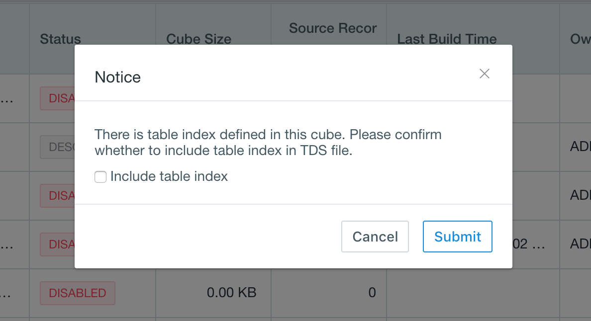

## Integrate with Tableau

Tableau is one of the most popular business intelligence applications. It is very easy for users to generate visualized diagrams, stories, and reports on huge amount of data via drag and drop.

This section will introduce two methods available to connect Tableau with Kyligence Enterprise.

- Quick sync up model by using Kyligence Enterprise TDS export function
- Manually build mapping model 

### Prerequisites

- Kyligence ODBC driver has been installed. For installation instructions, please refer to [Kyligence ODBC Driver](../../driver/odbc/README.md).


- To support detail data query, you need to configure table index or pushdown.

### Method 1: Quick Sync Up Model by Using TDS Import/Export Function

After modeling and creating cube, you can export cube definition as Tableau model definition file in Kyligence Enterprise and import it in Tableau. Please follow the steps below:

**Step 1:** Export Tableau Data source (TDS) file from Kyligence Enterprise

- Under **Model** > **Cube** module
- Select a **Ready** Cube
- Click **More Action** icon and select **Export TDS** option, a pop-up page shows:



> **Note:**
>
> - If "Include Table Index" is checked, the exported file contains all available columns in the cube.
> - If "Include Table Index" is unchecked, the exported file contains only the dimensions and measures defined in the cube, not including the foreign key of the fact table and the primary key of the snapshot table.

**Step 2:** Import TDS file into Tableau

- Copy the TDS file to the environment which tableau installed, and double click on it
- In the pop-up window, enter authorization information.
- Click **OK** 

**Step 3:** In Tableau, check model import, such as dimension, measure etc.


### Method 2: Manually Build Mapping Model

You can connect Kyligence Enterprise through ODBC Driver, and manually map Kyligence model in Tableau

The following detail steps required for mapping data model :

1. Start Tableau, under **Data**>**Connect**>**Other Databases(ODBC)**
2. In the pop-up window, select Driver **Kyligence ODBCDriver**, and click **Connect**
3. In **Connection Attributes**, config the connection information as following, and click **OK** 
   - Host
   - Port
   - Username
   - Password
   - Project
4. (Or) In the pop-up window, select the existing DSN to connect
5. In Tableau, you need rebuild data model refer to Kyligence Enterprise. How to create model in Tableau please refer to Tableau official website.

### Other Remarks

When you connect Tableau to Kyligence Enterprise, it will send a query which triggers full table scan. This will take a relatively long time to process the query when the dataset is extremely large. There are two ways to avoid this situation.

**Method 1**: You can download **Kyligence Tableau Datasource Customization (TDC)** file from Kyligence download center and apply it to your Tableau. This is a Kyligence specific connection configuration file with some capability customizations which helps Tableau to connect to Kyligence Enterprise. 

Tableau provides a way to customize TDC profiles, hence to meet Kyligence Enterprise's specific query specifications. Below are some advantages:

- Effectively reduce ODBC connection time by reducing the times of probing ODBC connection.
- Provides query specification customization support for Tableau connections and enhance system robustness.


Step 1: Download file named Tableau Datasource Customization on [Kyligence Download](http://download.kyligence.io/#/addons).

Step 2: Copy the file into the required Tableau directory. 

- For Tableau Desktop, the default location is:

  `Documents\My Tableau Repository\Datasources`

- For Tableau Server，the default location is： 

  Windows environment

  ```Program Files\Tableau\Tableau Server\<version>\bin```

  Or

  ```ProgramData\Tableau\Tableau Server\data\tabsvc\vizqlserver\Datasources```

  Linux environment

  ```/var/opt/tableau/tableau_server/data/tabsvc/vizqlserver/Datasources/```


**Method 2:** You can set the parameter `kylin.query.force-limit` in `kylin.properties` to limit returned records, such as 1000.

