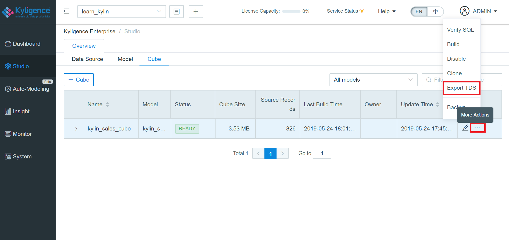
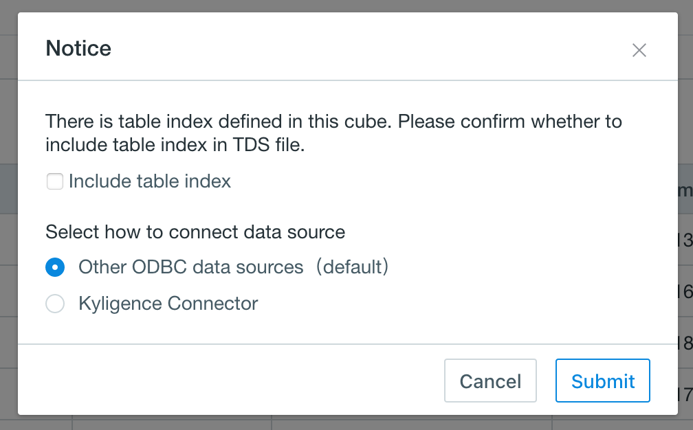
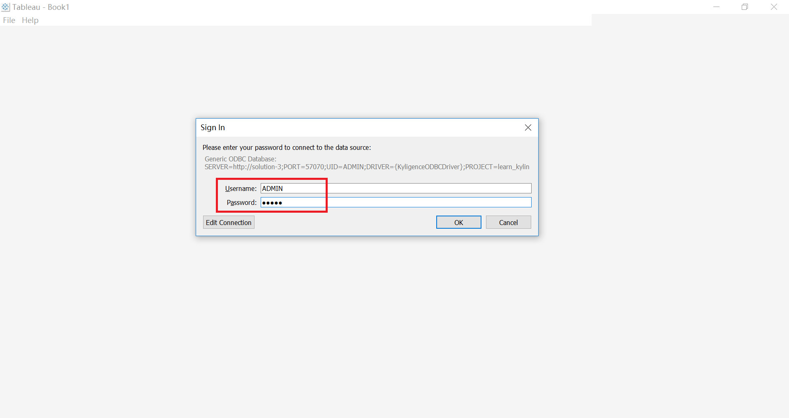
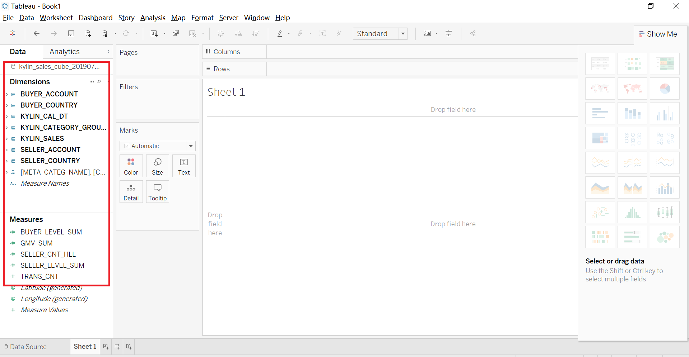
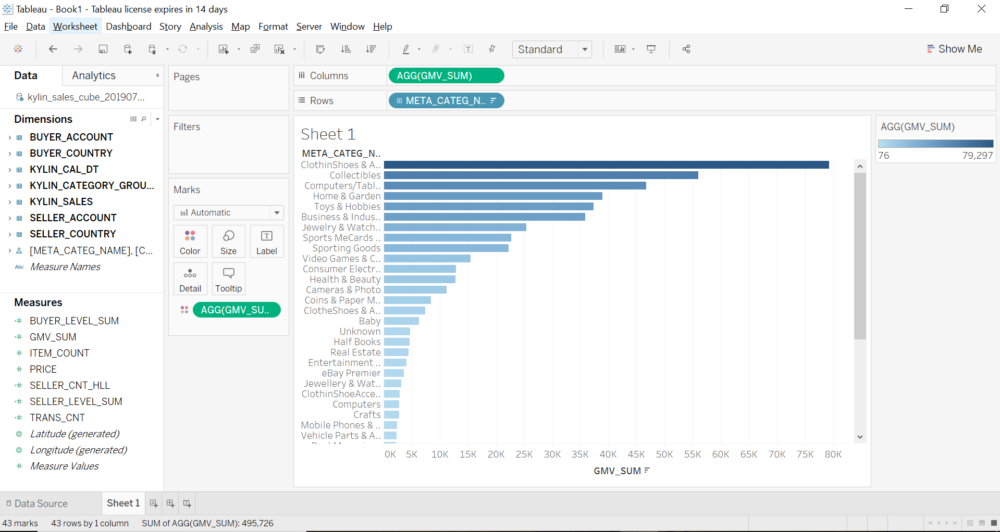
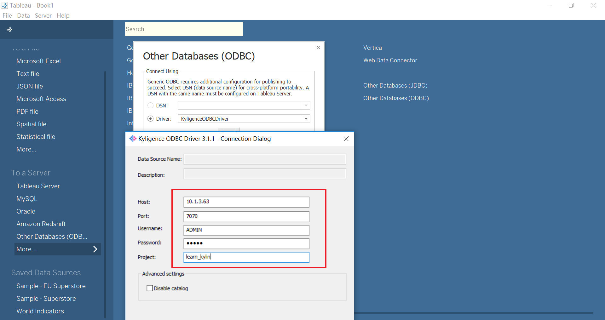
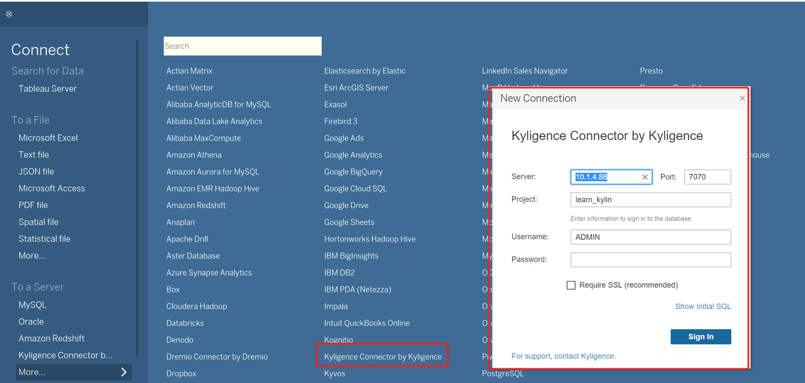
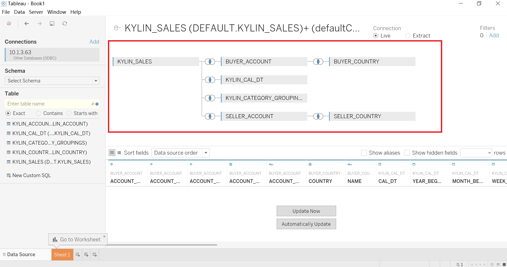
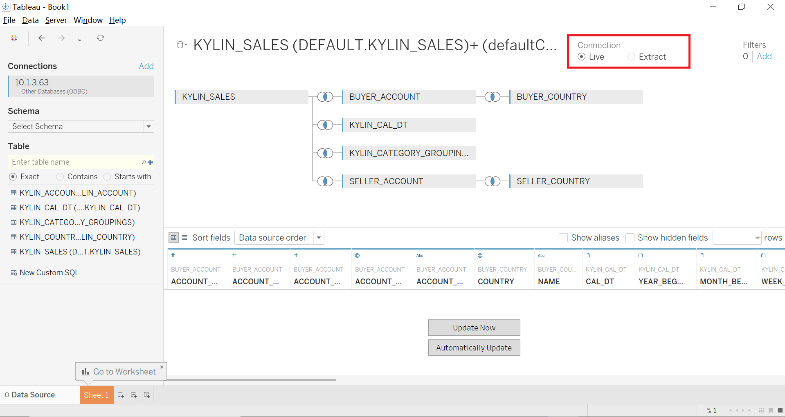
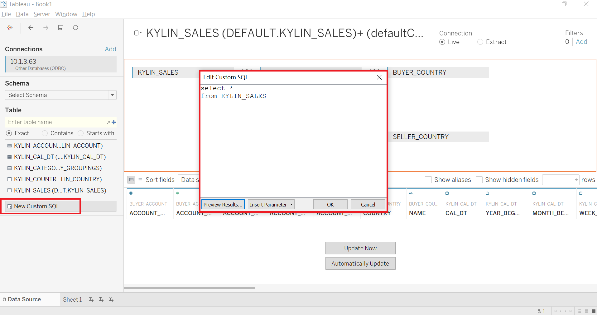

## Integrate with Tableau Desktop

Tableau is one of the most popular business intelligence applications. It is very easy for users to generate visualized diagrams, stories, and reports on huge amount of data via drag and drop.

Kyligence Enterprise supports integration with Tableau 8, 9, 10, 2018, 2019, 2020 and above. We will use Tableau 2019.4 as an example to introduce how to integrate Kyligence Enterprise with Tableau Desktop.

### Prerequisite

- Install Kyligence ODBC Driver. For the installation information, please refer to [Kyligence ODBC Driver introduction](../../driver/odbc/README.md).
- Install  Tableau Desktop. For the installation information, please refer to [Tableau Desktop Download](https://www.tableau.com/support/releases).

### Configure connection to Kyligence data source

If your Tableau version is 2019.4 and above, please configure Tableau Kyligence connector (Beta)
  
  1. Download the Kyligence Connector file (.taco) file from [Kyligence Download Center](http://download.kyligence.io/#/download)
  2. Copy the .taco file to the Tableau Desktop installation directory, which is

    ```
    Windows: My Documents/My Tableau Repository/Connectors
    macOS: ~/Documents/My Tableau Repository/Connectors
    Linux: ~/Documents/My Tableau Repository/Connectors
    ```
  3. Restart Tableau Desktop.

If your Tableau version is 2019.4 below, please configure the Tableau Datasource Customization (TDC) file.

> Note: Tableau supports configuring TDC files to customize and adjust ODBC connections. In response to this feature, Kyligence provides TDC files that meet Kyligence Enterprise's special query specifications to help Tableau better connect Kyligence data.
The configuration steps are as follows:

  1. Download the file named Tableau Datasource Customization on [Kyligence Download](http://download.kyligence.io/#/download)
  2. Copy the TDC file to the installation directory of Tableau Desktop. The default directory is `Documents\My Tableau Repository\Datasources`

### Connect Kyligence

This section will introduce two methods available to connect Tableau with Kyligence Enterprise.

- Quick sync up model by using Kyligence Enterprise TDS export function
- Manually build mapping model 

### Method 1: Quick Sync Up Model by Using TDS Import/Export Function

After modeling and creating cube, you can export cube definition as Tableau model definition file in Kyligence Enterprise and import it in Tableau. 

> **Note：** Only Kyligence Enterprise Version 3.4.5 or above supports this approach

Please follow the steps below:

**Step 1:** Export Tableau Data source (TDS) file from Kyligence Enterprise

- Under **Model** > **Cube** module
- Select a **Ready** Cube
- Click **More Action** icon and select **Export TDS** option, a pop-up page shows



- And there some options for TDS export
  1. Whether to include table index (if no table index is detected in the cube, it will not be displayed)
  2. Data source connector: 
  - Other ODBC Data Source（default）
  - Tableau Kyligence Connector.



**Step 2:** Import TDS file into Tableau

- Copy the TDS file to the environment which tableau installed, and double click on it
- In the pop-up window, enter authorization information.
- Click **OK** 



**Step 3:** In Tableau, check model import, such as dimension, measure etc.



**Step 4:** Now you can start to enjoy analyzing with Tableau Desktop



### Method 2: Manually Build Mapping Model

##### Use Other Database (ODBC) to connect Kyligence Enterprise

Open Tableau Desktop, click **Other Database (ODBC)** in the left panel, enter connection authentication information (host port, project, username, password) in the pop-up window, or drop-down to select t the existing DSN, and click **Connection**. After verification, you can get the tables and data with access rights.

> **Note：**When you use **DSN** on Tableau Desktop to connect to Kyligence Enterprise and need to publish the workbook to Tableau Server, you should create a DSN with the same name as the local one on Tableau Server. DSN type must be **System DSN**. If you use the  **Driver**  to connect, you do not need to create a DSN in Tableau Server.



##### Use Tableau Kyligence Conncetor to connect Kyligence Enterprise

If Kyligence connector is configured, click Kyligence Connector by Kyligence in the left panel, and enter the connection authentication information (server address, port, project, user name, password) in the pop-up window. Click **Login**, after the verification is passed, you can get all the tables and data that you have permission to access under the account.

> Note: If you use the Kyligence connector in Tableau Desktop, when you publish the workbook to Tableau Server, Tableau Server also needs to configure the Kyligence connector to ensure the normal connection of the data source.


### Mapping Data Model

In the left panel of Tableau Desktop, select **default** as the database and click on the **Search** icon in the search box. All tables will be listed. You can drag and drop the tables to the right panel to create the connection between tables and tables.



### Live Connection

Two types of data source connection are provided in Tableau. In large data scenarios, please choose **Live** connection.



### Custom SQL

If you want to interact through custom SQL, they can click on **New Custom SQL** in the bottom left corner of the model interface, and enter SQL in the pop-up box.



### Visualization

Now you can start to enjoy analyzing with Tableau Desktop.


### Limitation
- The measure TopN, PERCENTILE_APRROX, CORR are not currently supported to be displayed in Tableau.
