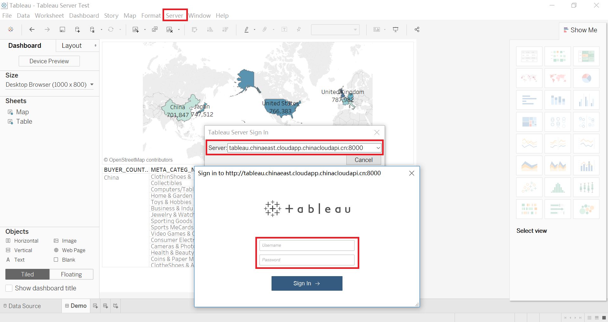
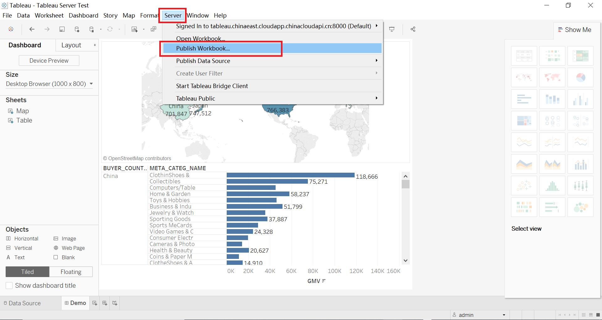
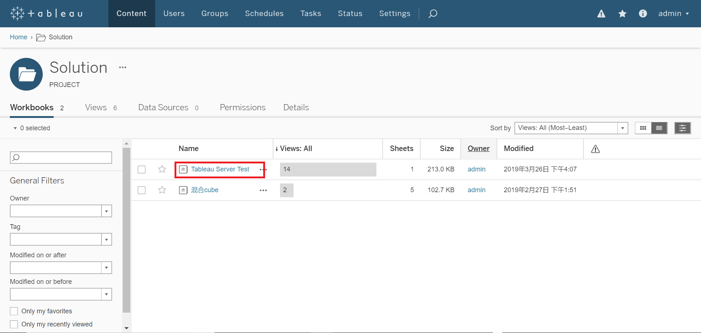
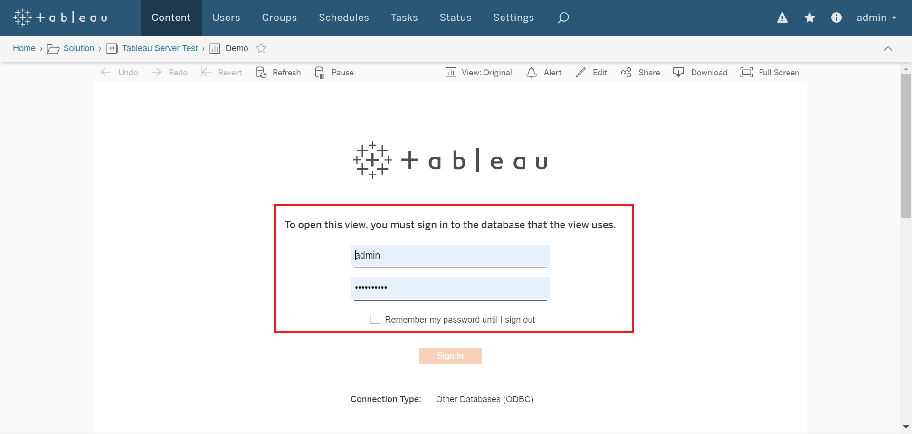
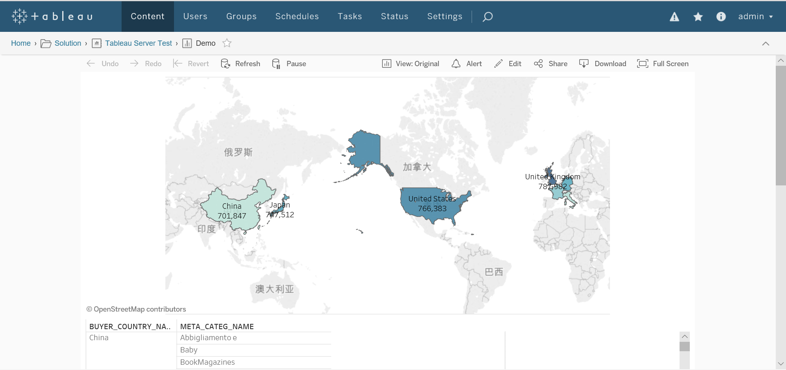

## Integrate with Tableau  Server

### Prerequisite

- Install Kyligence ODBC Driver

  For the installation information, please refer to [Kyligence ODBC Driver tutorial](../../driver/odbc/README.md).

- Install  Tableau Server

  For the installation information, please refer to [Tableau Server Download](https://www.tableau.com/products/server).

- Configure Tableau Datasource Customization (TDC) 

  Similar to Desktop, the steps are as follows:

  Step 1: Download file named Tableau Datasource Customization on [Kyligence Download](http://download.kyligence.io/#/addons).

  Step 2: Copy the file into the required Tableau directory. 

  ​             The default location is： 

  ​             Windows environment

  ​             Program Files\Tableau\Tableau Server\<version>\bin`

  ​             Or

  ​             ProgramData\Tableau\Tableau Server\data\tabsvc\vizqlserver\Datasources`

  ​             Linux environment

  ​             /var/opt/tableau/tableau_server/data/tabsvc/vizqlserver/Datasources/

  Step 3: Restart Tableau Server to apply the change.
  
  > **Note：**When configureing ODBC drivers in Tableau Server, make sure that the DSN name is the same as the local.
  >
  > The file must be saved with a `.tdc` extension, but the name does not matter. 
  >
  > The TDC file must be saved on all server nodes for consistent behavior.

### Login to Tableau Server

On the top of the Tableau Desktop interface, click **Server** -> **login**, enter the Tableau Server address in the pop-up window, enter Tableau account password to login.

### Publish Workbook to Tableau Server

After successful login, click **Publish Workbook**.

Tableau supports two types of data source authentication: **Embedded in workbook** or **Prompt user**. When **Embedded in wokbook** is selected, Tableau effectively embeds the connection rights of its publisher ,and allows anyone who can view the workbook to view the data . When you select **Prompt user** ,you will be prompted to enter the credentials of the Viewer who is allowed to use the ability of **connection** to the data source. For more information, please refer to the [Tableau Permission](https://onlinehelp.tableau.com/current/server/zh-cn/license_permissions.htm).

For Kyligence Enterprise, please select the  **Prompt user**  mode to publish.

### View Workbook in Tableau Server

After successful publishing, you can enter the Tableau Server, log in with your the Tableau account, enter the path where the workbook is located, view workbook.

For the first time, you need to enter your user name and password of Kyligence Enterprise, and after verification, you can view the data that you have access to.

1. Enter the Publishing Path

   

2. Enter Kyligence Enterprise account password

   

3. View report

   

### Important Notes

- When configureing ODBC drivers in Tableau Server, make sure that the DSN name is the same as the local.

- Tableau Server and Kyligence Enterprise are currently unable to achieve single sign-on. The accounts of the two systems are independent of each other. The workbook can be published in Desktop through the **Prompt user** mode, and the Kyligence Enterprise account password can be input in Tableau Server to realize the integration of privileges.

- Tableau Server supports saving Kyligence Enterprise account passwords by **Settings** -> **General** -> **Saving Credentials**.
