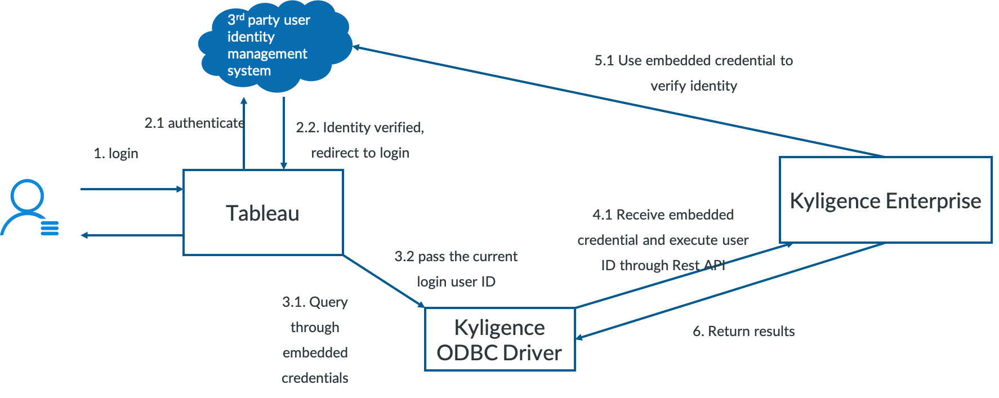
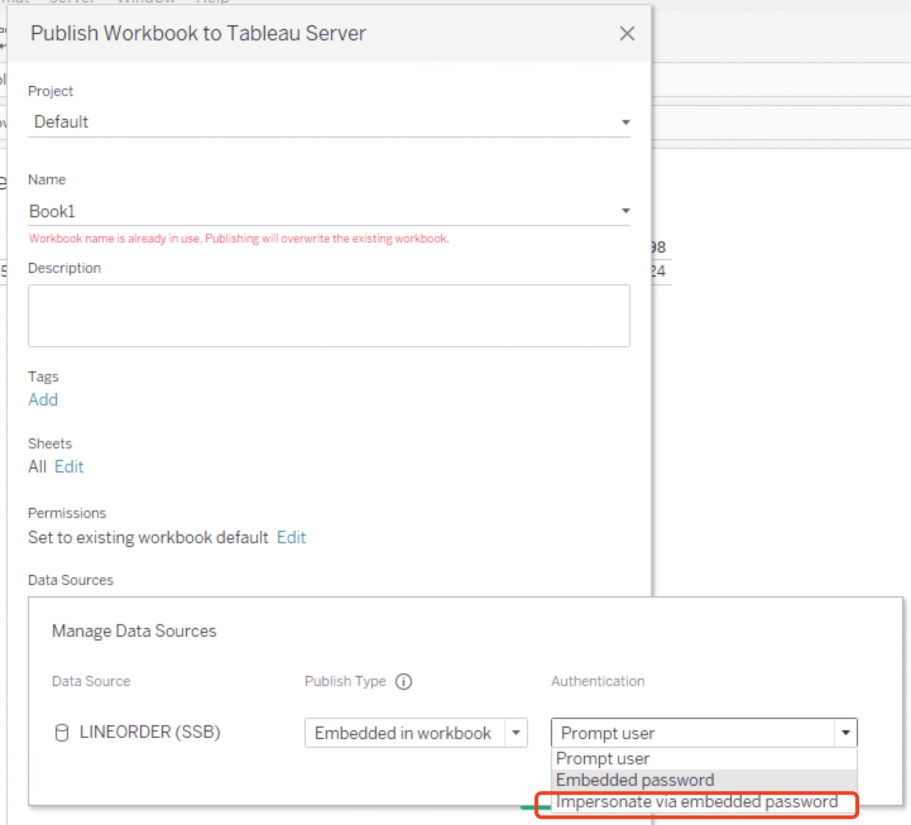
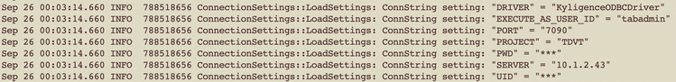

# User Delegation with Tableau Server

This document will guide you on how to configure Tableau user delegation with Kyligence Enterprise

In Kyligence Enterprise 3.4.5.2117 and above, you can use a authenticated user and delegate requests to another user by enabling Tableau Server to pass an Execute as user to the Kyligence Enterprise. As a result of this, the query will run on Kyligence Enterprise with the privileges of the Executed as user. 

There are two benefits of user delegation:

1. Tableau Server and Kyligence Enterprise user single sign-on
2. User can share the same data access on Tableau Server as the permission set in Kyligence Enterprise for row-level, column-level, table-level access control.

### Prerequisites

- You are using Tableau Desktop and Server 2019.4 and above.
- You are using Kyligence Enterprise 3.4.5.2117 and above
- You have installed Kyligence ODBC Driver 3.1.9 and above.
- You have configured the Kyligence connector on your Tableau Desktop and Tableau Server machine. 
- Ensure for each user, the Tableau Server username is the same as the username in Kyligence Enterprise. We call it an execute as user. You can set it locally in Tableau Server and Kyligence Enterprise, in LDAP or other 3rd-party user authentication systems.
- Set `kylin.query.query-with-execute-as` to `true` in the Kyligence Enterprise configuration file in `<Kyligence Enterprise Installation Directory\>/conf/kylin.properties`. Restart Kyligence Enterprise server to let the changes effective.

### Configure the delegation

The user delegation only works on Tableau Server. When you upload a workbook that using Kyligence connector as the data source to Tableau Server, please choose Impersonate via embedded password as the Authentication mode.

### Verify the user delegation is effective

If the user delegation is effective, you may see the Execute as user ID is passed in the ODBC log. You may learn [how to enable Kyligence ODBC log here](../../driver/odbc/win_odbc.en.md). 

### Troubleshooting

Below are the commonly found errors you may run into when enable the user delegation for Tableau Server, and we provided a explanation and a suggested resolution. If you run into more issues, please contact Kyligence Technical Support.

| **Error**                                                    | **Explanations**                                             | **Suggested Resolution**                                     |
| :----------------------------------------------------------- | :----------------------------------------------------------- | :----------------------------------------------------------- |
| EXECUTE_AS_USER_ID cannot be empty, please check its value in the Kyligence ODBC connection string. | Tableau did not pass the execute user id correctly.          | Please verify your have properly configure the Kyligence connector on your Tableau Server machine. Or provide your ODBC log to Kyligence Support |
| value of EXECUTE_AS_USER_ID cannot exceed 1024 characters.   | Execute user id has exceed the maximum allowed length of 1024 characters. | Please shorten the length of your user ID                    |
| KE-10024001(Access Denied): Access is denied"                | the current Tableau user has no access to the data source    | Grant access to the user in Kyligence Enterprise             |
| User [xxx] does not have permissions for all tables, rows, and columns in the project [xxx] and cannot use the executeAs parameter | The embedded credential when you upload the Tableau workbook does not have sufficient permission in the project in Kyligence Enterprise. | Use a user with no restriction on table-level, row-level and column-level in Kyligence Enterprise as the embedded credential. |
| User [xxx] in the executeAs field does not exist             | The execute user ID does not exist in Kyligence Enterprise   | Grant access to the user in Kyligence Enterprise             |