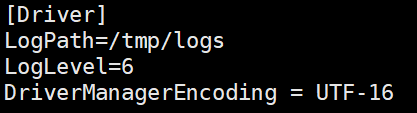

## Install & Configure Kyligence ODBC Driver on Linux

In this section, we will introduce how to install Kyligence ODBC driver (linux version) and configure DSN under Linux environment. 

### Install Dependency

We suggest using unixODBC(http://www.unixodbc.org/) as driver manager to manage ODBC connection info.

> **Caution:**  Since unixODBC 64 bit may cover some libs of unixODBC 32 bit which could cause conflict of dependencies, it is recommended to uninstall unixODBC 64 bit if you want to use Kyligence ODBC Driver for Linux 32 bit.

For different Linux systems:

1. For Redhat and CentOS, please refer to the following steps:

   * If you want to use Kyligence ODBC Driver for Linux 64 bit, please run following scripts to install unixODBC 64 bit

     `sudo yum install unixODBC-devel -y` 

   * If you want to use Kyligence ODBC Driver for Linux 32 bit, please install unixODBC 32 bit with following scripts in turns

     `sudo yum install unixODBC.i686 -y`

     `sudo yum install unixODBC-devel.i686 -y`

2. For Ubuntu, please refer to the following steps:

   * If you want to use Kyligence ODBC Driver for Linux 64 bit, please run following scripts to install unixODBC 64 bit

     `sudo apt-get install unixODBC-devel`

   * If you want to use Kyligence ODBC Driver for Linux 32 bit, please install unixODBC 32 bit with following scripts in turn

     `sudo apt-get install unixODBC.i686`

     `sudo apt-get install unixODBC-devel.i686`


### Download Kyligence ODBC Driver for Linux

You can download Kyligence ODBC driver (Linux version) from [Kyligence Account Center](http://account.kyligence.io).

### Install ODBC Driver

1. Uncompress package

   `tar zxf KyligenceODBC_linux.tar.gz`

   > **Note:** please **DONOT** uncompress Kyligence ODBC Driver under root folder, otherwise BI servers might be unable to access necessary files because of authoriztaion.

2. Check library dependency

   `cd ODBCDriver/`

   `ldd libKyligenceODBC64.so`

   > **Note:** If using Kyligence ODBC Driver for Linux 32 bit, please use `ldd libKyligenceODBC32.so` command to check library dependency.

   Expect output shall be:

   ```
    linux-vdso.so.1 =>  (0x00007fffca9eb000)
    librt.so.1 => /lib64/librt.so.1 (0x00007fe826b3f000)
    libdl.so.2 => /lib64/libdl.so.2 (0x00007fe82693b000)
    libm.so.6 => /lib64/libm.so.6 (0x00007fe8266b6000)
    libpthread.so.0 => /lib64/libpthread.so.0 (0x00007fe826499000)
    libc.so.6 => /lib64/libc.so.6 (0x00007fe826105000)
    lib64/ld-linux-x86-64.so.2 (0x00007fe829aac000)
   ```

    Bad output, which has "not found" libraries:

    ```
    linux-vdso.so.1 =>  not found
    librt.so.1 => /lib64/librt.so.1 (0x00007fe826b3f000)
    libdl.so.2 => /lib64/libdl.so.2 (0x00007fe82693b000)
    libm.so.6 => /lib64/libm.so.6 (0x00007fe8266b6000)
    libpthread.so.0 => /lib64/libpthread.so.0 (0x00007fe826499000)
    libc.so.6 => /lib64/libc.so.6 (0x00007fe826105000)
    lib64/ld-linux-x86-64.so.2 (0x00007fe829aac000)
    ```

### Create DSN (Linux 64bit) Using unixODBC

1. Add Kyligence ODBC to config files

   > **Note:** some BI tools also require the ODBC config files located in their own installation directory, such as **MicroStrategy** in [example section](#Example). Therefore, please set the configurations according to your BI tools.

   **Driver configuration** – /etc/odbcinst.ini

   ```
   [{DriverName}]
   APILevel=1
   ConnectFunctions=YYY
   Description={Description}
   Driver={DriverPath}
   Setup={DriverPath}
   DriverODBCVer=03.80
   SQLLevel=1
   Locale=en-US
   ```

   **DSN configuration** – /etc/odbc.ini 

   ```
   [{DSName}]
   Driver = {DriverName}
   PORT = {KE_Port}
   PROJECT = {KE_Project}
   SERVER = {KE_Url}
   ```

   Sample config: 

   **/etc/odbcinst.ini**

   ```
   [KyligenceODBC]
   APILevel=1
   ConnectFunctions=YYY
   Description=Sample 64-bit Kyligence ODBC Driver
   Driver=/home/kylin/KyligenceODBC/ODBC_DRIVER/libKyligenceODBC64.so
   Setup=/home/kylin/KyligenceODBC/ODBC_DRIVER/libKyligenceODBC64.so
   DriverODBCVer=03.80
   SQLLevel=1
   Locale=en-US
   ```

   **/etc/odbc.ini**

   ```
   [KyligenceDataSource]
   Driver = KyligenceODBC
   PORT = 80
   PROJECT = learn_kylin
   SERVER = http://kapdemo.chinaeast.cloudapp.chinacloudapi.cn
   ```

   > **Note:** please ensure DSN name in `odbc.ini` is consistent with DSN name in BI client tools, otherwise BI reports/applications cannot connect to data source when it's published to BI server.

2. Test connection with cmd tool "isql DSN [UID '[PWD]']

   `isql KyligenceDataSource ADMIN 'KYLIN'`

3. Send a query to test 

   `SQL> select count(*) from kylin_sales;`
   
   expected result:

   ```
   +---------------------+
   | EXPR$0              |
   +---------------------+
   | 4957                |
   +---------------------+
   SQLRowCount returns 1
   1 rows fetched
   ```

### Example

Here we use **MicroStrategy Linux Intelligence Server** as an example to explain how to create DSN.

1. From a Linux console window, browse to HOME_PATH, where HOME_PATH is the MicroStrategy Installation directory.

2. Open the `ODBC.ini` file to add new DSN to connect. 

    ```
    [DSN_Name]
    ConnectionType=Direct
    Driver=<ODBC_HOME>/libKyligenceODBC64.so
    PORT=<PORT_NUMBER>
    PROJECT=<PROJECT_NAME>
    SERVER=<SERVER_NAME>
    ```

3. To map the DSN with ODBC, add below setting on the top of your `ODBC.ini` file. 

    ```
    [ODBC Data Sources]
    <DSN_Name>=KyligenceODBC
    ```

    For example, you may configure your connection to DSN name *EAT1_WH* as below.

    ```
    [ODBC Data Sources]
    KyligenceDataSource=KyligenceODBC
    
    [EAT_WH1]
    ConnectionType=Direct
    Driver=/home/kylin/ODBCDriver/libKyligenceODBC64.so
    PORT=57070
    PROJECT=mstr
    SERVER=http://106.75.137.52
    ```

4. After you finished configuring the DSN, it is recommended to restart your MSTR Intelligence Server so that the new created DSN will be taken into effect. 

5. You can then connect to your MicroStrategy Linux I-Server and create a new database instance based on the DSN.

## Linux ODBC Driver Logging

You can enable logging in the driver to track activity and troubleshoot issues.

**Important:** Only enable logging long enough to capture an issue. Logging decreases performance and can consume a large quantity of disk space.

1. Open the driver configuration file in a text editor.
   For example,  you would open the  {ODBC installed path}/kyligence.odbc.ini

2. Information on all of the Log Levels is listed below.  6  is best in most cases.

   - **0** disables all logging.
   - **1** logs very severe error events that might lead the driver to abort.
   - **2**  logs error events that might still allow the driver to continue running.
   - **3**  logs potentially harmful situations.
   - **4**  logs general information that describes the progress of the driver.
   - **5**  logs detailed information that is useful for debugging the driver.
   - **6 (TRACE)** logs more detailed information than log level 5.

3. For example: **LogLevel=6**

4. Set the LogPath attribute to the full path to the folder where you want to save log files.  This directory mus exist and be writable, including being writable by other users if the application using the driver runs as a specific user.
   For example: **LogPath=/localhome/username/Documents**

         

5. Set the LogFileCount attribute to the maximum number of log files to keep.
   For example: **LogFileCount=5**

   > **Note**: After the maximum number of log files is reached, each time an additional file is created, the driver deletes the oldest file.

6. Set the LogFileSize attribute to the maximum size of each log file in megabytes (MB).
   For example: **LogFileSize=20**

   > **Note:** After the maximum file size is reached, the driver creates a new file and continues logging.

7. Save the driver configuration file.

8. Restart the application you are using the driver with.  Configuration changes will not be picked up by the application until it reloads the driver.

### FAQ

**Q: If isql test failed, what should I do?**

Please type `isql -v DSN [UID '[PWD]']` to get more information, and then check the configurations are correct or not including odbc.ini and odbcinst.ini.

Here is an example that the Configuration `SERVER` is written as `SEVER` by mistake.

Run command `isql -v KyligenceDataSource ADMIN 'KYLIN'`.

Then you can see the error message as below:

```
[08001][unixODBC][Simba][ODBC](10380) Unable to establish connection with data source. Missing settings: {[SERVER]}
[ISQL]ERROR: Could not SQLConnect
```


**Q: Isql test failed with error message "Can't open lib '/usr/local/ODBCDriver/libKyligenceODBC32.so' : file not found", but the file actually exists**

This is usually caused by conflict of dependencies with unixODBC 64 bit installed, you need to uninstall unixODBC 64bit. 

You can run `odbcinst -j` to know the information of unixODBC installed.

For unixODBC 32 bit, you can see following message:

```
unixODBC 2.2.14
DRIVERS............: /etc/odbcinst.ini
SYSTEM DATA SOURCES: /etc/odbc.ini
FILE DATA SOURCES..: /etc/ODBCDataSources
USER DATA SOURCES..: /root/.odbc.ini
SQLULEN Size.......: 4
SQLLEN Size........: 4
SQLSETPOSIROW Size.: 2
```

For unixODBC 64 bit, you can see following message:

```
unixODBC 2.2.14
DRIVERS............: /etc/odbcinst.ini
SYSTEM DATA SOURCES: /etc/odbc.ini
FILE DATA SOURCES..: /etc/ODBCDataSources
USER DATA SOURCES..: /root/.odbc.ini
SQLULEN Size.......: 8
SQLLEN Size........: 8
SQLSETPOSIROW Size.: 8
```


**Q: How to uninstall unixODBC**

First you need to use command `yum list installed | grep unixODBC` to know the package name of unixODBC you installed; Second, you need to use `sudo yum remove {package name}` to uninstall unixODBC.

Here is an example for uninstalling unixODBC 64 bit:

Run command `yum list installed | grep unixODBC` and you can see the following message:

```
unixODBC.x86_64           2.2.14-14.el6           @base
unixODBC-devel.x86_64     2.2.14-14.el6           @base
```

Then use following command in turns to uninstall unixODBC 64 bit:

```sh
sudo yum remove unixODBC-devel.x86_64
```

```sh
sudo yum remove unixODBC.x86_64
```

**Q: Error message with (11560) Unable to locate SQLGetPrivateProfileString function.**

Please run the following command to resolve this problem:   

```
export LD_PRELOAD=/usr/lib/libodbcinst.so
```
