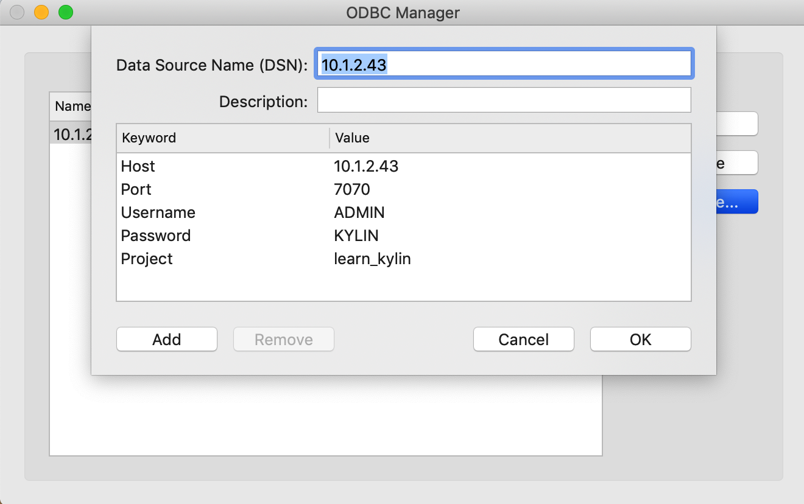

## Install & Configure Kyligence ODBC Driver on Mac

In this section, we will introduce how to install Kyligence ODBC driver (Mac version) and configure DSN via ODBC Manager or unixODBC on Mac OS. 

### Install using ODBC Manger

- #### Install Kyligence ODBC Driver 

1. You can download Kyligence ODBC driver (Mac version) from [Kyligence Account ](http://account.kyligence.io) 

2. Uncompress package

   ```
   tar -zxf KyligenceODBC_MacOS.tar.gz
   ```

> **Caution:** please **DONOT** uncompress Kyligence ODBC Driver under root folder, otherwise BI servers might be unable to access necessary files because of authoriztaion.

- #### Install ODBC Manger


1. You can download Mac OS ODBC Manager from  [ODBC Manager](http://www.odbcmanager.net) , and install it.

2. Enter the ~/Library/ODBC folder, give the login user read and write permissions to odbc.ini, odbcinst.ini 

   ```
   sudo chown -R {UserName} odbc.ini
   sudo chown -R {UserName} odbcinst.ini
   ```

>**Caution:** If there is no ODBC folder under ~/Library/ after installation, please create it manually and initialize the configuration odbcinst.ini, odbc.ini
>
>```
>mkdir ODBC
>cd ODBC
>touch odbcinst.ini
>touch odbc.ini
>```
>
>**Driver Configuration** –  /Library/ODBC/odbcinst.ini
>
>```
>[ODBC Drivers]
>[{DriverName}] = Installed
>
>[{DriverName}]
>Driver={DriverPath}
>```
>
>**DSN Configuration** – /Library/ODBC/odbc.ini 
>
>```
>[ODBC Data Sources]
>{DSNName} = {DriverName}
>
>[{DSNName}]
>Driver = {DriverPath}
>Host = {KE_Url}
>Port = {KE_Port}
>Project = {KE_Project}
>```
>
>Sample Config： 
>
>~/Library/ODBC/odbcinst.ini
>
>```
>[ODBC Drivers]
>KyligenceODBCDriver = Installed
>
>[KyligenceODBCDriver]
>Driver = /Library/KyligenceODBCLib/libKyligenceODBC64.dylib
>```
>
>~/Library/ODBC/odbc.ini
>
>```
>[ODBC Data Sources]
>KyligenceDataSource = KyligenceODBCDriver
>
>[KyligenceDataSource]
>Driver = /Library/KyligenceODBCLib/libKyligenceODBC64.dylib
>Host = http://kapdemo.chinaeast.cloudapp.chinacloudapi.cn
>Port = 7070
>Project = learn_kylin
>```
>
>After configured, you can use it directly in the BI tool，and You can skip the following steps to configure the Driver and DSN.

- #### Configure KyligenceODBCDriver

  Open ODBC Manger, go to the "Drivers" page, click "Add" 

  > **Caution:** Make sure the Driver Name is "KyligenceODBCDriver"

  Enter Driver Name: "KyligenceODBCDriver", select local Kyligence ODBC Driver， click "OK"

  

- #### Configure DSN

  Go to the "System DSN" or "User DSN" page and click on "Add"

  

  Select "KyligenceODBCDriver"

  

  After confirming, enter the Host, Port, Project and other information, click "OK"

  - Host: Kyligence Enterprise server address
  - Port: Kyligence Enterprise server port number
  - Username: username to login Kyligence Enterprise
  - Password: password to login Kyligence Enterprise 
  - Project: the name of the Kyligence Enterprise project to use for the query

  

### Install using unixODBC

- #### Install unixODBC 

  We suggest using unixODBC(http://www.unixodbc.org/) as driver manager to manage ODBC connection info.

  ```
  brew install unixODBC
  ```

  After the installation is complete, execute the following command to confirm whether the result is /usr/local/bin/isql

  ```
  which isql 
  ```

  Execute the following command to confirm whether the DRIVERS path is /usr/local/etc/odbcinst.ini, and confirm that the SYSTEM DATA SOURCES path is /usr/local/etc/odbc.ini

  ```
  odbcinst -j
  ```

- #### Configure KyligenceODBCDriver

  Add Kyligence ODBC to config files

  **Driver Configuration** –   /usr/local/etc/odbcinst.ini 

  ```
  [{DriverName}]
  APILevel=1
  ConnectFunctions=YYY
  Description={Description}
  Driver={DriverPath}
  Setup={DriverPath}
  DriverODBCVer=03.80
  SQLLevel=1
  Locale=en-US
  ```

- #### Configure DSN

  **DSN Configuration** – /usr/local/etc/ODBC/odbc.ini 

  ```
  [{DSName}]
  Driver = {DriverName}
  SERVER = {KE_Url}
  PORT = {KE_Port}
  PROJECT = {KE_Project}
  ```

  Sample config: 

  **/etc/odbcinst.ini**

  ```
  [KyligenceODBCDriver]
  APILevel=1
  ConnectFunctions=YYY
  Description=Sample 64-bit Kyligence ODBC Driver
  Driver=/Library/KyligenceODBCLib/libKyligenceODBC64.dylib
  Setup=/Library/KyligenceODBCLib/libKyligenceODBC64.dylib
  DriverODBCVer=03.80
  SQLLevel=1
  Locale=en-US
  ```

  **/etc/odbc.ini**

  ```
  [KyligenceDataSource]
  Driver = KyligenceODBCDriver
  SERVER = http://kapdemo.chinaeast.cloudapp.chinacloudapi.cn
  PORT = 7070
  PROJECT = learn_kylin
  ```

- #### Query verification

1. Test connection with cmd tool "isql DSN [UID '[PWD]']

   ```
   isql KyligenceDataSource ADMIN 'KYLIN'`
   ```

2. Send a query to test  

   ```
   SQL> select count(*) from kylin_sales;
   ```

   If the connection is successful, the following result will be returned

   ```
   +---------------------+
   | EXPR$0              |
   +---------------------+
   | 10000               |
   +---------------------+
   SQLRowCount returns 1
   1 rows fetched
   ```

- #### Copy the ini file to /Library/ODBC

  ```
  sudo cp /usr/local/etc/odbcinst.ini /Library/ODBC/
  sudo cp /usr/local/etc/odbcinst.ini /Library/ODBC/
  sudo chown -R {UserName} odbc.ini
  sudo chown -R {UserName} odbcinst.ini
  ```

  > **Caution:**：If your native environment does not have a /Library/ODBC folder, you need to create it manually.

  ```
  cd /Library
  sudo mkdir /ODBC
  ```

### FAQ

**Q: How to uninstall unixODBC**

Enter the command `brew uninstall unixodbc ` and you can see the following information:

```
Uninstalling /usr/local/Cellar/unixodbc/2.3.7... (46 files, 1.8MB)
```

