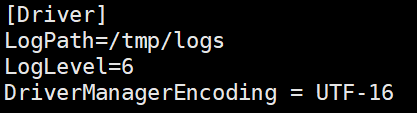

## Install & Configure Kyligence ODBC Driver on Mac

In this section, we will introduce how to install Kyligence ODBC driver (Mac version) and configure driver via ODBC Manager or unixODBC on Mac OS.

### Install Kyligence ODBC Driver

1. You can download Kyligence ODBC driver (Mac version) from [Kyligence Account ](http://account.kyligence.io/).

2. Install driver with installer, follow instructions, the driver will be installed to /Library/ODBC/KyligenceODBCDriver/ .

   > **Caution:** the installer will require user password during installing process, in order to install driver files, implement odbcinst.ini and odbc.ini files and give login user read and write permissions. For users who upgrade from an old version, a manual remove of the old installation may be required. See more details in FAQ.

### Configure Driver with ODBC Manger

You can download Mac OS ODBC Manager from [ODBC Manager](http://www.odbcmanager.net/) , and install it.

- #### Configure Driver

1. Open ODBC Manger, go to the "Drivers" page, click "Add".

   > **Caution:** Driver name can be customized. Key words like "Kyligence", "ODBC", "Driver" are recommended. "KyligenceODBCDriver" is chosen as driver name in the this example.

   

2. Enter Driver Name: "KyligenceODBCDriver", select local Kyligence ODBC Driver， click "OK".

   

   

- #### Configure DSN

1. Go to the "System DSN" or "User DSN" page and click on "Add".

   

2. Select "KyligenceODBCDriver".

   

3. After confirming, enter the Host, Port, Project and other information, click "OK".

   - Host: Kyligence Enterprise server address
   - Port: Kyligence Enterprise server port number
   - Username: username to login Kyligence Enterprise
   - Password: password to login Kyligence Enterprise
   - Project: the name of the Kyligence Enterprise project to use for the query

   

4. Use BI tool establish a connection. You can skip the following steps of configuring the driver.

### Configure Driver by Editing Files

> **Driver Configuration** – /Library/ODBC/odbcinst.ini
>
> ```
> [ODBC Drivers]
> [{DriverName}] = Installed
> 
> [{DriverName}]
> Driver={DriverPath}
> ```
>
> **DSN Configuration** – /Library/ODBC/odbc.ini
>
> ```
> [ODBC Data Sources]
> {DSNName} = {DriverName}
> 
> [{DSNName}]
> Driver = {DriverPath}
> Host = {KE_Url}
> Port = {KE_Port}
> Project = {KE_Project}
> ```
>
> Sample Configurations:
>
> /Library/ODBC/odbcinst.ini
>
> ```
> [ODBC Drivers]
> KyligenceODBCDriver = Installed
> 
> [KyligenceODBCDriver]
> Driver = /Library/ODBC/KyligenceODBCDriver/libKyligenceODBC64.dylib
> ```
>
> /Library/ODBC/odbc.ini
>
> ```
> [ODBC Data Sources]
> KyligenceDataSource = KyligenceODBCDriver
> 
> [KyligenceDataSource]
> Driver = /Library/ODBC/KyligenceODBCDriver/libKyligenceODBC64.dylib
> Host = http://kapdemo.chinaeast.cloudapp.chinacloudapi.cn
> Port = 7070
> Project = learn_kylin
> ```
>
> After configured, you can use it directly in the BI tool, and You can skip the following steps to configure the Driver and DSN.

### Install using unixODBC

- #### Install unixODBC

1. We suggest using unixODBC(<http://www.unixodbc.org/>) as driver manager to manage ODBC connection info.

   ```
   brew install unixODBC
   ```

2. After the installation is complete, execute the following command to confirm whether the result is /usr/local/bin/isql .

   ```
   which isql 
   ```

3. Execute the following command to confirm whether the DRIVERS path is /usr/local/etc/odbcinst.ini, and confirm that the SYSTEM DATA SOURCES path is /usr/local/etc/odbc.ini .

   ```
   odbcinst -j
   ```

- #### Configure KyligenceODBCDriver

  Add Kyligence ODBC to config files.

  **Driver Configuration** – /usr/local/etc/odbcinst.ini

  ```
  [{DriverName}]
  APILevel=1
  ConnectFunctions=YYY
  Description={Description}
  Driver={DriverPath}
  Setup={DriverPath}
  DriverODBCVer=03.80
  SQLLevel=1
  Locale=en-US
  ```

- #### Configure DSN

  **DSN Configuration** – /usr/local/etc/ODBC/odbc.ini

  ```
  [{DSName}]
  Driver = {DriverName}
  SERVER = {KE_Url}
  PORT = {KE_Port}
  PROJECT = {KE_Project}
  ```

  Sample config:

  **/etc/odbcinst.ini**

  ```
  [KyligenceODBCDriver]
  APILevel=1
  ConnectFunctions=YYY
  Description=Sample 64-bit Kyligence ODBC Driver
  Driver=/Library/ODBC/KyligenceODBCDriver/libKyligenceODBC64.dylib
  Setup=/Library/ODBC/KyligenceODBCDriver/libKyligenceODBC64.dylib
  DriverODBCVer=03.80
  SQLLevel=1
  Locale=en-US
  ```

  **/etc/odbc.ini**

  ```
  [KyligenceDataSource]
  Driver = KyligenceODBCDriver
  SERVER = http://kapdemo.chinaeast.cloudapp.chinacloudapi.cn
  PORT = 7070
  PROJECT = learn_kylin
  ```

- #### Query verification

1. Test connection with cmd tool "isql DSN [UID '[PWD]']:

   ```
   isql KyligenceDataSource ADMIN 'KYLIN'
   ```

2. Send a query to test:

   ```
   SQL> select count(*) from kylin_sales;
   ```

   If the connection is successful, the following result will be returned:

   ```
   +---------------------+
   | EXPR$0              |
   +---------------------+
   | 10000               |
   +---------------------+
   SQLRowCount returns 1
   1 rows fetched
   ```

- #### Copy the ini file to /Library/ODBC

  ```
  sudo cp /usr/local/etc/odbc.ini /Library/ODBC/
  sudo cp /usr/local/etc/odbcinst.ini /Library/ODBC/
  sudo chown -R {UserName} odbc.ini
  sudo chown -R {UserName} odbcinst.ini
  ```

  > **Caution:** If your native environment does not have a /Library/ODBC folder, you need to create it manually.

  ```
  cd /Library
  sudo mkdir /ODBC
  ```

## Mac ODBC Driver Logging

You can enable logging in the driver to track activity and troubleshoot issues.

**Important:** Only enable logging long enough to capture an issue. Logging decreases performance and can consume a large quantity of disk space.

1. Open the driver configuration file in a text editor.
   For example,  you would open the  {ODBC installed path}/kyligence.odbc.ini

2. Information on all of the Log Levels is listed below.  6  is best in most cases.

   - **0** disables all logging.
   - **1** logs very severe error events that might lead the driver to abort.
   - **2**  logs error events that might still allow the driver to continue running.
   - **3**  logs potentially harmful situations.
   - **4**  logs general information that describes the progress of the driver.
   - **5**  logs detailed information that is useful for debugging the driver.
   - **6 (TRACE)** logs more detailed information than log level 5.

3. For example: **LogLevel=6**

4. Set the LogPath attribute to the full path to the folder where you want to save log files.  This directory mus exist and be writable, including being writable by other users if the application using the driver runs as a specific user.
   For example: **LogPath=/localhome/username/Documents**

         

5. Set the LogFileCount attribute to the maximum number of log files to keep.
   For example: **LogFileCount=5**

   > **Note**: After the maximum number of log files is reached, each time an additional file is created, the driver deletes the oldest file.

6. Set the LogFileSize attribute to the maximum size of each log file in megabytes (MB).
   For example: **LogFileSize=20**

   > **Note:** After the maximum file size is reached, the driver creates a new file and continues logging.

7. Save the driver configuration file.

8. Restart the application you are using the driver with.  Configuration changes will not be picked up by the application until it reloads the driver.

### FAQ

**Q: How to uninstall unixODBC**

Enter the command `brew uninstall unixodbc ` and you can see the following information:

```
Uninstalling /usr/local/Cellar/unixodbc/2.3.7... (46 files, 1.8MB)
```

