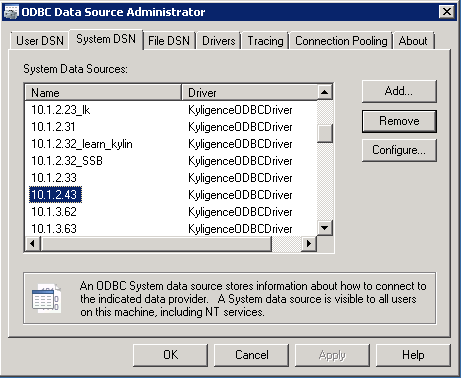
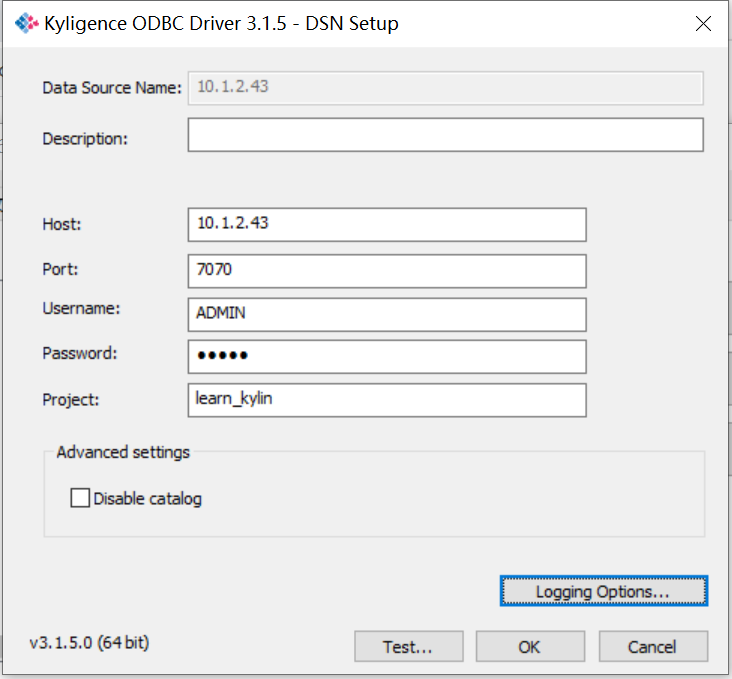
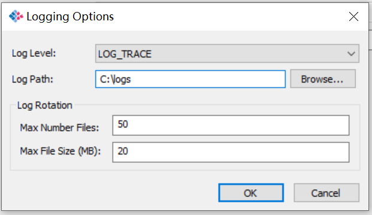

## Install & Configure Kyligence ODBC Driver on Windows

In this chapter, we will take Windows 7 as an example to introduce how to install Kyligence ODBC driver (windows version) and do follow-up configuration steps. 

## Prerequisites

1. Microsoft Visual C++ 2015

   During the installation of Kyligence ODBC Driver, Microsoft VC++ will be installed first and redistributable is already embedded in the installation package. If Microsoft Visual C++ 2015 is already installed on your machine, this step will be skipped.

2. A running Kyligence Enterprise server

   Kyligence ODBC Driver will connect to a Kyligence Enterprise server to verify whether the connection works, so make sure the Kyligence Enterprise is running properly.

## Installation

1. If you have previously installed Kyligence ODBC driver, please uninstall it first.

2. Apply and [Download](http://account.kyligence.io) Kyligence ODBC driver, and install it.

   - For 32-bit application, please install and use kyligence_odbc.x86.exe

   - For 64-bit application, Please install and use kyligence_odbc.x64.exe

## Configure the DSN

1. Open ODBC Data Source Manager:

   32-bit ODBC driver: click **start -> operation** to open C:\Windows\SysWOW64\odbcad32.exe

   64-bit ODBC driver: select **Control Panel -> Administrative Tools** to open **ODBC Data Source Administrator**

2. Switch to **System DSN** tab, click **Add** and select **KyligenceODBCDriver** in the pop-up driver selection box, then click **Finish**.

   

3. In the pop-up window, input the Kyligence Enterprise server information, as shown in the figure:

    

   Where, the parameters are described as below: 

   * Data Source Name: name of data source
   * Description：Description of data source
   * Host: Kyligence Enterprise server address
   * Port: Kyligence Enterprise server port number
   * Username: username to login Kyligence Enterprise
   * Password: password to login Kyligence Enterprise 
   * Project: the name of the Kyligence Enterprise project to use for the query
   * Disable catalog：Whether to disable the catalog layer, the default is **enable** state, If you choose to disable catalog, check this option.

4. Click **Test**

   Once it connects to the data source successfully, the following dialog will appear.

   

## Enabling the catalog layer

   the BI tool which need to **diable** the catalog layer：Cognos

   the BI tool which need to **Enable** the catalog layer：OBIEE

## ODBC Connection String

Some BI tools support connect data source with ODBC connection string. In that case, you may use below connection string as reference:

```
DRIVER={KyligenceODBCDriver};SERVER=locahost;PORT=7070;PROJECT=learn_kylin
```

> **Note:** Please replace *SERVER*, *PORT* and *PROJECT* with your Kyligence Enterprise settings.

### Windows ODBC Driver Logging - Using the logging dialog box

You can enable logging in the driver to track activity and troubleshoot issues.

**Important:** Only enable logging long enough to capture an issue. Logging decreases performance and can consume a large quantity of disk space.

1. Select **Control Panel -> Administrative Tools** to open **ODBC Data Source Administrator**
2. Select the DSN for which you want to log connection activity, and then click **Configure**



1. In the DSN Setup dialog box, click **Logging Options**

   

2. Information on all of the Log Levels is listed below.  LOG_TRACE is best in most cases.

   - **LOG_OFF** disables all logging.
   - **LOG_FATAL** logs very severe error events that might lead the driver to abort.
   - **LOG_ERROR** logs error events that might still allow the driver to continue running.
   - **LOG_WARNING** logs potentially harmful situations.
   - **LOG_INFO** logs general information that describes the progress of the driver.
   - **LOG_DEBUG** logs detailed information that is useful for debugging the driver.
   - **LOG_TRACE** logs more detailed information than the LOG_DEBUG level.

3. In the Log Path (or Log Directory) field, type the full path to the folder where you want to save log files.

   

4. In the Max Number Files field, type the maximum number of log files to keep.

   > **Note:** After the maximum number of log files is reached, each time an additional file is created, the driver deletes the oldest file.

5. In the Max File Size field, type the maximum size of each log file in megabytes (MB).

   > **Note:** After the maximum file size is reached, the driver creates a new file and continues logging.

6. Click **OK** to close the Logging Options dialog box.

7. Click **OK** to save your settings and close the DSN Configuration dialog box.

   > **Note:** Configuration changes will not be saved or picked up by the driver until you have clicked **OK** in the DSN Configuration dialog box.Clicking **Cancel** button will result in the changes being discarded.

8. Restart the application you are using the driver with.  Configuration changes will not be picked up by the application until it reloads the driver.

## Other Reminders

If you want to use Kyligence ODBC driver to connect to Kyligence Enterprise in other client applications, the configuration is similar to this example. For more information, please see [Connect with BI tools](../../bi/README.md) chapter of Kyligence Enterprise Manual.
