## Integrate with Excel

In this section, we will introduce you how to analyze data from Kyligence Enterprise using Excel. With this method, you will be able to query data in **Kyligence Enterprise** through MDX Service without importing data to Excel. 

### How It Works

Excel connect to MDX Service through SSAS interface, using XMLA protocol. MDX Service will parse the MDX queries sent from excel as SQL statements, and use JDBC to query Kyligence Enterprise. The query result will be converted and transferred to Excel through MDX Service. 

### Prerequisite

1. Install MDX Service

2. Your Excel version is 2007 or above

### Deploy MDX Service

+ Download [MDX Service](http://download.kyligence.io) binary package(in **Extension** tab), and copy it to your environment.

  > **Note:** We suggest you to install MDX Service on the same environment as Kyligence Enterprise.

+ Uncompress MDX Service binary package 

  `tar -xvf MDX Service-{version}.tar.gz`
  
+ Config mdx properties 

  `vi mdx-server-{version}/conf/mdx/properties`

  |Configuration|Description|Default value|Comment|
  | :------| :------| :------| :------|
  |kyligence.host|Kyligence Enterprise host|localhost||
  |kyligence.port|Kyligence Enterprise port|7070| |
  |kyligence.protocol|connect protocol|http| If you need to connect Kyligence Enterprise with https, please set this value to https. |
  |mdx.calculate.total.need|whether to enable calculate total/subtotal|true|If disable, the returned result will not carry total/subtoal，and query more faster. If you add a request parameter to the url, `needCalculateTotal=false`, it will also disable calculate total/subtotal, and will ignore this config in mdx.properties. Example url (http://localhost:7080/mdx/xmla/learn_kylin?needCalculateTotal=false)|
  |mdx.optimize.enable|whether to enable optimize mdx query|true|If you add a request parameter to the url, `enableOptimizeMdx=true`, it will also open MDX optimization, and will ignore this config in mdx.properties. Example url(http://localhost:7080/mdx/xmla/learn_kylin?enableOptimizeMdx=true)|
  |mdx.session.ip_cache.enable|whether to enable IP cache|true|If you add a request parameter to the url, `enableIPCache=true`, this feature also takes effect. When this feature is turned on, you do not need to enter the password twice during the connection to Excel, but it may cause the two users in the same project to share the session under the same Excel client.|

+ Start MDX Service 

  `./start-mdx.sh`
  
  > **Note:**
  >
  > 1.the default http port of MDX Service is 7080, if there is conflict with this port, please modify the default port in `tomcat/conf/server.xml`
  >
  > 2.Starting mdx for the first time will automatically download the dependency package mondrian-kylin. If the environment is networkless, you need to manually download the mondrian dependencies and copy them to the `tomcat/webapps/mdx/WEB-INF/lib` directory. [click here to download](http://repository.kyligence.io:8081/repository/maven-releases/pentaho/mondrian/mdx-1.0/mondrian-mdx-1.0.jar)

+ Stop MDX Service 

  `./stop-mdx.sh`

### Excel connect to MDX Service

1. Choose **data** -> **from Analysis Services**

   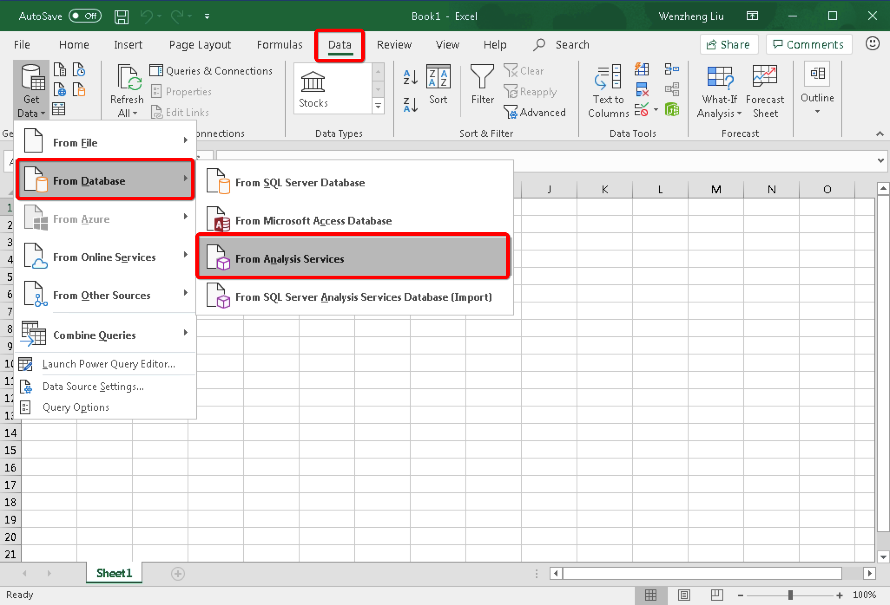

2. Next, you need to fill in the address information of the connection MDX Service in the `Server name` column, the sample is as follows:

   `http:// {host}:{port} / mdx / xmla / {project}`
   
   MDX Service default HTTP port is 7080. The username and password are your **Kyligence Enterprise** login username and password.

   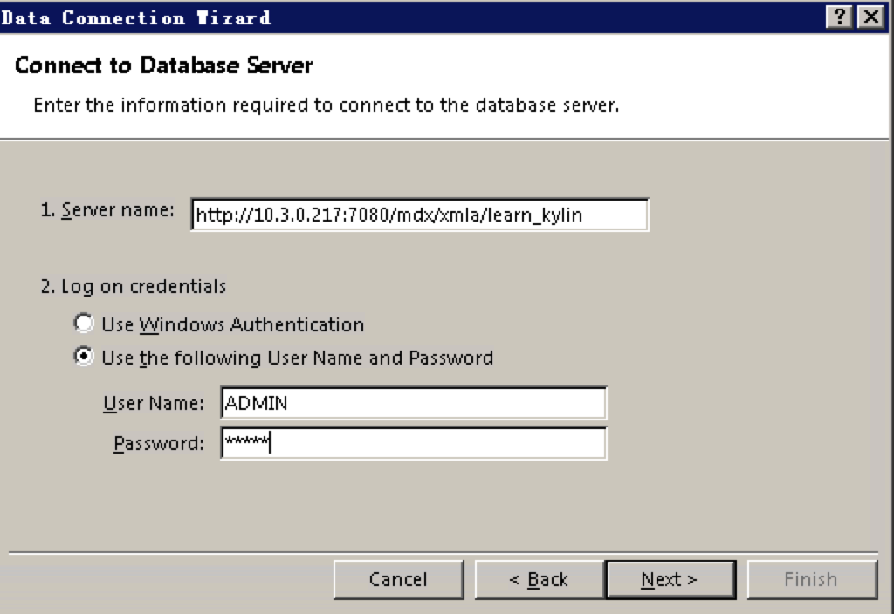

3. Now that cube is connected to Excel, click Next.

   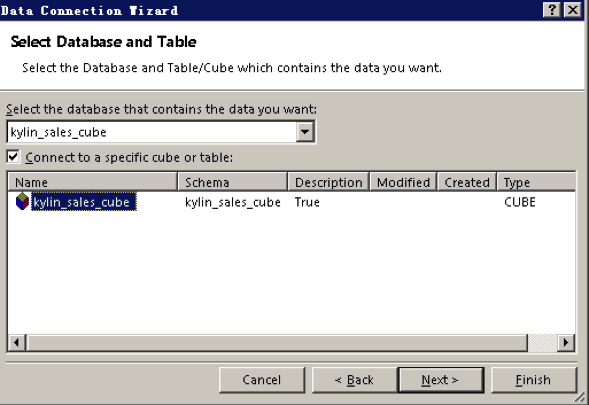

4. Check `Alwayls attemp to use this file to refresh data`

   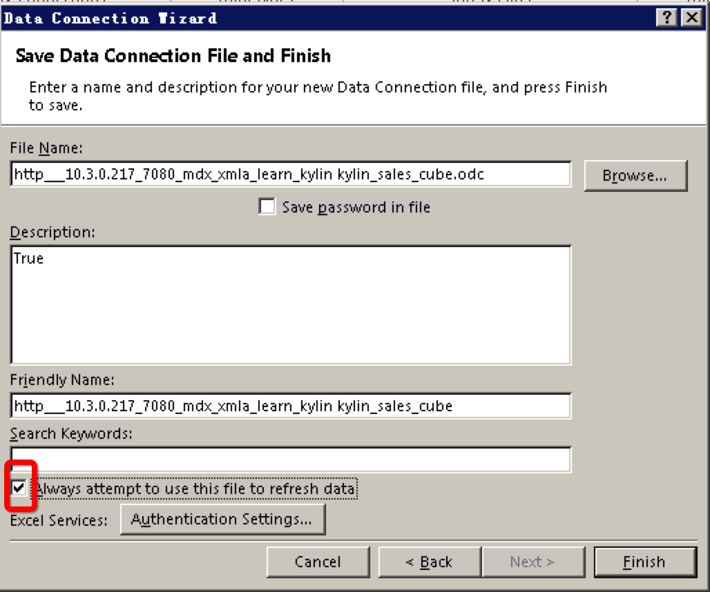

5. Now you can analyze Kyligence's Cube using Excel PivotTable.

   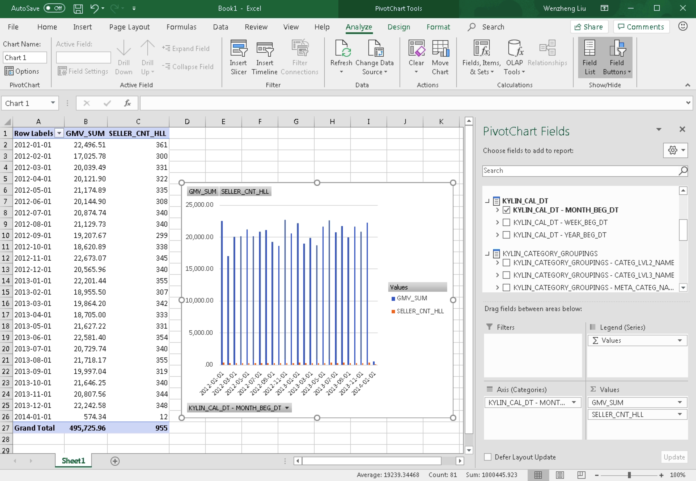

### How to Upgrade MDX Service

1. Stop the currently running MDX Service.

   `./stop-mdx.sh`
   
2. Rename the MDX Service installation directory.

   `mv MDX Service-{version} MDX Service.old`
   
3. Uncompress the new version of MDX Service.

   `tar -xvf MDX Service-{new_version}`
  
4. Copy the original configuration file to the new MDX Service.
  
   `cp -rf MDX Service.old/conf MDX Service-{new_version}`
   
5. Start MDX Service.
  
   `./start-mdx.sh`

### How to Connect MDX Service Using HTTPS

1. Create SSL keys and certificates

   + Use the following command in the mdx-server directory to generate the secret key.

     `keytool -genkeypair -alias "tomcat" -keyalg "RSA" -keystore "tomcat.keystore" -validity 9999`

     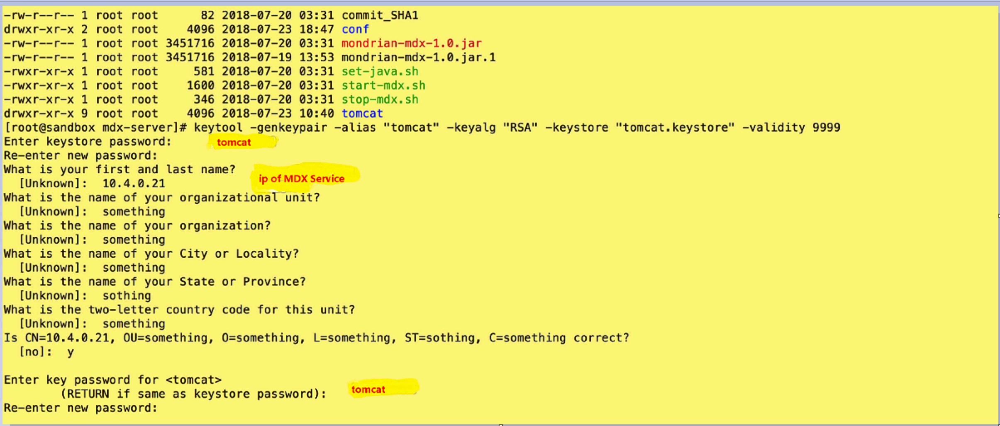

   + After the key is generated, it is saved in the current directory.
   
     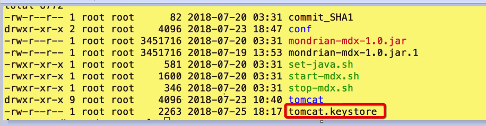

   + Use the following command to generate a certificate `tomcat.crt`.

     `keytool -export -alias tomcat -keystore tomcat.keystore -file tomcat.crt -storepass tomcat`
   
     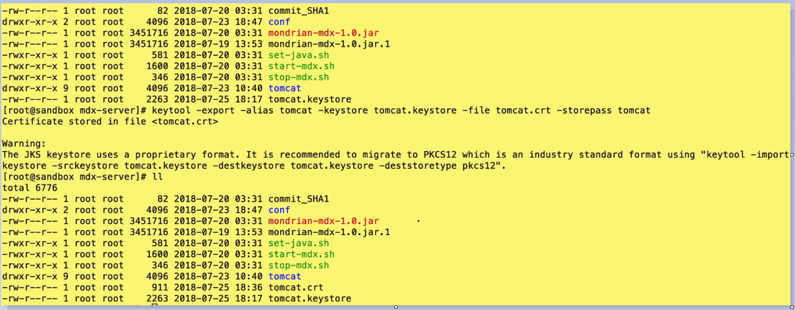

2. Install the certificate in the excel environment

   Copy the certificate just generated to the environment where Excel is installed, then double-click the certificate to start the installation.
   
   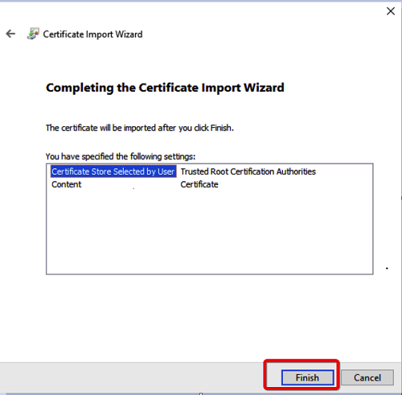 
   
   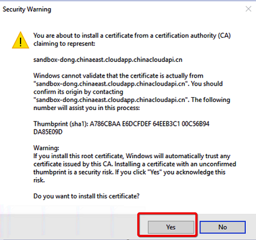  

3. Restart MDX Service

   After installing the certificate, you need to restart the MDX Service.
   
   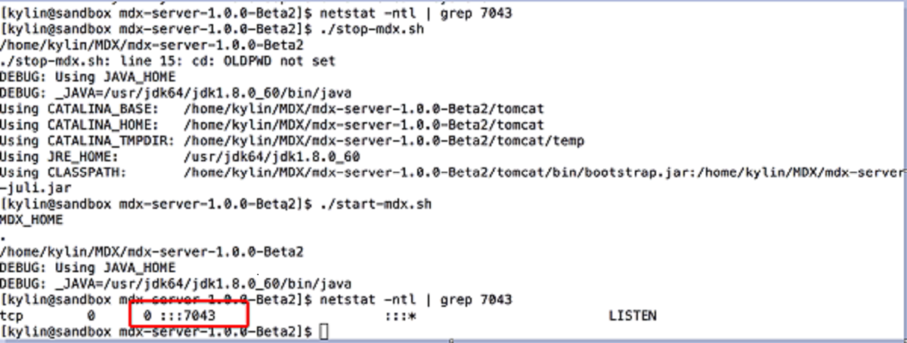

4. Use https protocol to connect MDX Service

   The default port of https for MDX Service is 7043. The connect url template is as follows.
   
   `https://{host}:7043/mdx/xmla/{project}`
   
   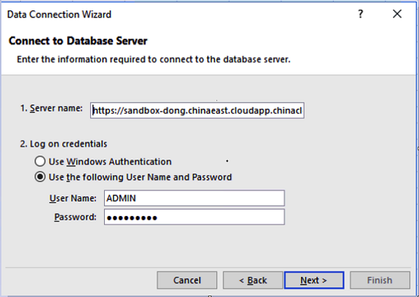 

