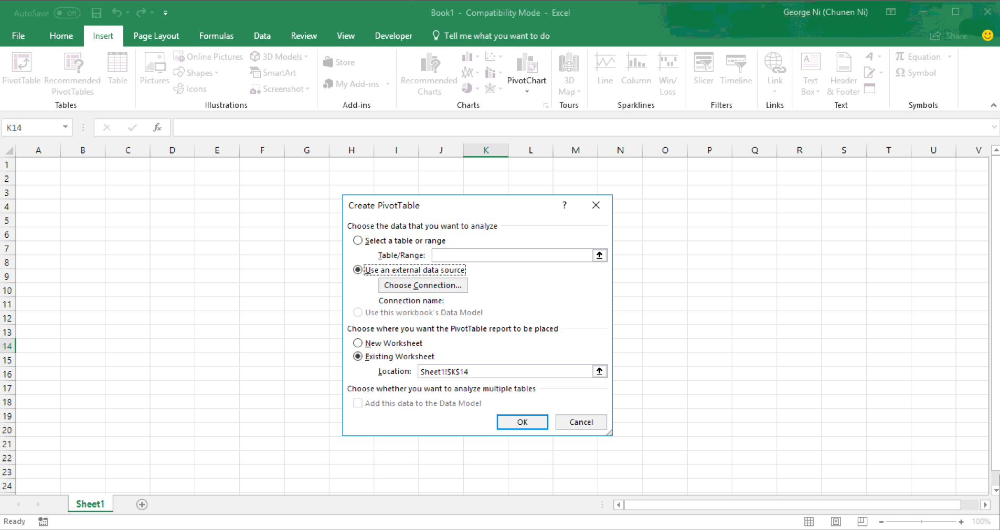
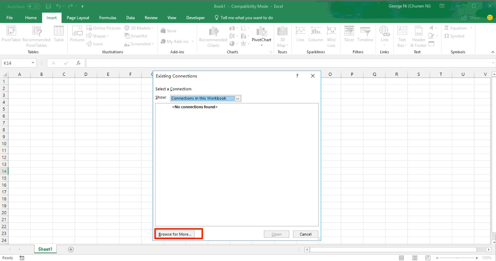
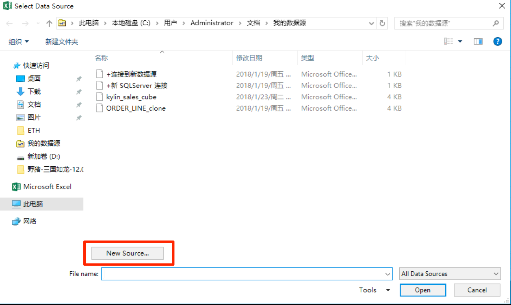
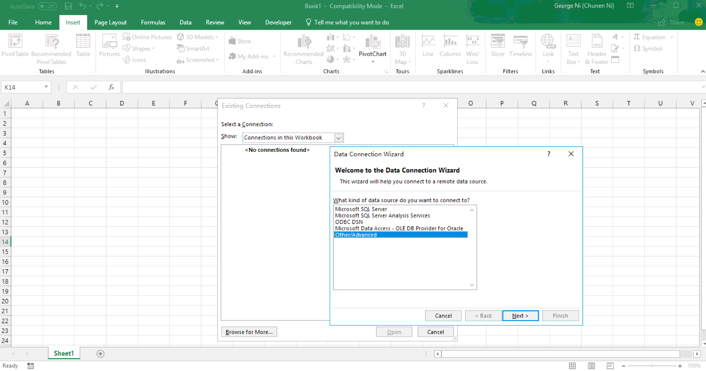
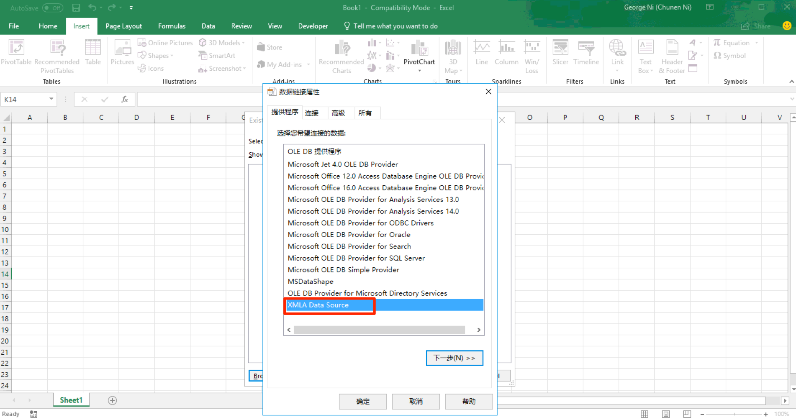
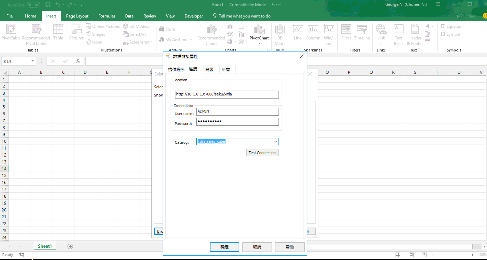
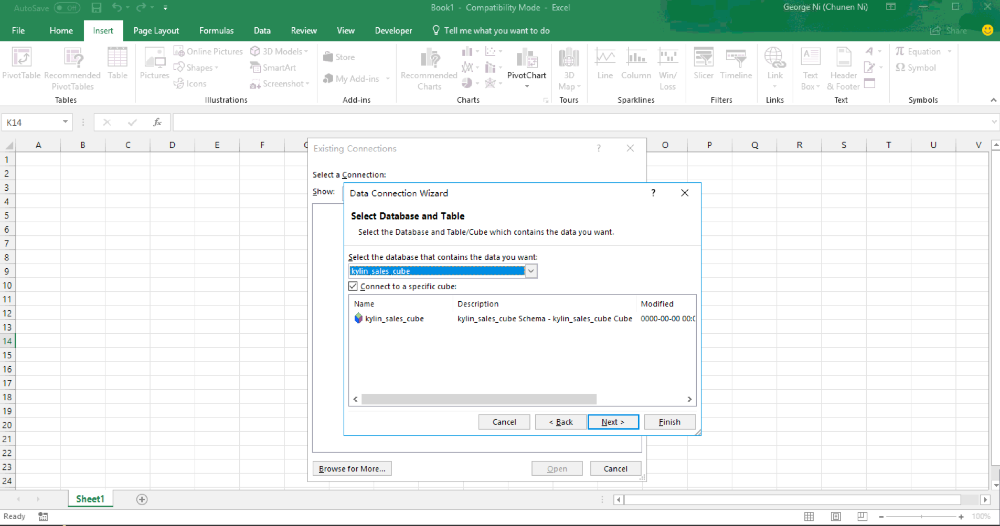
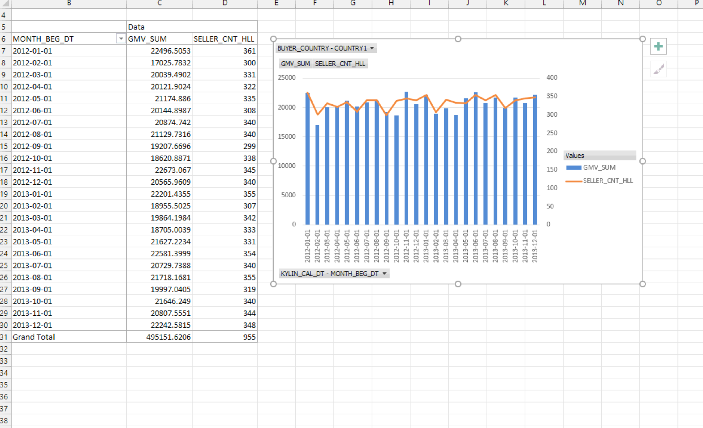

## Integrate Excel with Kyligence Enterprise through KyAnalyzer

We will introduce how you can analyze data from Kyligence Enterprise using Excel. With this method, your Excel will be able to query Kyligence Enterprise through KyAnalyzer without importing data to Excel. 

### How it works

Excel can connect KyAnalyzer service with some plugins (e.g. XMLA Connector), and call the XMLA query APIs that exposed by KyAnalyzer service. KyAnalyzer transforms XMLA requests from Excel into SQL and forwards to Kyligence Enterprise. The query results will return from Kyligence Enterprise through KyAnalyzer to Excel and eventually displayed on Pivot Table.

### Prerequisite.

1. Excel version is 2013 or above. 
2. Install XMLA connect Excel Plugin here. You may download and install it with your Excel [here](https://sourceforge.net/projects/xmlaconnect/).
3. KyAnalyzer is installed and configured to your Kyligence Enterprise. Please refer to this [section](http://docs.kyligence.io/books/v2.5/en/kyanalyzer/kyanalyzer.en.html) on Kyligence Enterprise manual for detail instruction on how to install and configure KyAnalyzer. 

### Establish connection to KyAnalyzer 

Now your KyAnalyzer is up running. You can now connect KyAnalyzer using Excel in Pivot table. 

In Excel, go to `Insert` Ribbon and click `PivotTable`.

Choose to `Use an external data source`.

In the Existing Connections, click `Browse for More`.

In next step, choose `new source`.

In the Data Connection Wizard, choose `Other/Advanced`. 

In the Data Link Properties, choose `XMLA Data Source`.

Next, you may fill in the KyAnalyzer connection information, for Location fill with your **KyAnalyzer** host and server with this pattern:`http://<host>:<port>/saiku/xmla/<cube_name> `

The User Name and Password will be user's **Kyligence Enterprise** login credential.

Choose the Cube you want to connect under Catalog. 

Now the Cube has been connected to Excel. Click Finish to close the Data Connection Wizard.

Now, you are ready to analyze your Kyligence Enterprise Cube using Excel PivotTable. 

