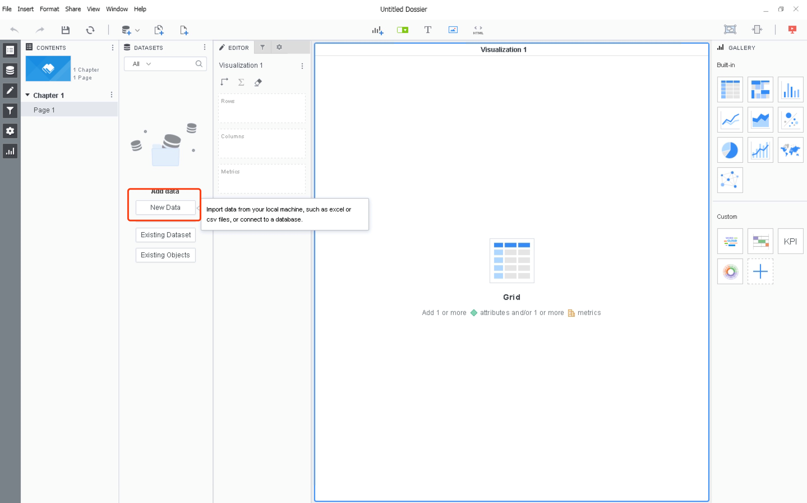
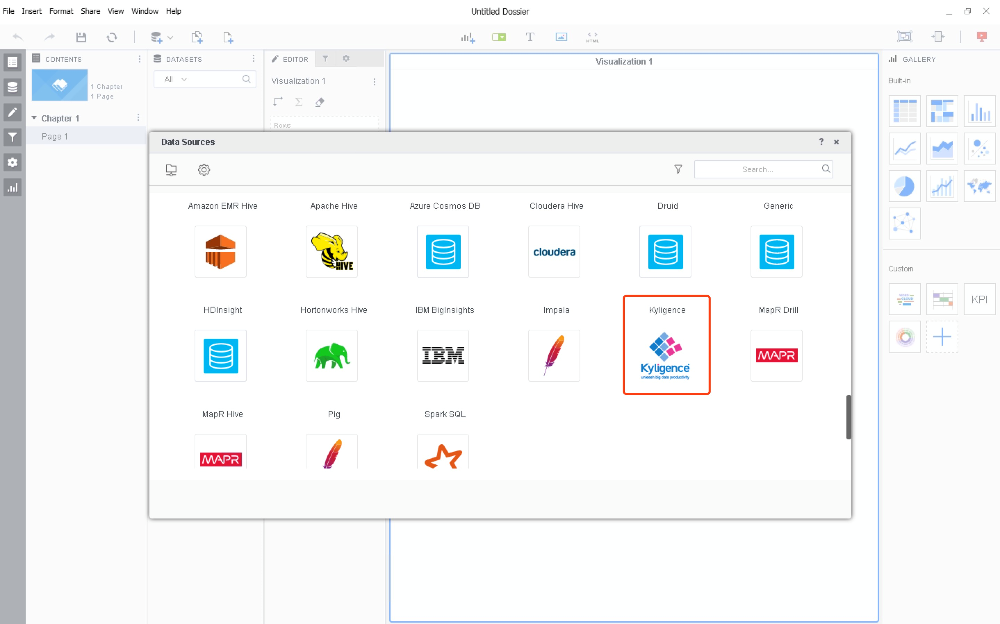
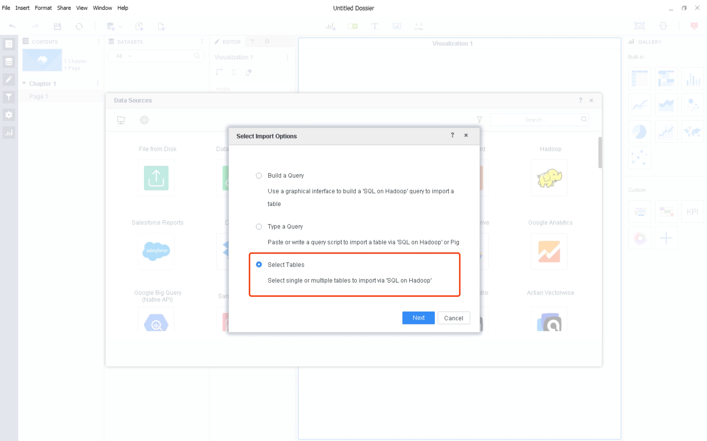
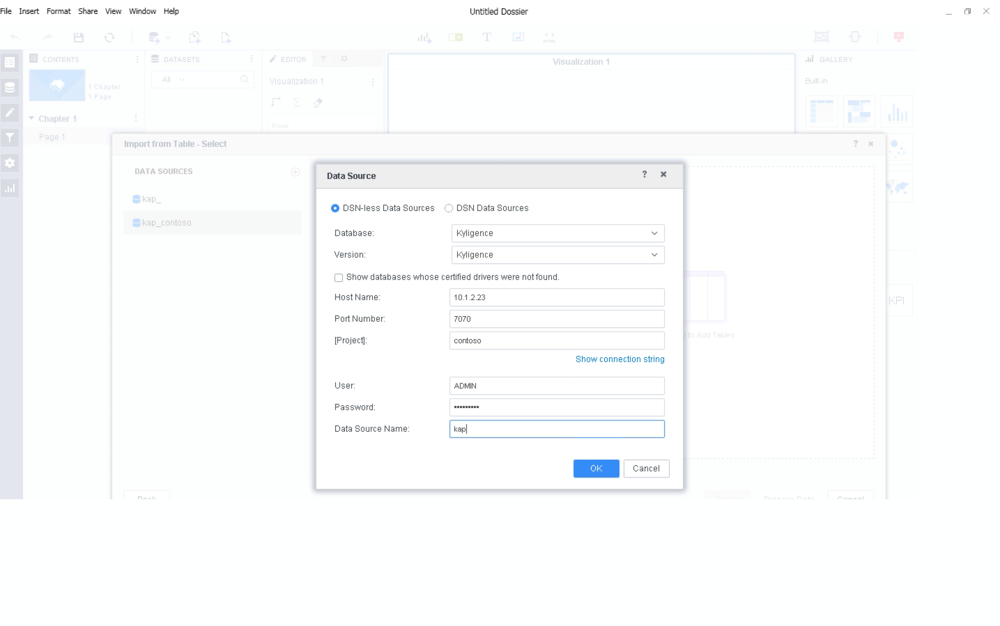
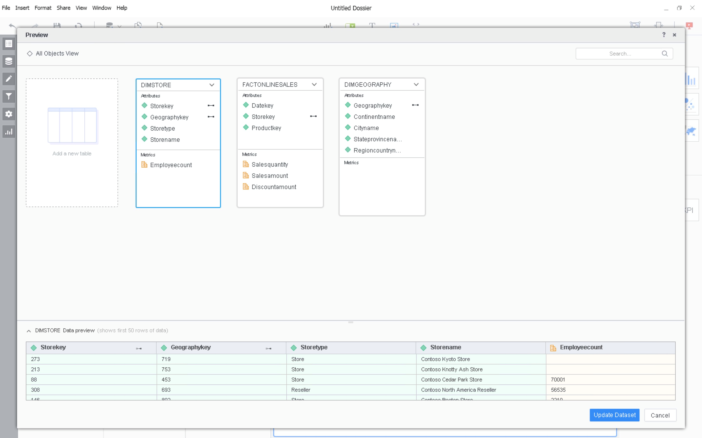
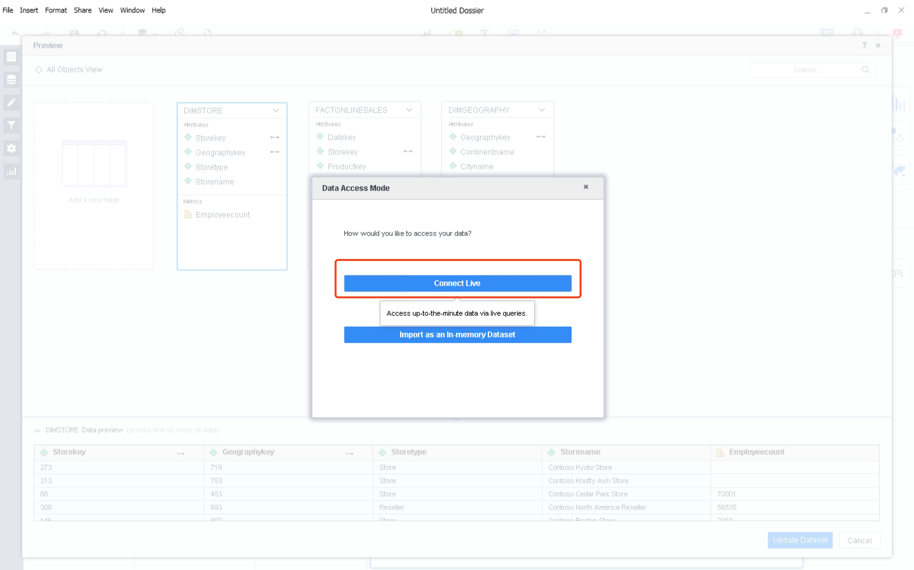
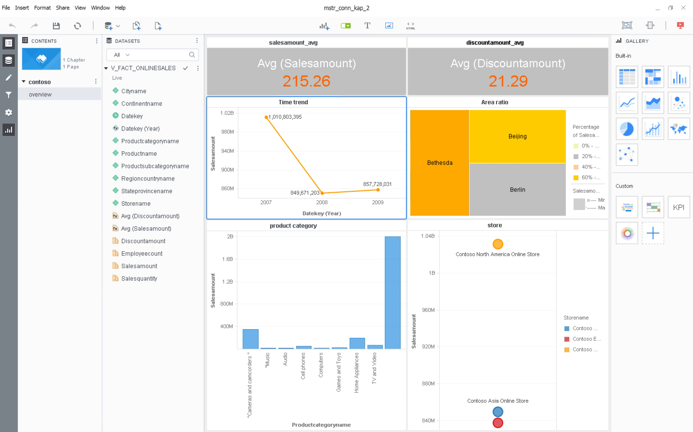

## Integration with MicroStrategy Workstation / Desktop

### Prerequisite:

1. MicroStrategy Workstation / Desktop 10.10 or above is installed.
2. Kyligence Analytics Platform 2.x is installed. 
3. JDK 1.8 or above is installed on your MicroStrategy WorkStation / Desktop machine.
4. Kyligence ODBC Driver 64 bit is installed on your MicroStrategy WorkStation / Desktop machine. 
For detail on how to download and configure Kyligence ODBC Driver please refer to [Kyligence ODBC Driver tutorial](../driver/kyligence_odbc.en.md)

### Install connector in MicroStrategy Workstation / Desktop:

1. Follow the two steps in Web platform configuration to update DBProperties.xml file

2. Update DBProperties.json

  * Decompress the utils.zip found attached

  * Run the run.bat script as administrator from the command line on windows, and note that running the script requires that you install JRE 8 or above

  * After running the script, the tool will automatically convert original DBProperties.xml into two new files: DBProperties.json32 and DBProperties.json64, rename DBProperties.json64 to DBProperties.json and replace the old file in Workstation/Desktop with this new file

    > Old File location: <MSTR_WINDOWS_WORKSTATION/Desktop>\code\config for Windows Platform

3. To customize your own icon, put the icon image of KyligenceConnectorFiles.zip in the location <MSTR_WINDOWS_WORKSTATION>\code\javascript\mojo\css\images\DI\connectors\ for Windows Workstation.

4. Replace the DATABASE.PDS and DTMapping.PDS in workstation with the two files you configured in previous steps of MicroStrategy Intelligence Server.

   > DATABASE.PDS and DTMapping.PDS location: C:\Program Files (x86)\Common Files\MicroStrategy

5. Restart Workstation/Desktop.

6. Notice that Kyligence is not available in Mac Workstation/Desktop yet .

### Connect Kyligence using MicroStrategy Desktop:

1. Open up your MicroStrategy Desktop and choose New Data, you will notice now you have a new data source Kyligence available. 

   

   

2. Next, choose select tables. 

   

3. Next, you may either create a DSN Data Sources or a DSN-less Data Sources. If you choose to connect through DSN Data Sources, a 64 bits DSN connection need to be configured first. 

   > To ensure correct connection, please make sure you choose Kyligence as the database type. 

   

   

4. After you successfully create a data source, you may now map the data model, define attribute and metrics as any other data source in MicroStrategy Desktop.

   

5. In order to fully utilize pre-calculated Kyligence Cube, we recommend you choose Connect Live when you connect to Kyligence data source. 

   

6. Now, you are ready to analyze data from Kyligence with drag-and-drop interface in MicrStrategy Desktop.

   

