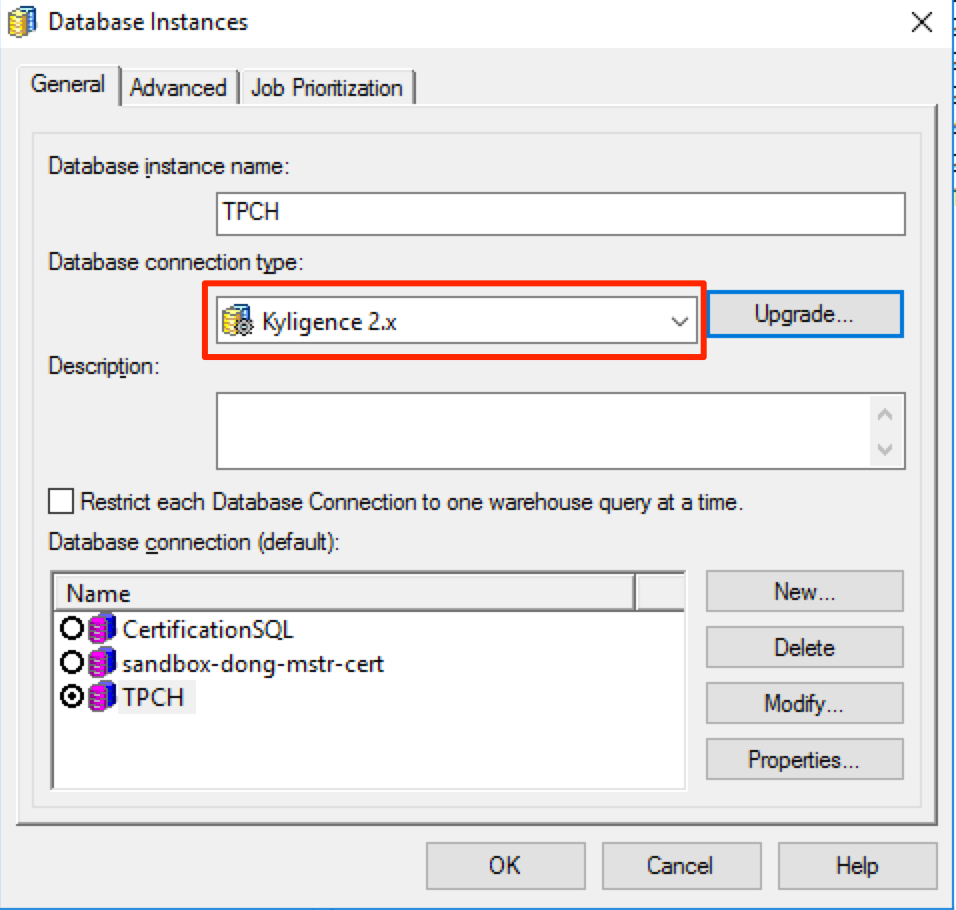

## Integration with MicroStrategy Secure Enterprise

### Supported Platform:

Kyligence currently support MicroStrategy Secure Enterprise 10.8 or above on Windows and Linux Operating System. 

### Prerequisite:

1. MicroStrategy Secure Enterprise 10.8 or above is installed. 

2. Kyligence Enterprise is installed. 

3. JDK 1.8 or above is installed on the machine where MicroStrategy Intelligence Server is installed.

4. Kyligence ODBC Driver 64 bit is installed on the machine where MicroStrategy Intelligence Server is installed. 
For details on how to download and configure Kyligence ODBC Driver please refer to [Kyligence ODBC Driver tutorial](../driver/kyligence_odbc.en.md)

  
### Install Kyligence Connector for MicroStrategy Intelligence Server

#### Update Database object

1. Download and copy the connector file onto the machine where MicroStrategy Intelligence Server is installed. The connector file can be found [here](https://community.microstrategy.com/s/article/Kyligence-Analytic-Platform).

2. Extract the zip file to its own directory, separating from the existing MicroStrategy installation directory.

3. Launch MicroStrategy Developer and login to a 2-tier project source. Go to Database Instance Manager and edit the warehouse database instance that you have connection to Kyligence data source. Click on the “Upgrade” button located next to "Database Connection Type" as shown below:

   

4. The following window appears. Browse files so that the DB types script file is pointing to the "Database_KAP.PDS" file obtained in Step 1. Click on the “Load” button, as shown below:

   

5. The available database types on the left pane is now populated. Move the "Kyligence" object from the left pane to the right using the arrow key, as shown below:

   

6. Click OK. “Kyligence 2.x” now appears as an available database connection type. Select “Kyligence 2.x”.

   

7. Click OK and save the Database Instance.

8. Reload the project so that the new setting take effect. This entails disconnecting and re-connecting to the project source.


#### Update data type mapping on Intelligence Server

1. Copy the file DTMAPPING and AddConnector.jar files to all the Intelligence Server machines that need to be upgraded.
x
2. Find the location of the DTMAPPING.pds file of the Intelligence Server installation

   > Note: On Windows the default location is `C:\Program Files (x86)\Common Files\MicroStrategy`, also referred to in the  $MSTR_CLASSPATH environment variable.

3. Run the following command replacing <location> with the folder where dtmapping.pds file is located.

   ```
   java -jar AddConnector.jar --target <location>\DTMAPPING.pds --file DTMAPPING
   ```

   > Note: Running the command requires the privileges to copy and modify the existing dtmapping.pds file. The command will create a backup of the original file in <location>.

4. Restart Intelligence Server.


#### Install Kyligence Connector in MicroStrategy Web

Next, you will need to finish below configurations in all MicrStrategy Web machine in the cluster. 
1. Copy the file DBproperties and AddConnector.jar files to all the machines that run MicroStrategy Web. Use the location of the files to replace <location1> for the command in step 3.

2. Find the location of the DBProperties.xml file. Use this location to replace <location2> as the path to the DBProperties.xml file in the command in step 3. 

   > Note: The file can be found in the directory where MicroStrategy Web is deployed. This path will be different depending on the application server used. The following are common examples:
   >
   > * Microsoft IIS: `C:\Program Files (x86)\MicroStrategy\Web ASPx\WEB-INF\xml\DBproperties.xml`
   > * Tomcat (on Windows): `C:\Program Files (x86)\Common Files\MicroStrategy\Tomcat\apache-tomcat-8.0.30\webapps\MicroStrategy\WEB-INF\xml\DBProperties.xml`
   > * Tomcat (on Linux): `/opt/apache/tomcat/apache-tomcat-8.0.43/webapps/MicroStrategy/WEB-INF/xml/DBproperties.xml`

3. Run the following command replacing <location2> with the folder where DBProperties.xml file is located.

      ```
      java -jar <location1>AddConnector.jar --target <location2>DBProperties.xml --file <location2>DBproperties
      ```

      > Note:
      >
      > * Running the command requires the privileges to copy and modify the existing DBproperties.xml file.
      >
      > * The <location> needs to finish with a backslash ("\") on Windows and with a forward slash ("/") character on Linux.
      >
      > * The command will create a backup of the original DBProperties file in <location2>.

4. After running the above command, please restart your application server.

5. For configuring the connector icon:

      * By default, the icon in Data Import home page is general icon for Database like below.

        

      * To customize your own icon, put the below image found in the KyligenceConnectorFiles.zip to in the location `<MSTR_WEB_SERVER>\javascript\mojo\css\images\DI\connectors\`

        


Then search for kyligence at the data source to connect kyligence. Alternatively, you may find Kyligence under the “Hadoop” connection category.


### Best Practice for Connecting MicroStrategy to Kyligence Enterprise

1. It is recommended to set up your report intermediate table type as derived to improve query efficiency.
   You can change this setting at report level using Data-> VLDB property-> Tables-> Intermediate Table Type

2. Avoid using below functionality in MicroStrategy as it will generate multiple SQL passes that can not be bypassed by VLDB property:
    - Creation of datamarts
    - Query partitioned tables
    - Reports with custom groups

3. If underlying Kyligence data model has left join from fact table to lookup table, in order for MicroStrategy to also generate the same left join SQL statement, please follow below MicroStrategy TN to modify VLDB property: [https://community.microstrategy.com/s/article/...](https://community.microstrategy.com/s/article/ka1440000009GrQAAU/KB17514-Using-the-Preserve-all-final-pass-result-elements-VLDB)

4. By default, MicroStrategy generates SQL query with date filter in a format like 'mm/dd/yyyy'. This format might be different from Kylin's date format. if so, query will error out. You may refer to this article to change the setting in MicroStrategy so that date format MicroStrategy generated will be consistent with Kyligence Enterprise: [https://kyligence.zendesk.com/...](https://kyligence.zendesk.com/hc/en-us/articles/115001690433-Modify-MicroStrategy-query-date-format-to-be-consitent-with-KAP)
