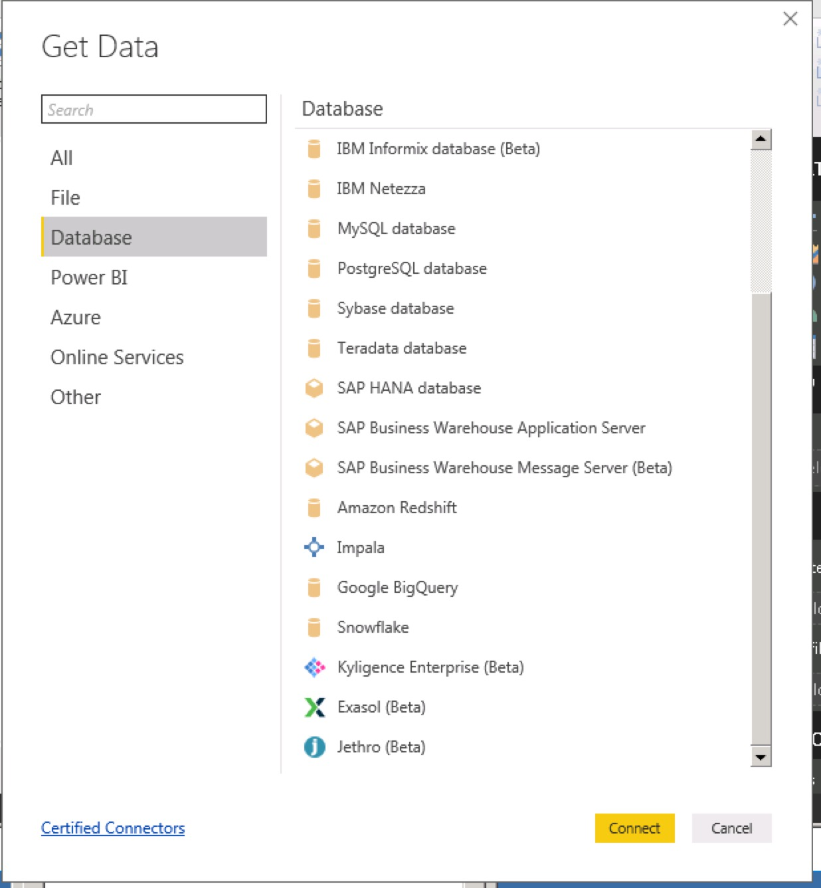
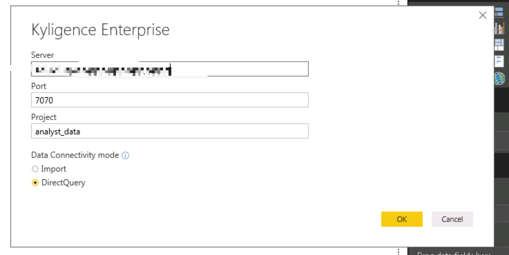
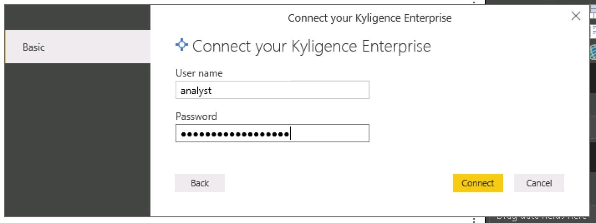

## Integration with Power BI Desktop

Microsoft Power BI Desktop is a professional business intelligence analysis tool providing rich functionality and experience for data visualization and processing to user. This article will guide you to connect Kyligence Enterprise with Power BI Desktop. 

### Install Kyligence ODBC Driver
For the installation information, please refer to [Kyligence ODBC Driver tutorial](../driver/kyligence_odbc.en.md).

### Install Kyligence Enterprise Data Connector for PowerBI plugin
1. Download Kyligence Enterprise Data Connector for Power BI  plugin from [Kyligence Account Page](http://account.kyligence.io).

2. Copy the plugin file (.mez)  to the install folder *[Documents]\Microsoft Power BI Desktop\Custom Connectors*. If this folder does not exist, please create one.

3. In Power BI Desktop, open **Options** under **Options and settings**.

4. Click **Preview features** and then check the box **Custom data connectors**.

   

   > Tips：If the latest version Power BI (version 2.61) can not display Kyligence data connector,  you can change data extension security settings. In Power BI Desktop, select **File > Options and Settings > Options > Security**. Under **Data Extensions**, select option **(Not Recommended) Allow any extension to load without warning**

5. Restart Power BI Desktop.

### Connect Kyligence Enterprise through Power BI Desktop

1.  Start the installed Power BI Desktop, click **Get data -> more**, and then click **Database -> Kyligence Analytics Platform**.

     

2.  In the pop-up window, type the required database information, and select **DirectQuery** as Data Connectivity mode.

     > Note: If your Kyligence Enterprise is deployed on Azure, please add **https://** in server url and input 443 as PORT number

     

3.  Enter **User name** and **Password** 

     

4.  After connecting successfully, Power BI will list all the tables in the project. You may select the tables based on your requirements.
     

5.  Model the tables which need to be connected.

     

6.  Return to the report page and start visualization analysis.

