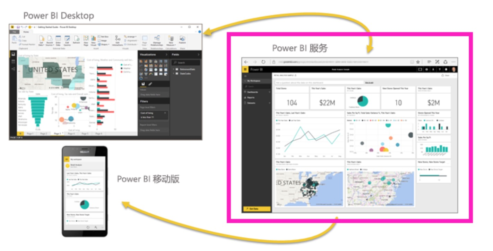
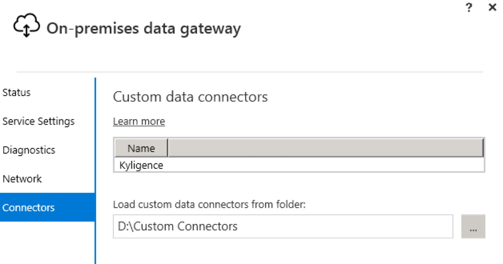
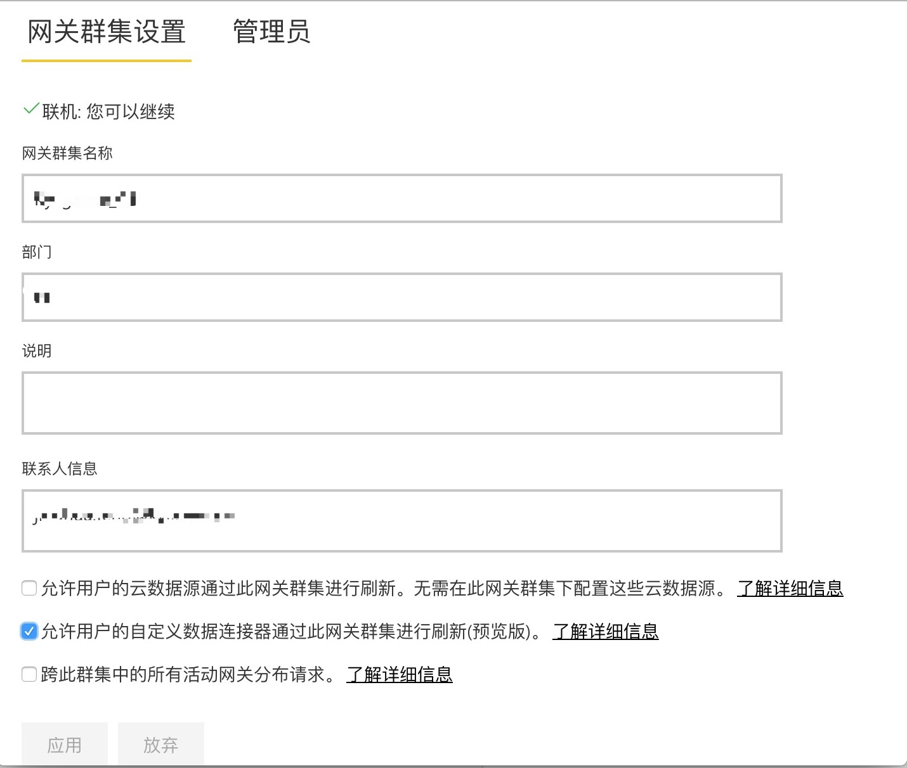
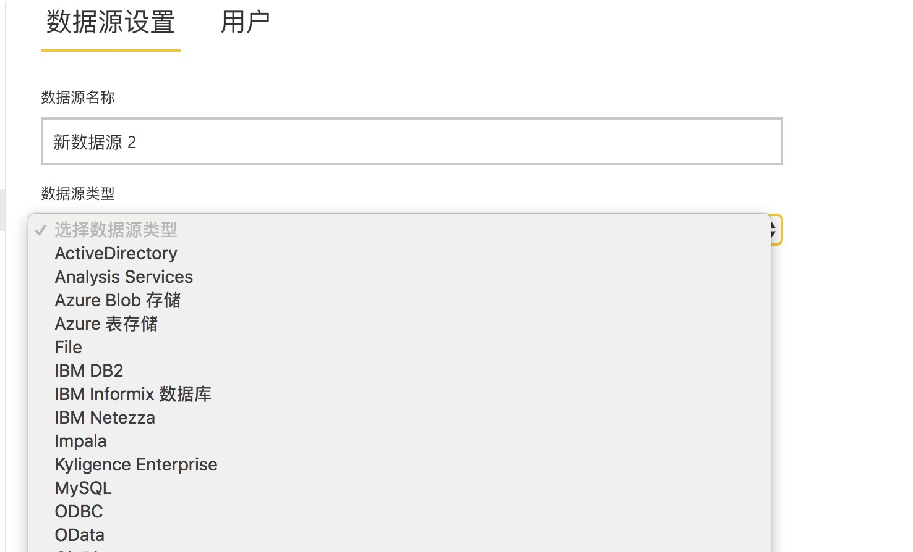

## Integration With Power BI Service

Microsoft Power BI service is also named as Power BI online, which is an online SaaS service with strong analytical capabilities and collaborative management capabilities. It can easily collaborates with Power BI Desktop or Power BI Mobile to build an enterprise BI platform.



This article will guide you to connect Kyligence Enterprise with Power BI service.


### Integration With Power BI Desktop

To analyze and share the reports on Power BI service, which are published through Power BI Desktop, you need to integrate the Power BI Desktop with Kyligence at first. The relevant installation and configuration information, please refer to following link for details: [Power BI Desktop integration](powerbi.cn.md). NOTE: Power BI Desktop is linked to Power BI service through Power BI account, you need to guarantee that Power BI Desktop is at correct log-in status before deploying the reports on Power BI service platform. 

### Install Gateway

Power BI service communicates with local server by Gateway, you can refer this guide [Gateway installation](https://docs.microsoft.com/zh-cn/power-bi/service-gateway-install) for installation. Note: Gateway does not need to be installed on the same machine as Power BI Desktop, but the machine network running the Gateway should be open and access to data source configured by Kyligence Enterprise Data Connector for Power BI.

### Configure Gateway

1.After completing the Gateway installation, you can open the administrator command prompt and run ```net start PBIEgwService``` to start the Gateway service. Then you can double-click the *On-premises data gateway* program icon       to configure Gateway. you can also run ```net stop PBIEgwService``` command to stop the Gateway service.

2.Configure Kyligence Enterprise Data Connector for Gateway:

a) Create a directory, which Gateway could access to, to store the connector. (Please do not create this directory in unaccessible or system folders.) 

b) Download the Kyligence Enterprise Data Connector for Power BI plug-in from [Kyligence Download Page](http://download.kyligence.io/#/products) and put it under new-created directory. 



For more configure information, you can refer to [Custom Connectors](https://docs.microsoft.com/en-us/power-bi/service-gateway-custom-connectors).

### Power BI Service Manage Gateway

1.After logging into Power BI service, you can check the **Allow user's custom data connectors to refresh through this gateway cluster** select box and click the **Apply** button in Gateway page. Then you can add the Kyligence Enterprice connector in Gateway cluster.



2.After success Gateway installation, please click the Gear setting icon on Power BI service page:->**Manage gateways**->**ADD DATA SOURCE**: select Kyligence Enterprise data sources



3.DATA SOURCE CONFIGURATION: Please keep the configuration information of DATA SOURCE same as the connection information between Power BI Desktop and Kyligence Enterprise Data Connector for Power BI.


4.You can click the **Users** tab at right side of **Data Source Settings** to add users for DATA SOURCE. Then, the new-added users will have editor access, including report deployment.

### Publish Reports on Power BI Service

After completing all configuration work of Gateway, you can edit your reports and publish them in assigned workspaces on Power BI Desktop. Then, you can make analysis or changes reports in Power BI Service workspaces.


