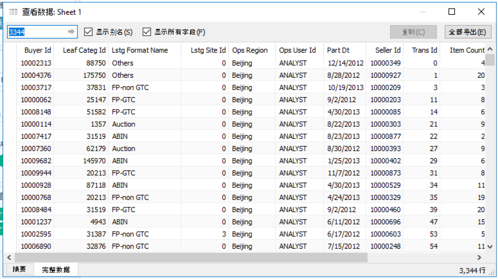

## Integration with Tableau 

### Install Kyligence ODBC Driver

For the installation information, please refer to [Kyligence ODBC Driver tutorial](../driver/kyligence_odbc.en.md).

### Connect to Kylin Server
Connect Using Driver: Start Tableau 10.1 desktop, click `Other Database(ODBC)` in the left panel and choose `Kyligence ODBC Driver` in the pop-up window. 

Click `Connect` button and input the server information, then click `ok`.

### Mapping Data Model
In left panel, select `defaultCatalog` as Database, click `Search` button in Table search box, and all tables get listed. Drag the table to right side, then you can add this table as your data source and edit relation between tables(mapping information is shown in figure).

**NOTE: Tableau will send query "select \* from fact\_table" and it'll take a long time if the table size is extremely large. To work around the issue please refer to [Configuration](../config/basic_settings.en.md#kylinqueryforce-limit)**

### Connect Live

There are two types of Connection in Tableau 10.1, choose the Live option to make sure using Connect Live mode.

### Visualization

Now you can start to enjou analyzing with Tableau .

### Publish to Tableau Server
If you want to publish local dashboards to a Tableau Server, just expand `Server` menu and select `Publish Workbook`.

### View Detail Data

> Note: Table Index or Query Pushdown need to be enabled in order to query detail data from KAP.

You can drill down from aggregated data to detail data in Tableau. First, click on the data you would like to view detail data of on the report, then click the icon as shown. 

Click on the Full Data tab and then you can view the drill-down detail data.

### Sync Model from KAP to Tableau

#### **Export TDS from KAP**

If you want to download a tds file, please select a `READY` cube and click `Export TDS` in `more actions` to download a tds file.

#### Connect Kiligence Datasource Using TDS file
To see the data source information, you can double click tds file on where has installed tableau, type authorization information in dialog.

