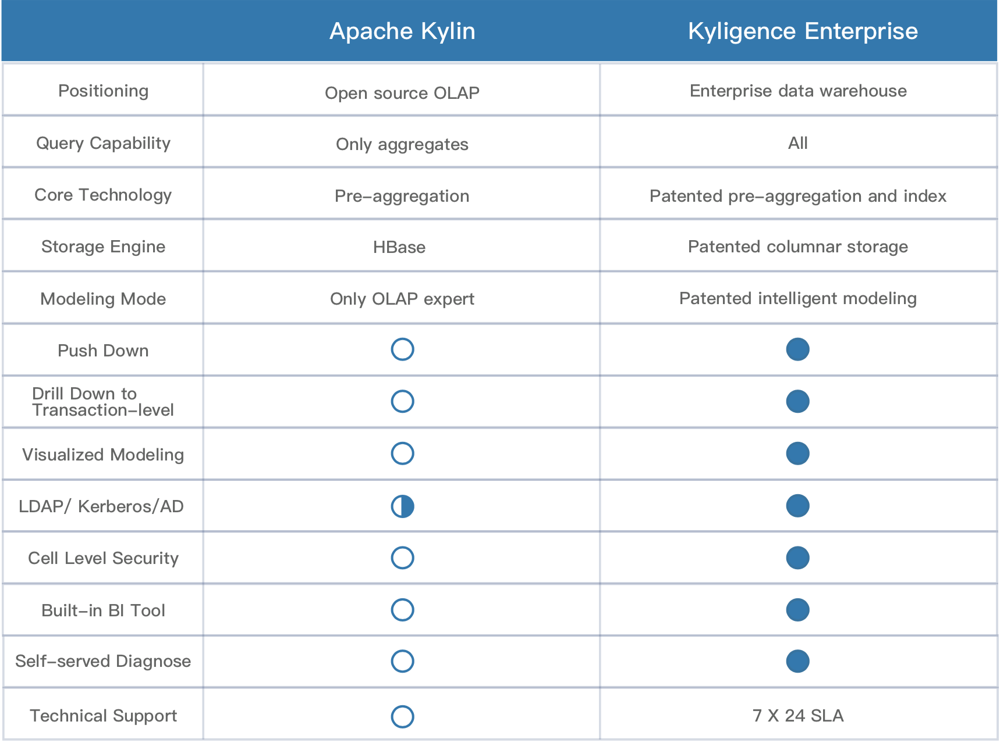

## Kyligence Enterprise Overview

Kyligence Enterprise is an enterprise OLAP on Hadoop powered by Apache Kylin, enables sub-second SQL query latency on petabyte scale dataset, provides high concurrency at internet scale, empowers analysts to architect BI on Hadoop with industry-standard data warehouse and business intelligence methodology. Kyligence Enterprise is an unified analytics platform simplified Big Data Analytics for business users, analysts and engineers with self-service, seamless integrated with BI tools and no programming required. Kyligence Enterprise is a native on Hadoop OLAP solution which interactive with cluster only via standard APIs, supports main Hadoop distributions from on-premieres to in the Cloud.

**KyStorage: Columnar Storage Engine, Support Detailed Query**

Kyligence Enterprise introduces new columnar storage engine *KyStorage*, supports multiplexed indexes, specially optimizes for ultra-high cardinality dimensions and complex filtering conditions. Compared with *Apache Kylin*, Kyligence Enterprise increases query performance from several times to a dozen times and reduced over 50%  storage space.

Kyligence Enterprise which is built on *KyStorage* and inverted index technologies, breaks the traditional OLAP engine‘s limitations which query aggregation data only. It supports detailed data query, optimizes the support for super wide table, reduces the difficulties of data modeling, provides better service for data exploration and analyses.

**KyStudio: Interactive Modeling Platform**

*KyStudio* focus on model, enables drag-and-drop modeling process, enhances semantic layer with computed column, simplifies the model integration with BI tools. Built-in cube suggestion and tuning algorithms, improve the modeling efficiency and performance. 

**KyAnalyzer: Agile Self-serve OLAP BI Tool**

Kyligence Analyzer as the built in its agile BI tool *KyAnalyzer*, users can explore multiple data sources interactively, and design report by familiar drag-and-drop style. Supports multidimensional analysis methods such as drilling, rolling, slicing, rotating, and so on. Provides dozens of reporting charts, simplifies multi-format data sharing, improves big data analysis productivitity greatly.

**More Enterprise Level Features**

Kyligence Enterprise supports out-of-the-box user management and cell-level access control. Integrates with customer existing authentication system easily. Guarantees security, manageability and traceability.

**Compatible with Hadoop Distribution**

Kyligence Enterprise is compatible with open source Hadoop and mainstream commercial Hadoop distributions, including but not limited to *Apache Hadoop*, *Hortonworks HDP*, *Microsoft HDInsight*, *AWS EMR* and *Huawei FusionInsight*. Has certified with  *Cloudera CDH*.

### Kyligence Enterprise vs. Apache Kylin

