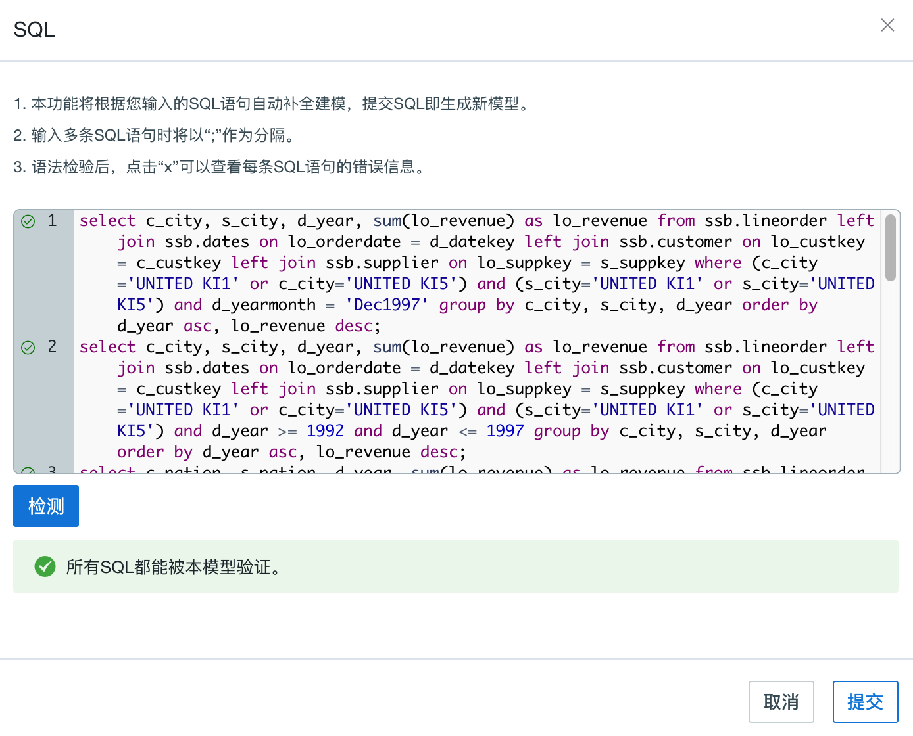
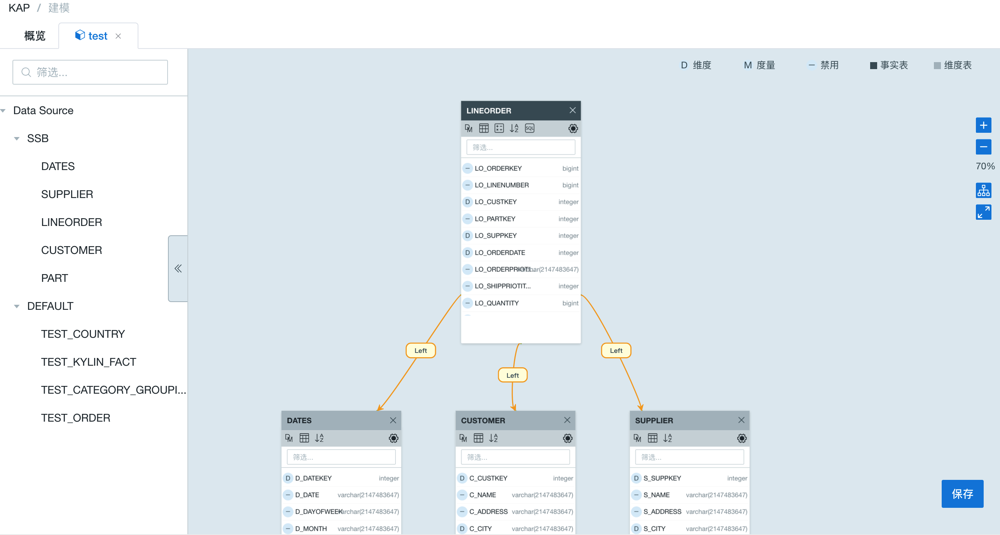

## Model Advisor

Model design is a key part to use KAP. Because the initial version of model design requires modelers to have business acumen and deep understanding of query requirements. To lower the learning curve of modeling, enable business professionals to generate models directly from SQLs. We featured the model advisor to meet this demand: all you need to do is just drag one table into the model designer and set it as fact table, then the SQLs you entered will complete the rest part of the model design.

### Apply SQL to Generate a Desired Model

Step 1, sync target tables to the project. 

Step 2, drag one table, which will be the fact table, to the model designer and set it as *fact*. Click ***SQL*** button to pop up a dialog to collect your SQL statements. 

> Note: only fact tables will have this button and SQL queries here you typed in should be the SQL you would query later.
>

Step 3, enter the SQLs that would cross this model. You should ***check***  these SQLs to make sure which could be used to generate model, because only correctly recognized ones could work. If all SQLs are right to the model advisor, the dialog would look the same as the following picture.

Step 4, ***submit*** checked SQLs and you will get a initial model from your SQLs as below. Please do modify, check and re-submit SQLs via ***model advisor***.  When you are all set, save it.

