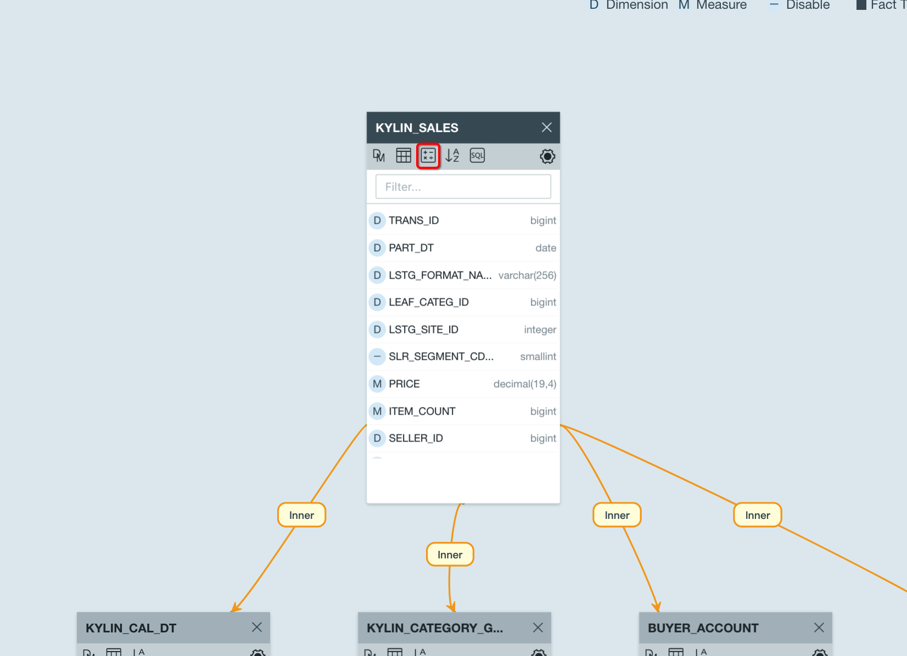
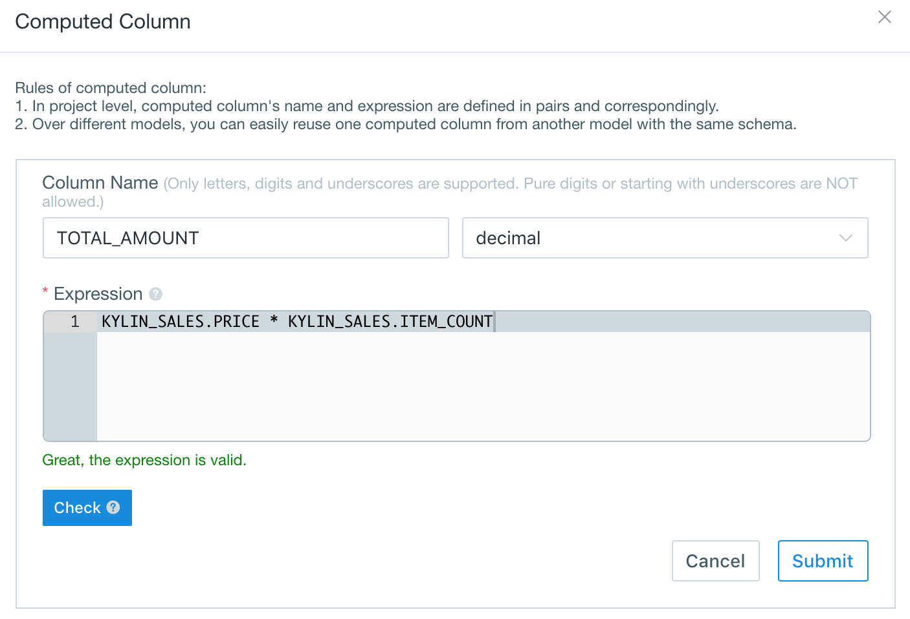
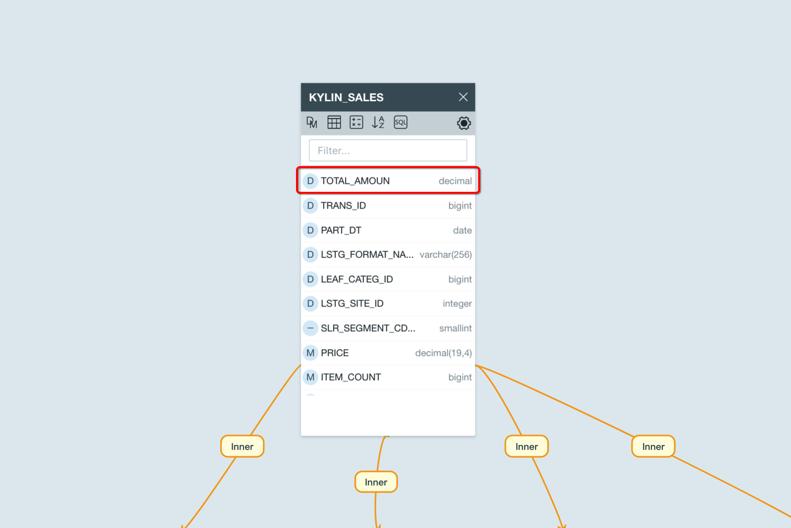
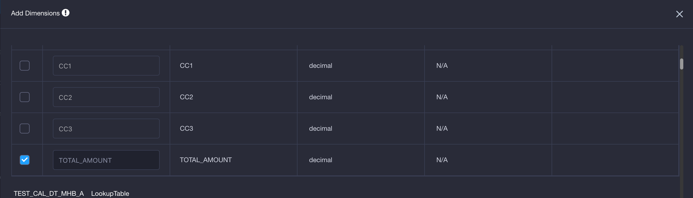

## Computed Column

**Computed Column** allows you to pre-define actions like data transformation and calculation in models, it enhances the data semantic abstraction according to various business scenarios. By replacing runtime calculation with offline cube construction, the pre-calculation capability of Kyligence Enterprise is fully utilized. As a result, query performance could be improved significantly. It's allowed to use Hive UDF in computed columns, so that existing business codes can be reused.

> **Caution:**
>   - Computed column is **ONLY** supported when the data source is Hive.
>   - Please **DO NOT** define an expression with only constants for a computed column.

### Basic Concepts and Guidelines
- **Naming convention:**
  - Only letters, digits and underscores are supported. Pure digits or starting with underscores are NOT allowed.
  - Under one project, the name of a computed column cannot duplicate with any other columns in the current model.
- **Expression:** calculating logic. Expression of the computed column can contain columns across a fact table and a lookup table.
- **Re-use and reference:**
  - In a project, a computed column can be reused across different models. So its name and expression should be unique.
  - In a new data model, you can re-use computed columns which are already defined in another model on the same table. 
  - You can define a new computed column based on an existing computed column.
- **Others:**
  - It's highly recommended to define computed column only on the fact table, although you can define computed column on lookup tables which are not stored as snapshots.
  - You can define different computed columns in different models with following the guideline above.
  - Access control: If a user has restricted access to the column used in the expression of a computed column, then this user will not be able to query the computed column either. 

### Create Computed Column

Kyligence Enterprise allows you to define computed columns for each model separately. 

For example, say you have a fact table named `kylin_sales` with following columns: `price` (price for each item in the transaction), `item_count` (number of sold items in the transaction) and `part_dt` (time when the transaction happens). You can define two more computed columns on `kylin_sales`: `total_amount = kylin_sales.price * kylin_sales.item_count` and `deal_year = year(kylin_sales.part_dt)`. 

Later when you create a cube, you can add computed columns total_amount/deal_year.

You can create computed columns by clicking the icon as the arrow points to:

The following information is required:

- **Column**: Display the name of the created computed column.
- **Expression**: Definition of the computed column. Columns in the expression can refer to any table in the current model, however, you have to make sure the column reference complies to **Table.Column**.
- **Data Type**: The data type of the created column.

After successfully submitting and saving the computed column, you will see the new column `total_amount` appearing in the table:

After defining the computed columns in model, you need to use them to build cube (either as dimension or measure), so that computed column can be pre-calculated and performance improvement can be observed.

### Explicit Query vs. Implicit Query

**Query:** A computed column is logically appended to the table's column list after creation. You can query the computed column as if it was a normal column as long as it is pre-calculated in a cube. 

When **query pushdown** is enabled and there is no cube can be hit on for your query on computed columns, Kyligence Enterprise will analyze the query and translate the computed column to the original formula. Continuing with the previous example, if you query `select sum(total_amount) from kylin_sales` when there is no cube ready to answer, and query pushdown is enabled, this query will be translated into `select sum(price * item_count) from kylin_sales`, and be pushed down to underlying SQL on Hadoop engine. 

**Explicit Query**: If you created and built a cube containing measure `sum(total_amount)`, Kyligence Enterprise can answer queries like `select sum(total_amount) from kylin_sales`. We call it **Explicit Query** on computed columns. 

**Implicit Query:** You can pretend that computed column is invisible from the table, and still use the expression behind the computed column to query. Continuing with the last example, when your query `select sum(price * item_count) from kylin_sales`, Kyligence Enterprise will analyze the query and figure out that expression in `price * item_count` is replaceable by an existing computed column named `total_amount`. For better performance, Kyligence Enterprise will try to translate your original query to `select sum(total_amount) from kylin_sales`. We call it **Implicit Query** on computed columns.

Implicit Query is **enabled** by default. To disable it you'll need to remove `kylin.query.transformers=io.kyligence.kap.query.util.ConvertToComputedColumn` in `KYLIN_HOME/conf/kylin.properties`

### Nested Computed Columns

You can define a new computed column based on an existing computed column, and this is called nested computed column. 

1. Define a computed column named *TOTAL_AMOUNT*, click **Submit**

2. Define a computed column named *DOUBLE_TOTAL_AMOUNT*, and refer to *TOTAL_AMOUNT* in the expression.

Click **Check** to validate the expression.

### Advanced Functions

Computed column is pushed down to data source which will be calculated. Hive is the default data source for Kyligence Enterprise, as a result, the syntax for computed column need to follow hive's. 

Expressions can support rich advanced functions (specified at the end of this article), but please do not define the expression that contains the aggregate functions (as cube measures). For example that expression of a computed column cannot directly support count (distinct), such as `select count (distinct seller_ID) from kylin_sales`

It is possible to utilize Hive embedded function or Hive User Defined Function in computed column. To learn more about what function Hive SQL offers, please refer to Hive documentation below:

https://cwiki.apache.org/confluence/display/Hive/LanguageManual+UDF#LanguageManualUDF-StringFunctions

