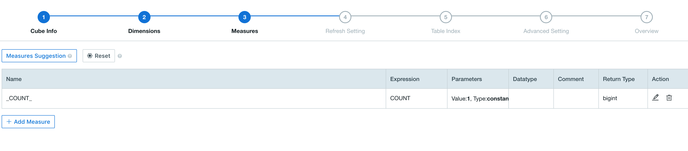
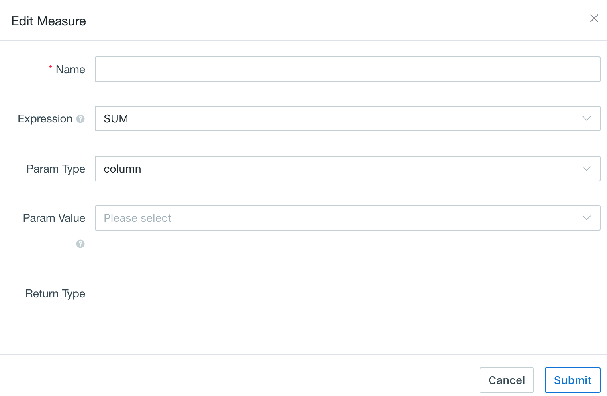
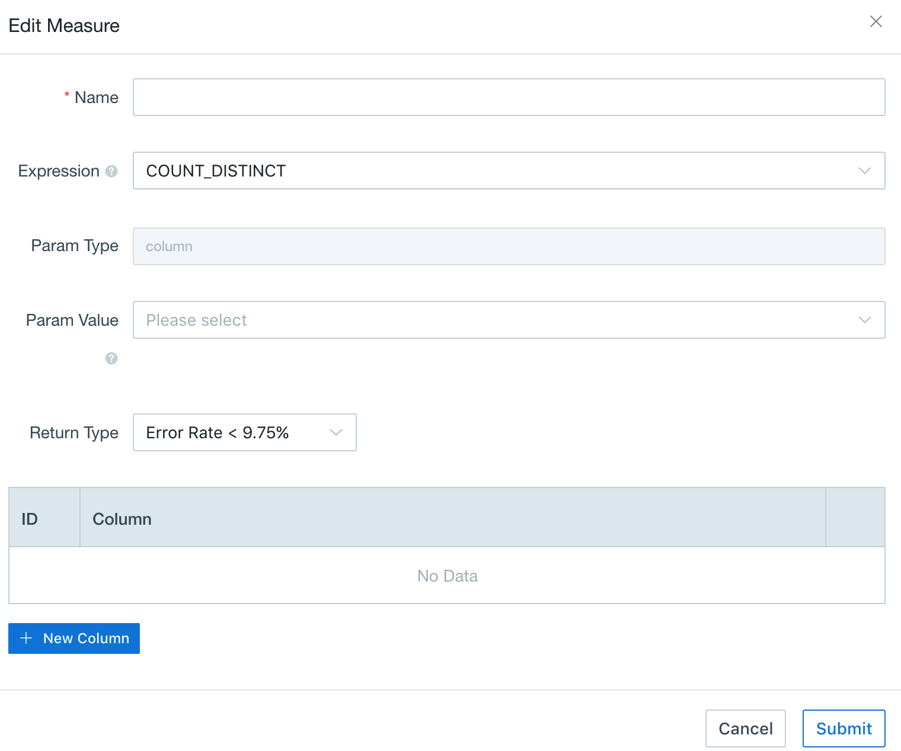
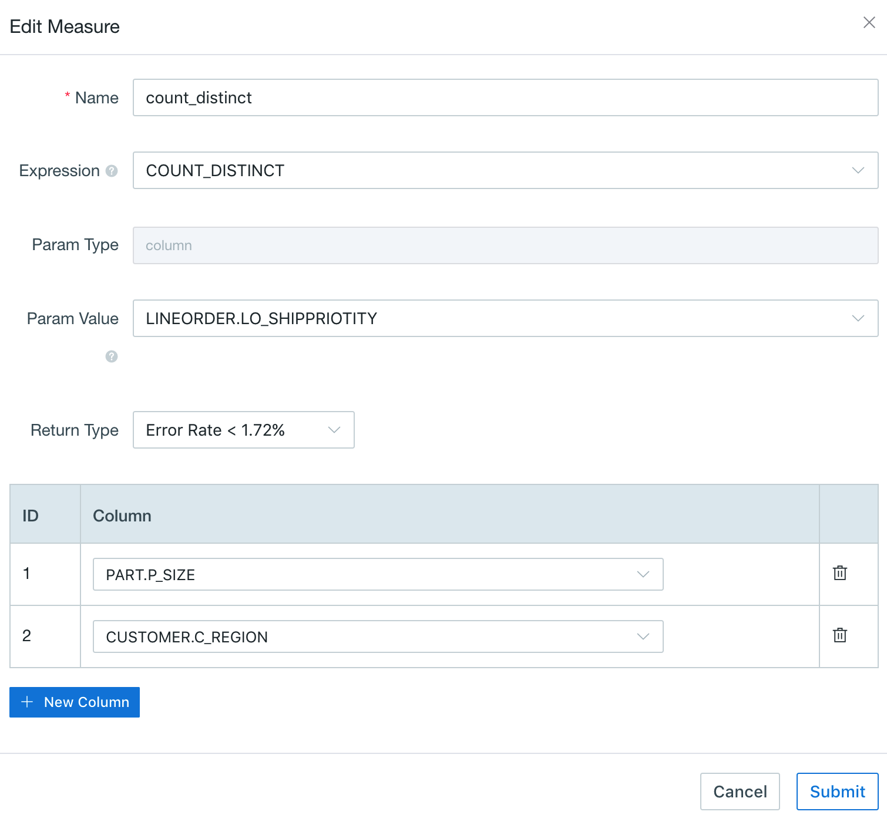

# Approximate Count Distinct

Count distinct is a frequent-used function for most data analysts. Since v2.1, this product implements approximately count distinct using [HyperLogLog](https://hal.inria.fr/hal-00406166/document) algorithm, offered serveral precision, with the error rates from 9.75% to 1.22%. The result of measure has theorically upper limit in size, as 2^N bytes. For the max precision N=16, the upper limit is 64KB, and the max error rate is 1.22%. It would be perfectly fit if you don't require a particularly precise result and have limited storage resource. 


## Prerequisite

Before using count distinct query, you need to clarify if the target column is ready for it. You can get measures information by checking `measures` of built `Cube`(as shown below). If the measure desired has been pre-calculated on approximate count distinct syntax(here requires both `Expression` to be count_distinct and `Return Type` to be hllc), and stored within the Cube information, then this measure is ready to do further count distinct query. Otherwise, you need to create a new Cube.




## Approximate Count Distinct Setting

Firstly, after creating a new Cube and ensure all dimensions selected, then click `Measures+` on the lower left corner to start measures setting.  



Next, choose the column desired from `Param Value` and COUNT_DISTINCT from `Expression`. Here be careful to select accuracy requirement from `Return Type`.  this product offers both approximate count distinct function and precise count distinct function. To get the pre-calculated approximate count distinct value, you should select  `Return Type: Error Rate<*%` based on HyperLogLog algorithm, which would return a nearly result if you don't require a particularly precise result and have limited storage resource. 



### Multiple Columns Count Distinct

Multiple columns count distinct has been supported by [HyperLogLog](https://hal.inria.fr/hal-00406166/document) algorithm since v2.4. The sql statements and detailed settings are shown below.

```sql
SELECT COUNT (DISTINCT P_LINEORDER.LO_SHIPPRIORITY, PART.P_SIZE, CUSTOMER.C_REGION) FROM P_LINEORDER 
INNER JOIN PART on XXX=XX
INNER JOIN CUSTOMER on XXXX=XX
```



Follow the [Create Cube](create_cube.en.md) introduction for rest steps, the Cube would be ready after you setting segments on the [Build Cube](../build_cube.en.md) section.

Not only this result but also other testified results are right, which prove that approximate count distinct query works well. More information about precise count distinct function, please refer to [Precise Count Distinct](count_distinct_precise.en.md) Introduction.

### Reference

[Use Count Distinct in Apache Kylin](http://kylin.apache.org/blog/2016/08/01/count-distinct-in-kylin/) (Yerui Sun)

