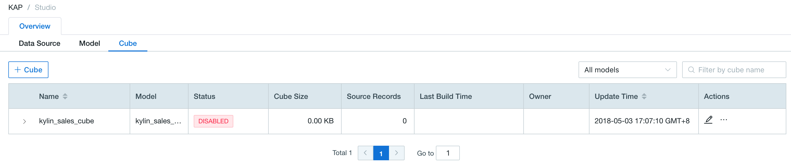
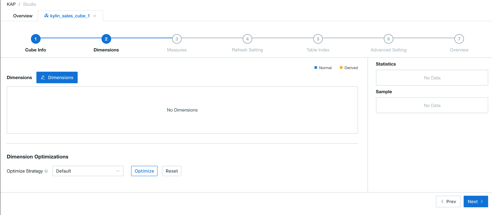
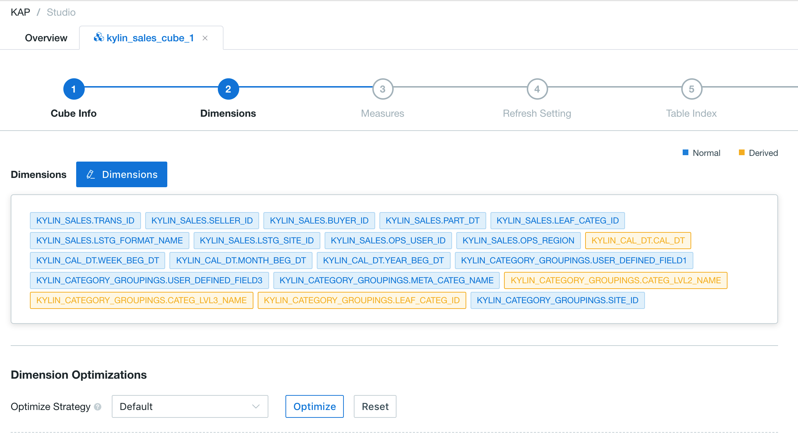
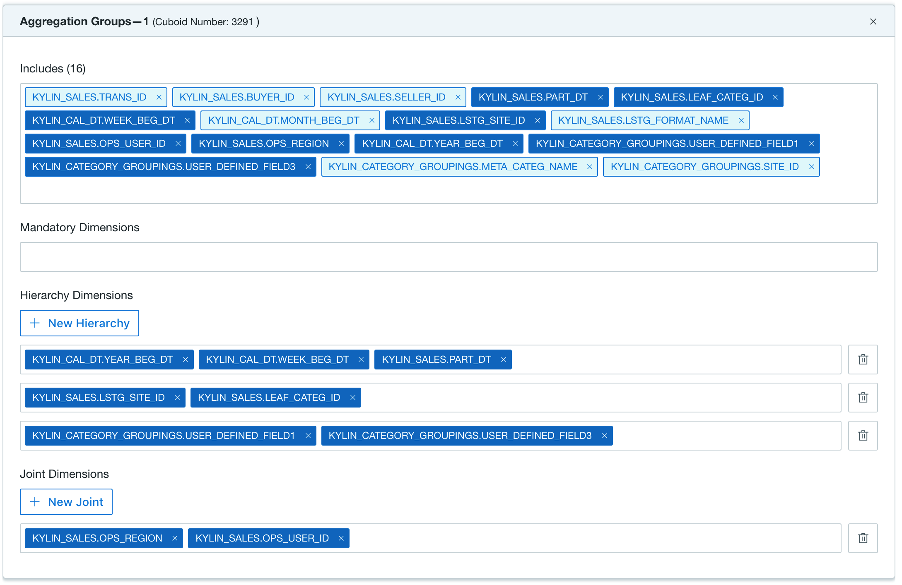
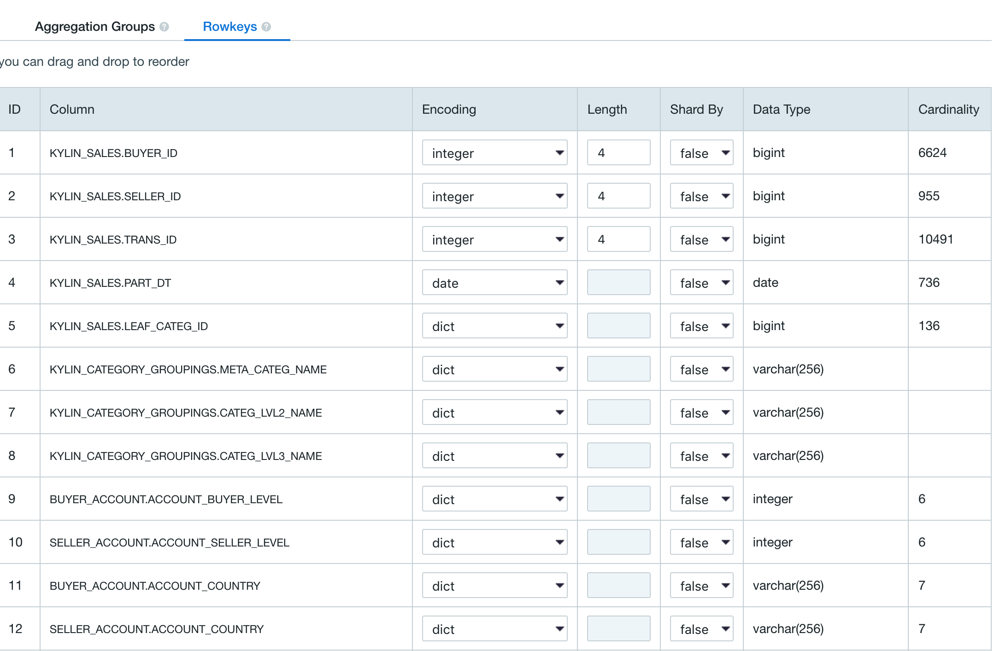
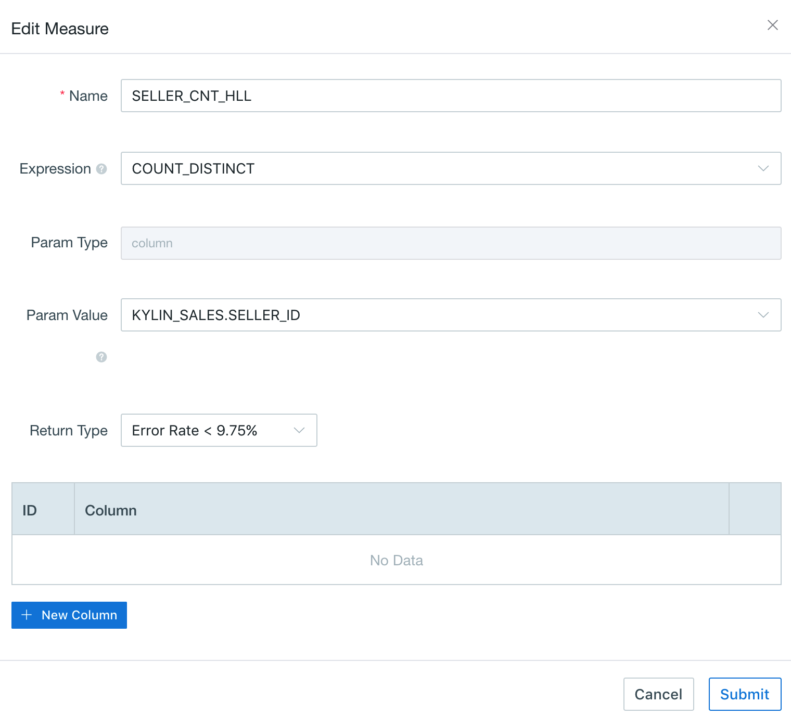
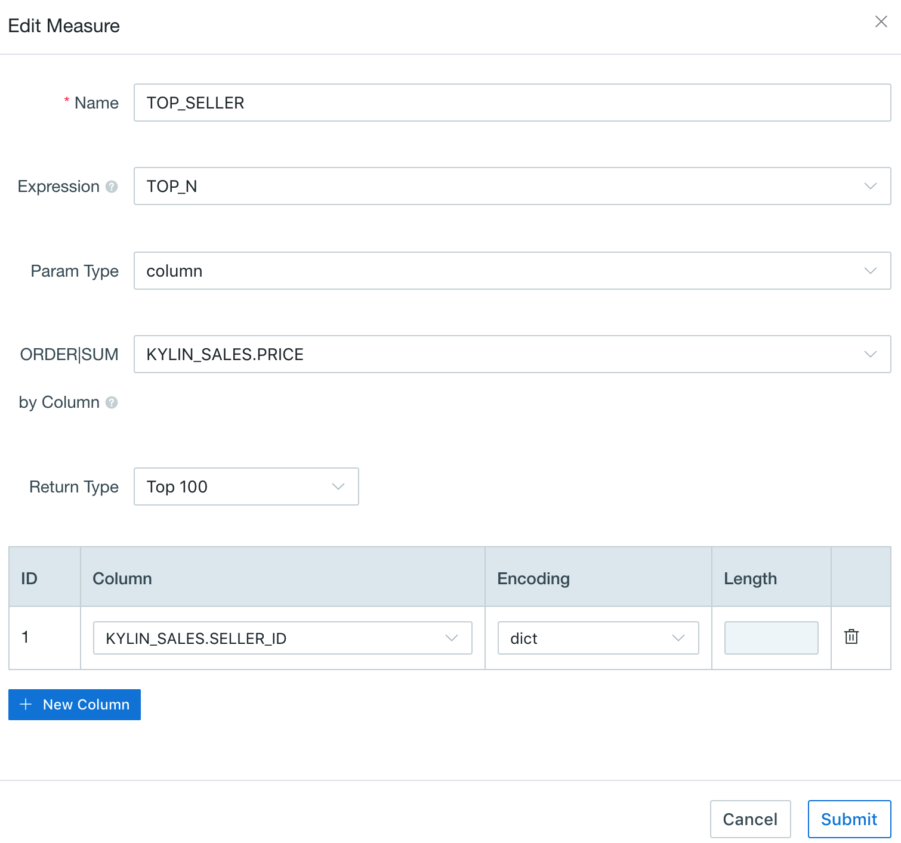
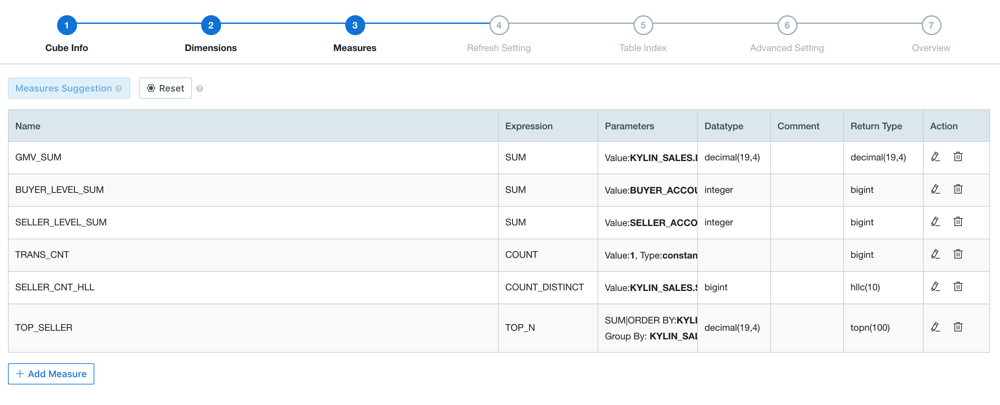
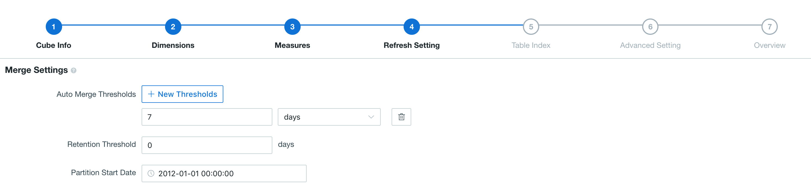
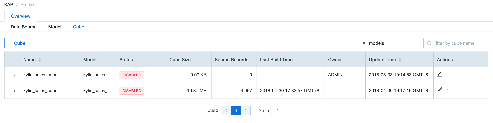

## Create Cube

This article will introduce how to design a cube with sample data(learn_kylin).

Open this product Web UI, select project *learn_kylin* in project list located at upper left corner. 



Step 1: Click *Add Cube* from `kylin_sales_Model`. We create a cube named *kylin_sales_cube_1* to start. Click `Submit` button to continue. Then you will get a whole screen of cube design flow.




Step 2: *Dimensions and dimension optimization*. Select some dimensions via *Add Dimensions*. The number of selected columns will affect the number of Cuboid generated later, so as the size of Cube data. 

Dimension can be set as *normal* and *derived*. For derived dimensions, only dimensions from lookup table can be set as derived dimension. We recommend you to use cube optimizer to generate dimension type. Or use following case to lead you set derived dimensions.

Basic rules for dimension selecting process are as following example:

In table `KYLIN_CATEGORY_GROUPINGS`, if three columns (`META_CATEG_NAME`, `CATEG_LVL2_NAME`, `CATEG_LVL3_NAME`) can be filter condition in query, they should be set as normal dimensions at first.  

Date usually appears in filter and aggregation condition appears in query, such as filter by week or aggregation by week. Here we take Week as an example, column `WEEK_BEG_DT` in table `KYLIN_CAL_DT` is required and derived from column `PART_DT`. So column `WEEK_BEG_DT` is set as *derived* dimension.

For the same reason, column `USER_DEFINED_FIELD1`, `USER_DEFINED_FIELD3` and `UPD_DATE、UPD_USER` in table `KYLIN_CATEGORY_GROUPINGS` are set as derived dimensions. Finally set column `LSTG_FORMAT_NAME` in fact table as *normal* dimension.

The result is shown in following diagram:



Optimize Cube's storage size and query speed through *Dimension Optimization* settings, including *Aggregation Group**(**AGG**), **Rowkey* and *Max Dimension Combination(MDC)*. The number of cuboids can be reduced by set a proper AGG, MDC and Row Key. Details for the how to leverage the [AGG](aggregation_group.en.md) and [MDC](). The design result is shown in the following diagram:



*RowKey* specifies how dimensions are organized together. Each dimension in the cube has a corresponding placeholder in the RowKey. For normal dimensions the placeholder is the column itself, and for derived dimensions in lookup table the placeholder could be the lookup table's corresponding foreign key in the fact table. Each placeholder of the RowKey has an encoding as below:  

1. `dict` Use dictionary to encode dimension values. Dict encoding is very compact but vulnerable for ultra high cardinality dimensions.
2. `boolean` Use 1 byte to encode boolean values, valid values include: true, false, TRUE, FALSE, True, False, t, f, T, F, yes, no, YES, NO, Yes, No, y, n, Y, N, 1, 0
3. `integer` Use N bytes to encode integer values, where N equals the length parameter and ranges from 1 to 8. [ -2^(8*N-1), 2^(8*N-1)) is supported for integer encoding with length of N. 
4. `int` Deprecated, use latest integer encoding instead. 
5. `date` Use 3 bytes to encode date dimension values. 
6. `time` Use 4 bytes to encode timestamps, supporting from 1970-01-01 00:00:00 to 2038/01/19 03:14:07. Millisecond is ignored. 
7. `fix_length` Use a fixed-length("length" parameter) byte array to encode integer dimension values, with potential value truncations. 
8. `fixed_length_hex` Use a fixed-length("length" parameter) byte array to encode the hex string dimension values, like 1A2BFF or FF00FF, with potential value truncations. Assign one length parameter for every two hex codes.

There're multiple dimensions in our example, and we need to set encoding type for each column(placeholder). We use dict encoding for all of the dimensions except `LSTG_FORMAT_NAME`, which uses fixed_length (length 12) encoding. The order of RowKey is important for speed up queries. In general, the RowKeys is ordered according to its frequency used in filter condition. The first RowKey has the highest frequency, it's `PART_DT` in this case.

The RowKey setting result is shown in following diagram:



Step 3: *Measures*. Define Cube measure types according to aggregation requirements in analysis. COUNT measure and SUM measure could be created automatically if you click *Optimize*, which depend on data type, to demonstrate order amount and over all amount of item sold. Of course these defaulted measures can be modified or deleted later manually. In this case, `PRICE` is also an important in sales measurement. For example, total sales `SUM(PRICE)`. 

Secondly we need to count sellers number by `COUNT(DISTINCT SELLER_ID)`. this product adopts HyperLogLog algorithm, an approximation algorithm, by default in `COUNT_DISTINCT` computing. Low accuracy is enough in this case, so we choose "Error Rate < 9.75%". For the same reason we create another measure `COUNT(DISTINCT LSTG_FORMAT_NAME)`.



We usually need to figure out the best sellers in business cases where TOP-N measure is required. In this case, we execute following SQL query to get the best sellers' ID:

```
SELECT SELLER_ID, SUM(PRICE) FROM KYLIN_SALES 
GROUP BY SELLER_ID 
ORDER BY SUM(PRICE)
```

So we create a TOP-N measure, select PRICE column in SUM and ORDER BY and select SELLER_ID in GROUP BY. Select TOPN(100) as the measure accuracy.



The result is shown in the following diagram:




Step 4: *Refresh settings*. We configure cube's building and maintain. Filter and aggregation conditions of a SQL query are usually based on months or weeks. So Cube's set to automatically merge every week or month, meaning cube will be merged every 7 days. The settings are as bellow:



*Retention Threshold*. For some old and not-used segments, this product could remove these segments automatically by configuring the *Retention Threshold*. For each new segment built ready, this product will check whether the old segments should be removed at the same time. The rule is if the time range between the latest segment's end date and the old segment's end date exceeds the *Retention Threshold*. 

> For example, if the **Retention Threshold** is 1 year, and the latest segment's end date is today. Any old segments whose end dates before the today of the last year will be removed. If automatic cleanup is not required, please keep the default value to 0. 

*Partition start time*. In previous sections, we mentioned that we want to build Cube incrementally and choose column `PART_DT` as the partition column. The *partition start time* of the cube is required in creating process and it is "1970-01-01 08:00:00" as the start time by default.

Build *Scheduler* is a cube build plan. Check the scheduler box and set a build time to trigger the first build and build cycle is time interval between different build job.

Step5: *Table index*. Please refer to [table index section](table_index.en.md).

Step 6: *Advanced Setting*. The configuration added here can override the global ones read from file `kylin.properties`. We suggest don't change any configuration in this case.

In this step, you may choose Cube build engine. By default, Kyligence Enterprise uses MapReduce as build engine. But you may also switch to *Spark(Beta)* manually. For the detailed information on how to configure and use Spark as build engine, please see [Configure Spark Build Engine](../../config/spark_engine_conf.en.md).

Step 7: *Overview*. Please read the information carefully. Click `Save` button if everything is desired. Then click `Yes` button in pop-up menu.
​	
Finally Cube creation is complete. The new Cube will be shown in Cube list in the refreshed Cube list page. The state of the Cube is disable for that it has not been built.


