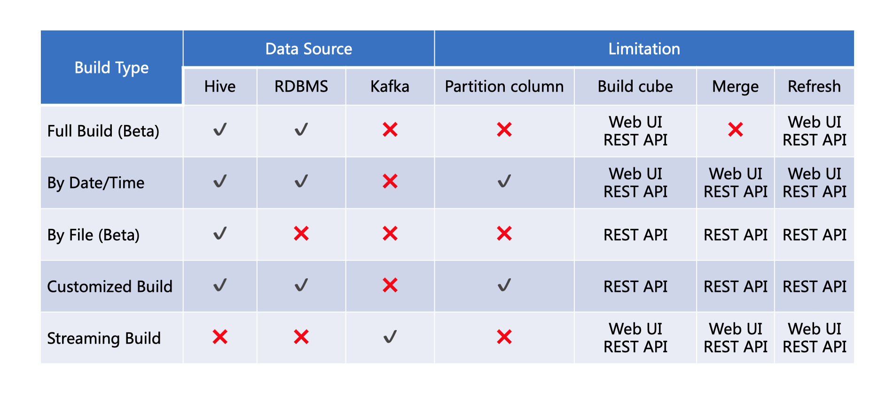

## Build Cube

After cube is created, it has to be built to serve queries. We will use Kyligence Enterprise sample data to show the process of cube building.

This product supports the following ways to build cube: full build, build by date/time, build by file, streaming build and customized build.

The following table lists the data sources and limitations of each build type.

