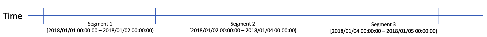
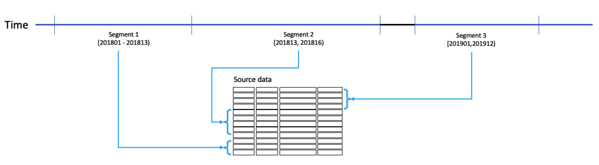

## Customized Build (Beta)

In this chapter we will introduce customized build to incrementally load new data for some specific scenarios. We will explain in details how it works and how to use.

### Application Scenario

In most cases, we recommend you to build cube based on standard date/time column to incrementally load new data into cubes, on a weekly, daily, or even hourly basis, via submitting a build job with a date/time range containing a start and end date/time. 

But in some scenarios, new data cannot be identified or selected simply by a date/time column. E.g. :

- You have a self-increasing transaction number and you need to build new data into cube based transaction number ranges. 
- You have a fiscal year/period column and you need to build new data based on fiscal year/periods. 
- You have two columns, like date and batch id, you can build new data by different batches in each date.

So in this case, Kyligence Enterprise supports cube customized build. You can implement your own way to build new data incrementally into Kyligence cubes.

### How It Works

For each successful date/time based cube build job, Kyligence Enterprise will create a new segment in cube which contains the date/time range as well as the data of the segment. And normally the date/time ranges of all segments in a cube are consecutive if looking at them from a time axis point of view, just as shown below:

> **Note：**In real implementation, Kyligence Enterprise will transform date/time value into Long type, and these ranges are actually number ranges.

For customized build, you can submit the job with a number range of Long type instead of a date/time range. Kyligence Enterprise will call a customized build implementation (or technically a Java class) which is developed by yourself, to generate the data selection SQL for this job. In this customized build implementation, you will be responsible for mapping this number range to the new data selection criteria (or technically a WHERE clause in SQL statement).

### How to Use

1. Set Incremental Data Loading type during model design.

   Please set **Incremental Data Loading** to be *Customize* when save your model. When you submit a cube build job for cubes based on this model, Kyligence Enterprise will call your own implementation to generate new data selection SQL.

   

2. Set your own implementation for customized build

   You have to implement your own Java class for customized cube build, put your jar under `$KYLIN_HOME/ext` and restart Kyligence Enterprise. 

   For how to implement this Java class, please refer to [Developer Guide for Implementing Java Class of  Customized Cube Build](../../appendix/customized_build_dev_guide.en.md).

   Then specify your Java class name in **Java Class for Customized Incremental Build**.

   You can also specify class initialization parameter for your Java class. For example, you can pass the column name(s) which should be used in the WHERE clause for the new data selection. Use comma as the separator if it contains multiple values.

3. Click **Submit** to save this model.

4. Create a cube based on the model above.

5. Submit a build job with a number range using REST API.

   For customized build cubes, you can submit job **ONLY** via REST API to build, refresh, or merge segment. For more information about how to use REST API, please refer to Kyligence user manual.

6. After submitting a cube build job, you can go to **Monitor** page to check its status and progress. You can also to go cube management page and check whether the data range is correct for the new segment.

7. After the job is successfully finished, please check whether the right data is loaded into cube via submitting a SQL query.

