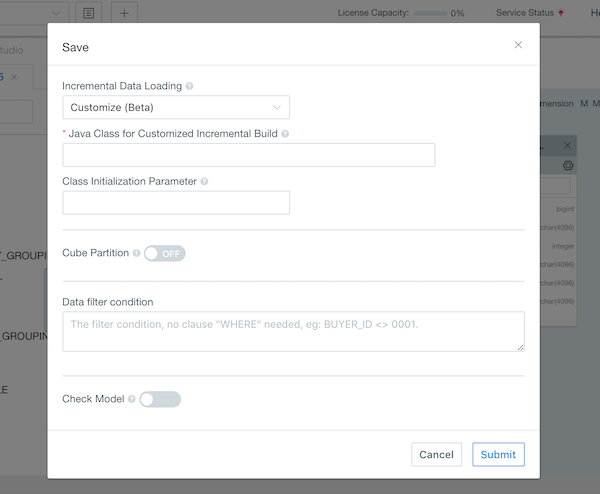
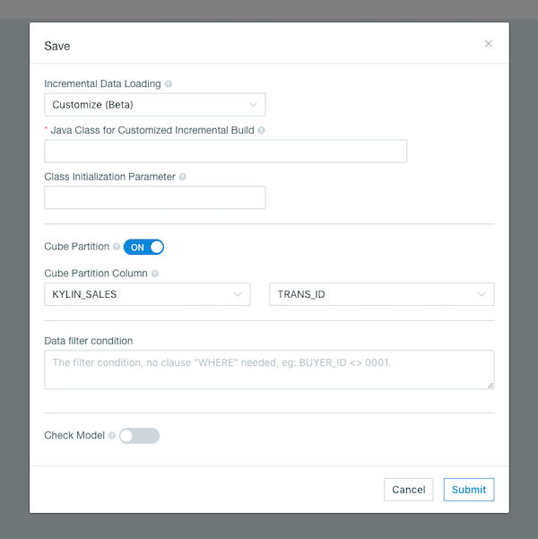

## Customized Build

In addition to Full Build, Build by date/time, Build by file, and streaming build, users may need more flexible ways to build cube. This product provides a customized incremental build from version 3.2. Users can customize the way the cubes are built in the system to meet production needs.

### Set build type in model

1. Choose Build Type

   If we set the incremental data load type to **Customize** when saving the model, the build type of the Cube designed in that model corresponds to **Customize**.

   

2. Java Class for Customized Incremental Buil

   User needs to enter the class name of the Java class used to implement the custom incremental build. The Java class should inherit from the parent class io.kyligence....cubbuild and implement its build method. The mapping of build parameters to data selection is implemented in the build method.

   [Example Java Class]

3. Class Initialization Parameter

   User passes the corresponding parameters according to the above Java class to implement a custom incremental build. Multiple parameters are separated by commas.

4. Set Cube Partition

   The cube will be built incrementally based on the specific column if the cube partition is enabled.

   

5. After click the **Submit** button, the model is all set.

**Note:** Cube build, segments refresh and merge can only be conducted in REST API. See [Cube API](../../rest/cube_api.en.md) for details.

