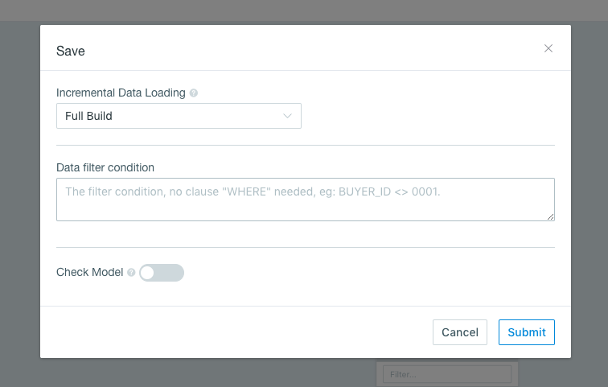
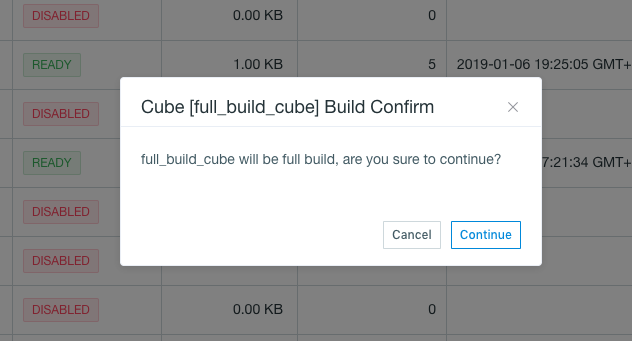
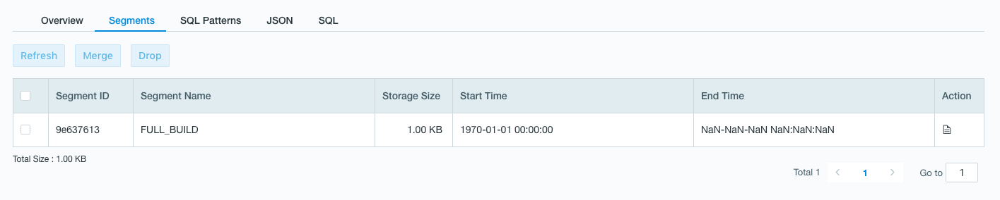

## Full Build

If we set the incremental data load type to **Full Build** when saving the model, the build type of the Cube designed in that model corresponds to **Full Build**.

User can conduct full build in Web UI or via REST API. See [Cube API](../../rest/cube_api/README.md) for details.

User cannot merge segments in a full-build cube since there should be only one segment. Segment refresh can be conducted in Web UI and REST API.

### Full Build in Web UI

1. Select the cube (here Cube "full_build_cube" for example) designed in the model saved as **Full Build**, right click the **Action** button, and select **Build** in the drop-down menu. A pop-up wondow will appear as below:

   

2. Click Continue to run the build job. After build completes, go to cube detail page and check if the cube status now is *Ready*. There should be a segment named FULL_BUILD under the cube.

