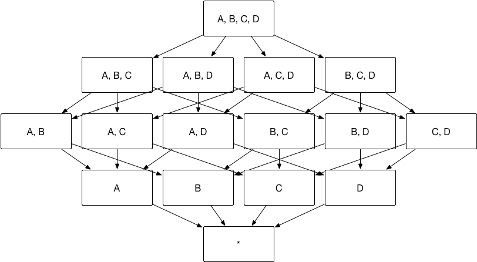
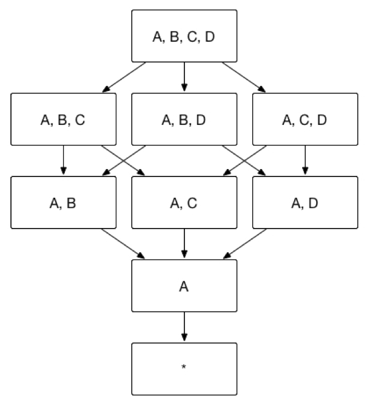

## Aggregation Group

Curse of dimensionality is an infamous problem for all of the OLAP engines based on pre-calculation. In Kyligence Enterprise we designed the aggregation group mechanism to alleviate this issue.


### Introduction

It is a known fact that Kyligence Enterprise speeds up query performance by pre-calculating cubes, which in term contains different combination of all dimensions, a.k.a. cuboids. The problem is that cuboids grow exponentially with the dimension. For example, there’re totally 8 possible cuboids for a cube with 3 dimensions, however there are 16 possible cuboids for a cube with 4 dimensions. Even though Kyligence Enterprise is using scalable computation framework (MapReduce) and scalable storage (HBase) to compute and store the cubes, it is still unacceptable if cube size turns up to be times bigger than the original data source.





To alleviate the pressure on cube building, Kyligence Enterprise has released a series of advanced settings to help user filter actual needed cuboid. These advanced settings include **Aggregation Group**, **Joint Dimension**, **Hierarchy Dimension** and **Mandatory Dimension**.  

You can pick dimensions in the cube into one or more aggregation groups, by selecting dimension under **Includes** window. 


Users can then set **Mandatory Dimension**, **Hierarchy Dimension** and **Hierarchy Dimension**. Dimensions under these three settings have to be included into **Includes**  under this aggregation group first. Once set properly, on the top left corner of aggregation group, estimated cuboid number will be calculated and displayed. This can help you to understand the complexity of the cube build. 


Next, we will explain the mechanism of these advanced settings and provide use cases in the following sections. 


### Aggregation Group 

You can divide combination of dimensions they focus on in several groups, and these groups are called **Aggregation Group.**  

As the cube shown at the begining of this chapter, if you only need dimension combination AB and CD, then cube can be divided into two aggregation groups, group AB and group CD. As shown below, the number of cuboid can be reduced from 16 to 8. 


The aggregation groups that end users need might contain overlapping dimensions, for example, aggregation ABC and aggregation BCD both contain dimension B and C. These aggregation groups will derive the sample cuboid, for example aggregation group ABC will derive cuboid BC, and so does aggregation group BCD. A cuboid will not be generated multiple times, if it can be derived from more than one aggregation group, as shown in below.

With aggregation groups, you can then filter the granularity of cuboid to get the dimensionality he/she want. 


                     


#### Use Case

Assume a transactional cube, which contains below dimension: Customer ID`buyer_id`, Transaction Date`cal_dt`, Payment Type `pay_type`and Customer City`city`. Sometimes, analyst need to group dimension City, Cal_dt and Pay_Type to understand different payment type in different cities. There are other times, analyst need to group dimension city, cal_dt andbuy_id together to understand customer behavior in different cities. As example shown above, it is recommended to build two aggregation groups, including dimensions and groups as below:


Aggregation Group 1： `[cal_dt,city, pay_type]`

Aggregation Group 2： `[cal_dt,city, buyer_id]`

Regardless of other situations, those two aggregation groups can reduce 3 unnecessary cuboid: [pay_type, buyer_id]、[city,pay_type, buyer_id] and [cal_dt, pay_type, buyer_id], thus storage space and build time can also be saved. 


Case 1: 
```sql
Select cal_dt, city, pay_type, count(*) from table
Group by cal_dt, city, pay_type
```
will hit on cuboid [cal_dt, city, pay_type]


Case 2: 

```sql
Select cal_dt, city, buyer_id, count(*) from table
Group by cal_dt, city, buyer_id 
```
will hit on Cuboid [cal_dt, city, buyer_id]

Case 3: If one unusual query occur

```sql
Select pay_type, buyer_id,count(*) from table
Group by pay_type, buyer_id
```
then no cuboid can be hit, Kyligence Enterprise will calculate result based on existing cuboid on-demand. 


### Mandatory Dimension

Sometimes you might be interested in analysis with one or more specific dimensions, any queries will include one specific dimension. In this case, this dimension can be set as **Mandatory Dimension**. Once set, only the cuboid with this dimension will be calculated. In the example at the begining of this chapter, if dimension A is set as mandatory, then cuboid will be calculated as shown below. The number of cuboid will be reduced from 16 to 9.





#### Use Case​
Assume a transactional cube that include transaction date, transaction location, product, payment type. Transaction date is a frequently used group by dimension. If transaction date is set as mandatory dimension, combination of dimensions will be calculated as below:


### Hierarchy Dimension

End user usually will use dimensions with hierarchical relationship, for example, Country, Province and city. In this case, hierarchical relationship can be set as **Hierachy Dimension**. From top to bottom, country, province and city are one-to-many relationship. That is to say, query to these three dimensions can be group into three types：

1. group by country

2. group by country, province（equivalent to group by province）

3. group by country, province, city（equivalent to group by country, city or group by city）
    ​
    As the cube shown below, assume dimension A = Country, dimension B = Province and dimensionC = City, then dimension ABC can be set as hierarchy dimension. And cuboid [A, C, D] = cuboid [A, B, C, D]，cuboid [B, D] = cuboid [A, B, D], thus, cuboid [A, C, D] and cuboid [B, D] can be pruned.

    

    As the diagram below illustrates, based on the method above, Kyligence Enterprise can prune redundant cuboid, hence, reduced cuboid from 16 to 8.

    


### Use Case
Assume a transactional cube that include dimensions transaction city`city`,transaction province`province`, transaction country`country` and payment type`pay_type`. Analyst will group transaction country,transaction province, transaction city and payment type together to understand customer payment type preference in different geographical location. In this example above, it is recommended to create hierarchy dimension in existing aggregation group (Country / Province / City) that include dimension and combinations shown in below:


Aggregation Group: `[country, province, city，pay_type]`
​
Hierarchy Dimension: `[country, province, city]`

​
Case 1: 
​
Analysts want to understand city level customer payment type preferences

```sql
SELECT city, pay_type, count() FROM table GROUP BY city, pay_type
```

can be retrieved from cuboid [country, province, city, pay_type].


Case 2: 
​
Analysts want to understand province level customer payment type preference

```sql
SELECT province, pay_type, count() FROM table GROUP BY province, pay_type
```

can be retrieved from cuboid [country, province, pay_type].


Case 3: 
​
Analysts want to understand customer's payment type preference from country level

```sql
SELECT country, pay_type, count() FROM table GROUP BY country, pay_type
```

can be retrieved from cuboid [country, pay_type].


Case 4: 
​
Analysts want to get different granularity of geographical dimension:

```sql
SELECT country, city, count(*) FROM table GROUP BY country, city
```


it will retrieve data from cuboid[country, province, city].


### Joint Dimension

Sometimes you don’t need detail of some combination of dimensions, for example, you might query dimension A, B, C together in most cases, but not dimension A, C or dimension C alone. To enhance performance in this case, **Join Dimension** can be used. If A, B and C are defined as Joint Dimension, Kyligence Enterprise will only build cuboid ABC but not cuboid AB, BC and A. Finally, cuboids will be built as below. The number of cuboid can then reduced from 16 to 4.


​
#### Use Case
Assume a transactional cube that include dimension transaction date`cal_dt`, transaction city`city`, customer gender`sex_id`, payment type`pay_type`. Analyst usually need to group transaction date, transaction city and customer gender to understand consumption preference for different genders in different cities, in this case, `cal_dt, city,sex_id `will be grouped together. In this case above, it is recommended to assign them in joint dimension based on existing aggregation groups that include following dimension and combination as shown below:
​ 
​ ​
Aggregation Group: `[cal_dt,city, sex_id，pay_type]`

Joint Dimension:  `[cal_dt, city, sex_id]`


Case 1: 

```sql
SELECT cal_dt,city, sex_id, count(*) FROM table GROUP BY cal_dt, city, sex_id
```
​​​can retrieve data from cuboid [cal_dt, city, sex_id].

​​ ​​​​​​​​​​​​​​
Case 2: 
​​ ​​​​​​​​​​​​​​​​​​​​
​​ ​​​​​​​​​​​​​​​​​​​​​​​If one unusual query runs

```sql
SELECT cal_dt, city, count(*) FROM table GROUP BY cal_dt, city
```
​​​​​​​then no cuboid can be hit, Kyligence Enterprise will leave calculate result based on existing cuboid. 
​​ ​​​​​​​​​​​​​​​​​​​​​​​​