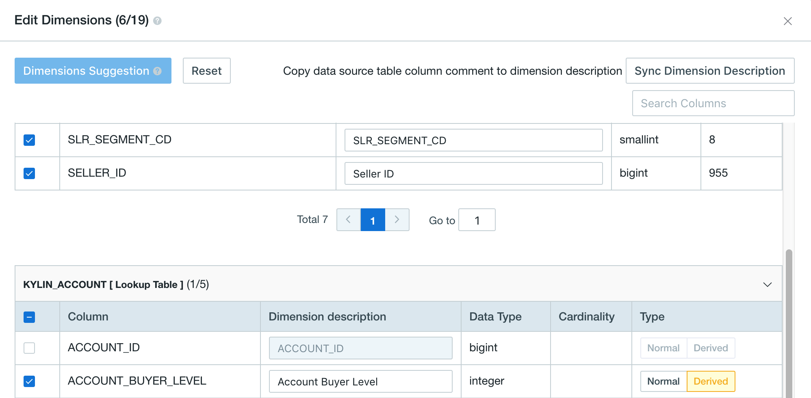
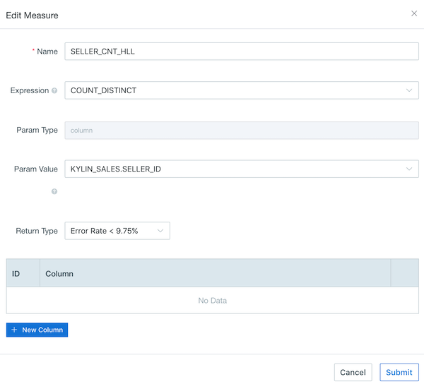
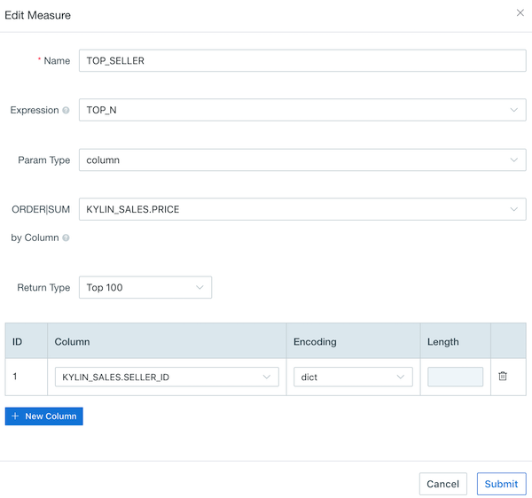
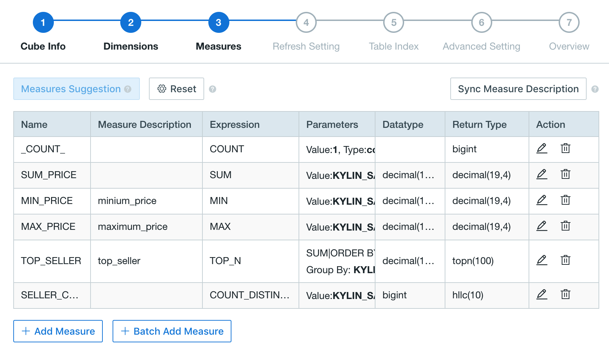

## Cube Design Basics

This chapter introduces how to design a cube, using sample data (*learn_kylin*) as an example.

Open the web UI, select project *learn_kylin* in project list in upper left corner. We will create a new cube named *kylin_sales_cube_1*.


### Basic Cube Info

Click **Add Cube** on model *kylin_sales_model* and input cube name *kylin_sales_cube_1*. Click **Submit** button to continue. Then you will get to the cube design wizard which will guide you through all the steps.


### Dimensions

Select some columns as dimensions via **Add Dimensions**. Dimension can be set as *normal* or *derived*. Only dimensions from lookup tables that have snapshots can be set as derived dimensions. 



> **Note:**
>
> 1. You can maintain dimension description to add semantic comment to each dimension. Meanwhile this description can be directly exposed to specific BI tools such as Tableau, via using "export TDS" functionality.
> 2. You can directly sync column comment defined in data source as dimension description and it can also be changed afterwards.
> 3. In version 3.4.2, description of unchecked dimensions can also be synced, but it will be lost if you rollback to previous version and edit then save the cube again. It is recommended that you backup the metadata before rolling back to a version before 3.4.2.

Only the number of normal dimensions will affect the number of cuboid generated as well as the size of cube data. Compare to normal dimension, derived dimension does not participate in cube calculation directly. Instead, it is represented by its FK (Foreign Key) in cube. That is why using derived dimensions can greatly reduce cube complexity. During query, derived dimensions have to be converted to their FKs first, causing a small compromise to performance.

Basic rules for defining dimensions in a cube is explained as below:

- Dimensions that are often used in filters should be set as normal dimensions for best query performance.

  In table *KYLIN_CATEGORY_GROUPINGS*, if three columns (*META_CATEG_NAME*, *CATEG_LVL2_NAME*, *CATEG_LVL3_NAME*) can be all filter conditions in query, they should be set as normal dimensions at first.  

- Dimensions that come from lookup table, if their cardinality is not high, should be set as derived dimensions.

  For example, week column is frequently used in filters as well as aggregations. Here column *WEEK_BEG_DT* in table *KYLIN_CAL_DT* is required and derived from column *PART_DT*, and it has a relatively low cardinality. So column *WEEK_BEG_DT* is set as derived dimension.

- For the same reason, column *USER_DEFINED_FIELD1*, *USER_DEFINED_FIELD3*, *UPD_DATE*, *UPD_USER* in table *KYLIN_CATEGORY_GROUPINGS* are set as derived dimensions.
- Finally set column *LSTG_FORMAT_NAME* in fact table as normal dimension.

The dimension setting result is shown as below:


Kyligence Enterprise provides several means to optimize cube's storage size and query performance through **Dimension Optimization** settings, including **Aggregation Group (AGG)**, **Rowkey** and **Max Dimension Combination (MDC)**. The number of cuboids can be greatly reduced by setting a proper AGG and MDC. For more details, please refer to [Aggregation Group](aggregation_group.en.md) and [Cuboid Pruning](cuboid_pruning.en.md).

Here we recommend to use the **Optimize** button. It will do the dimension optimization automatically, based on the dimensions selected and other information collected from table statistics, model check, and SQL patterns.

The optimization setting for our sample cube is shown as below:


Rowkey specifies how dimensions are organized and stored together. The order of dimensions specified in rowkey can greatly affect the query performance, so we recommned to set these dimensions which are frequently used in query filters as first or second. 

Kyligene Enterprise can automatically set rowkey encoding and sequence according to dimension data types and cardinalities according to table sampling results. So ususally you don't have to set it manually except for special optimization purposes.

To show you how to set rowkey, we will set *PART_DT* as the first dimenions in this example.

Each dimension in the cube has a corresponding placeholder in rowkey. For normal dimensions the placeholder is the column itself, and for derived dimensions the placeholder is the lookup table's corresponding foreign key in the fact table. 

Each placeholder of the rowkey has an encoding as below:  

1. **dict**: use dictionary to encode dimension values. Dict encoding is very compact but vulnerable for ultra high cardinality dimensions. By default, this product will use this encoding for non-UHC *varchar* and *char* dimensions.
2. **boolean**: use 1 byte to encode boolean values, valid values include: true, false, TRUE, FALSE, True, False, t, f, T, F, yes, no, YES, NO, Yes, No, y, n, Y, N, 1, 0. By default, this product will use this encoding for *boolean* dimension.
3. **integer**: use N bytes to encode integer values, where N equals the length parameter and ranges from 1 to 8. [ -2^(8*N-1), 2^(8*N-1)) is supported for integer encoding with length of N. By default, this product will use this encoding for *tinyint*, *smallint*, *int*, *bigint* dimensions.
4. **date**: use 3 bytes to encode date dimension values.  By default, this product will use this encoding for *date* dimensions.
5. **time**: use 4 bytes to encode timestamps, supporting from 1970-01-01 00:00:00 to 2038/01/19 03:14:07. Millisecond is ignored.  By default, this product will use this encoding for *time* dimensions.
6. **fixed_length**: use a fixed-length("length" parameter) byte array to encode integer dimension values, with potential value truncations.  By default, this product will use this encoding for UHC *varchar* and *char* dimensions.
7. **fixed_length_hex**: use a fixed-length("length" parameter) byte array to encode the hex string dimension values, like 1A2BFF or FF00FF, with potential value truncations. Assign one length parameter for every two hex codes.

There're multiple dimensions in our example, and we need to set encoding type for each column. For demonstration purpose, we use dict encoding for all dimensions except *LSTG_FORMAT_NAM*E, which uses fixed_length (length 12) encoding. 

The rowkey setting result is shown as below:


> **Note**: Columns in lookup tables can be set as normal dimension or derived dimension, if snapshot is enabled for the lookup table. Normnal dimensions are stored in cube, while derived dimensions are stored in snapshots. For more information, please refer to [Set Lookup Table Snapshot](../model_design/data_modeling.en.md#advanced-set-lookup-table-snapshot).

> **Caution**: It's **NOT** reconmended to mix normal dimensions and derived dimenions in one lookup table. Users might be confused by query results, as some dimensions are from cube which reflects histrocal truth, while some are from snapshot which shows more recent status.


### Measures

We can define measures according to analysis requirements. COUNT measure and SUM measure could be created automatically if you click **Optimize**. Of course these measures can be modified or deleted later manually.  

- **SUM**

To summerize order amount in our case, we define total sales  `SUM(PRICE)` as a cube measure. 

- **COUNT DISTINCT**

Also we need to count number of sellers by defining another measure `COUNT(DISTINCT SELLER_ID)`. 

Kyligence also implements HyperLogLog algorithm - an approximation algorithm, for counting high-cardinality columns with much higher query performance.  If accuracy is not that so critical in some cases, you can choose this algorithm and specify an error rate, e.g. in our case we set *Error Rate < 9.75%*. Similarly we also create another measure `COUNT(DISTINCT LSTG_FORMAT_NAME)`.



- **TOP N**

We usually need to figure out the best sellers by executing following SQL query to get the best sellers' ID:

```sql
SELECT SELLER_ID, SUM(PRICE) FROM KYLIN_SALES 
GROUP BY SELLER_ID 
ORDER BY SUM(PRICE)
```

In Kyligence Enterprise, we can define a TOP-N measure to acheive this with much better query performance.

We create a TOP-N measure, select *KYLIN_SALES.PRICE* column in **ORDER/SUM by Column** and select *SELLER_ID* in **GROUP BY**. Select *TOPN(100)* as the measure accuracy.




Finally, all the measures are defined as blow:



> **Note:**
>
> In 3.4.2 and later version, you can directly sync column comment defined in data source as measure description and it can also be changed afterwards. If the measure involves multiple columns, the descriptions of multiple columns will be spliced together as the measure description. 

### Refresh Settings

**Auto Merge Threshold**: After each successful cube build job, one segment will be added into cube data. When there're too many segments exist in one cube, it might greatly affect query performance. Hence we recommend to set up auto merge by week or month, to merge these small segments into one big segment. The settings are as bellow:


> **Caution:** auto merge only applies to cubes with incremental data loading type "By Date/Time". For other scenarios, please **DO NOT** enable this setting.

**Retention Threshold**: For some old and not-used segments, the system can remove these segments automatically by configuring the retention threshold. For each new segment already built, the system will check whether the old segments should be removed at the same time. The rule is if the time range between the latest segment's end date and the old segment's end date exceeds the retention threshold. For example, if the Retention Threshold is 1 year, and the latest segment's end date is today. Any old segments whose end dates before the today of the last year will be removed. 

> **Note**: If automatic cleanup is not required, please keep the default value to 0. 

**Partition Start Time**: In previous sections, we mentioned that we want to build cube incrementally and choose column *PART_DT* as the partition column. The partition start time of the cube is required in building process and it is "1970-01-01 08:00:00" as the start time by default.


### Table Index

To support high query performance also on detailed data, Kyligence provides indexing functionality on raw tables and this can be enabled in **Table Index**.

For more details,lease refer to [Table Index](table_index.en.md).


### Advanced Setting

Some of the configurations in `kylin.properties` can be overwritten at cube level and this can be done in **Advanced Setting**. We do not suggest to change any configurations for the moment.

> **Note:** For more details about overriding configurations, please refer to [Configuration Override](../../installation/config/config_override.en.md)

In this step, you can also choose cube build engine. By default, the system uses MapReduce as build engine. But you may also switch to *Spark (Beta)* manually. 

> Note: For the detailed information on how to configure and use Spark as build engine, please see [Build Cube on Spark](../../installation/spark_cubing/spark_engine.en.md).


### Cube Overview

Please confirm all the information and click **Save** if everything is settled. Then click **OK** in pop-up menu.

Finally a cube is successfully created. This new cube will be shown in cube list. But its status is *disabled* due to it has no data built into this cube.


