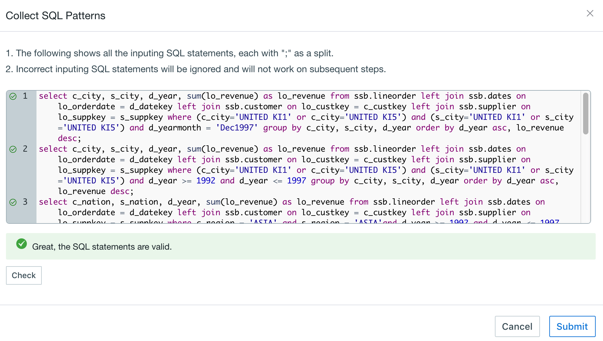

## Cube Optimizer

Start from V2.5, Kyligence Enterprise provides a *multi-preference based Cube Optimizer* to suggest cube designs, which helps reduce cube expansion and improve Query and Build performance.

In the second step of Cube creation, you may find this function.

### Introduction

According to the best practices of Cube tuning, optimizer analyzes statistics of source data and SQL patterns, and suggests a optimized Cube design, which includes:

- ***Optimization Strategy***: 
  - Data Oriented: Optimizer would mainly digest source data feature to suggest one aggregate group, which optimizes all dimensions from a model. Cubes which follows data-oriented strategy are suitable to serve flexible queries.

  - Business Oriented: Optimizer would only digest SQL patterns input in *Optimizer Inputs* to suggest multiple aggregate groups consisting of mandatory dimensions. Cubes which follows business-oriented strategy are designed to answer known queries.

  - Default: If you do not specify any strategy, This product will suggest the aggregation groups and RowKeys based on the contents in *Optimizer Inputs*.

- *Dimensions*: dimension and the type of dimension, such as *Normal* or *Derived.*
- *Measures*: suggest common aggregation mostly in entered SQL patterns as measures.
- *Aggregation Groups*: Optimizer will suggest select rules for each group, such as Joint, Hierarchy, Max Dimension Combination(MDC), etc.
- *RowKey*: Optimizer will suggest order and configuration for each RowKey, such as Encoding.

In order to achieve accurate suggestion, Optimizer need to take the following items as input:

- Preference: Help you to optimize cube accordingly based on your query scenario

> Note: when you choose one preference, the following input content may be the required condition to use cube optimizer later

- Model Check: Model check must be completed before Optimize a cube, and the result is required input for Data Oriented Optimizer

- SQL Patterns: Some history or target SQL statements, which guides the suggestion for Measures, Aggregation Groups and RowKeys

### Steps

Step 1, Implement model check on a data model. Skip the model check if it has already passed. To get more info about model check, please click [Model Check](model/model_design/model_check.en.md).

Step 2, To create a cube with this model, please click "Collect SQL patterns" under "Cube Info" tab, then paste your SQL statements. For multiple SQLs, use ';' for separation.

Step 3, Click the blue "Dimensions" button on "Dimensions" tab and then the dimension window will pop up. You can select *SQL output* to get suggested dimensions from *SQL patterns*, or select dimensions manually. All default dimension types(normal/derived) are suggested by Cube Optimizer. 

Step 4, Click "Optimize" button under "Dimension Optimizations" section, aggregation groups will be filled with suggested rules, such as Mandatory, Hierarchy and Joint. Besides, configuration and order of RowKeys will also be updated as suggestion.

Step 5, Click "SQL Output" button under "Measures" tab, Optimizer will fill in recommended measures from SQL patterns.

Step 6, According to business requirements, users are able to make any adjustment to dimension, measures, aggregation groups, RowKeys, measures and so on. After that, save it.

