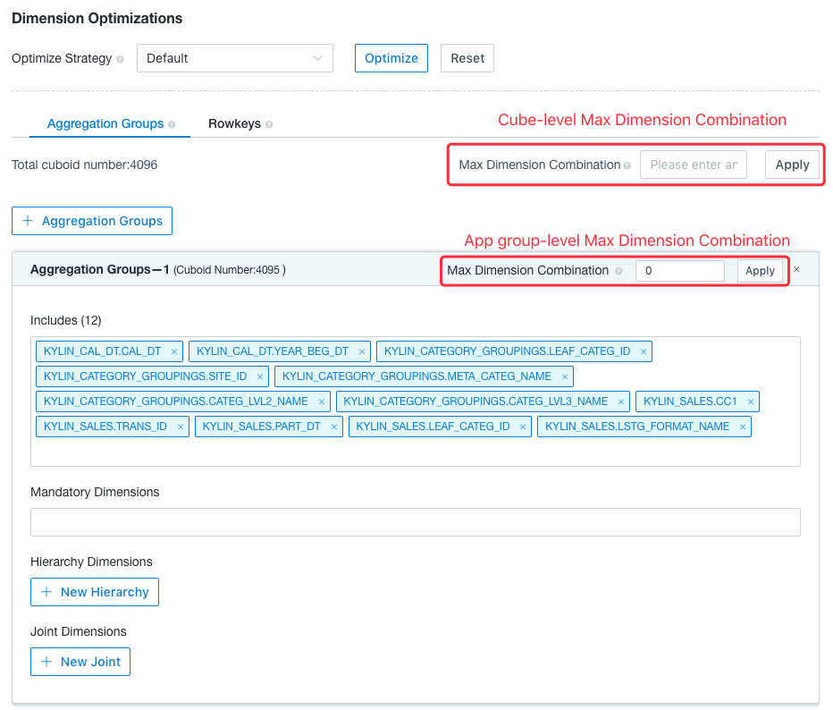
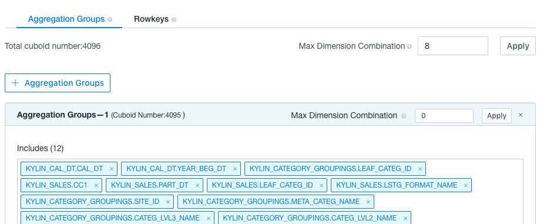
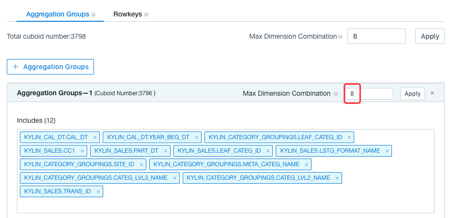
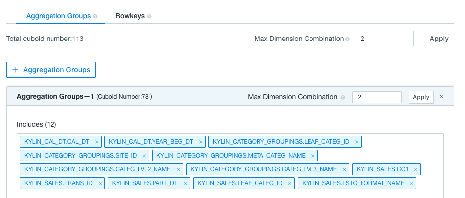

## Maximum Dimension Combination

Aggregation group and all its advanced settings help avoid cuboid number explosion. To achieve better Cube design, users need to understand the data model, which is hard for the junior ones. Fortunately, This product provides another simple cuboid pruning tool named *Max Dimension Combination (MDC)*, which indicates the maximum number of dimensions in every cuboid. This tool limits the dimension number in a single cuboid, which means cuboids containing too many dimensions are not built in Cube Building process. It fits well in the situation where most queries only touch no more than N dimensions, N is MDC threshold that is configurable.


### Dimensions Count in Query ###

From V2.4.3, we treat a group of joint dimension or hierarchy dimension as one dimension when counting dimensions in a cuboid, and ignore mandatory dimensions. For example,

```sql
select count(*) from table group by column_mandatory, column_joint1, column_joint2, column_hierarchy1, column_hierarchy2, column_normal
```

There is one mandatory dimension, two dimensions belonging to one joint dimension, two dimensions belonging to one hierarchy dimension and one normal dimension. So we treat them as 3 dimensions in cube pruning.


### Schematic Diagram of Pruning ###


This is a sprouting graph of cuboid which has 7 dimensions and some details are hidden in order to help users understand.

When MDC = 4, the cuboid which has over 4 dimensions will be pruned, such as ABCDEF, ABCDEG, ABCDE, and ABCDF.

When MDC = 3, the cuboid which has over 4 dimensions will be pruned, such as ABCDEF, ABCDEG, ABCD, and ABCE.

Considering the performance in cube build, the base cuboid and *some cuboid* will not be pruned although their dimensions are greater than MDC. For example, cuboid ABCEF is likely to be left. Meanwhile, a group of joint dimension or hierarchy dimension and mandatory dimensions need to be considered when using the MDC tool.


### Set Max Dimension Combination (MDC)  ###

We'll introduce how to set Max Dimension Combination (MDC) in this section. It locates in Dimension Optimizations section of Cube dimension design, the second step of the whole Cube design process. User can set MDC in Cube level and in aggregation group level. Enter an integer larger than 0 and click the **Apply** button, the MDC setting is saved.



The Cube level MDC applies to all aggregation groups, while the aggregation group level MDC affects only itself. More information of how these two levels of MDC work list below:

1. If and ONLY if the aggregation group level MDC = 0, it will be overriden by the cube level MDC.

   

   Save the cube and edit the cube again, you can see the aggregation level MDC equals to cube level MDC.

   

2. If the aggregation group level MDC > 0, it only applies to this aggregation group. 

3. If the cube level MDC = 0 or the cube level MDC is empty, it means the user turn off the cube level MDC. At this time, the number of dimensions in a Cuboid generated by an aggregation group with MDC of 0 is not limited. If aggregation group level MDC is larger than 0, the MDC still works.


Based on the example above, we set the cube level MDC to 2, and keep the aggregation group level MDC as 0. Save the cube and edit it again, we can see the cuboid number is reduced from 4095 to 78 in the aggregation groups, and all cuboids in this cube are reduced to 113. It is because the cuboids containing more than 2 dimensions are ignored except for base cuboid.




### Benefit and Trade-off ###

On one hand, MDC dimension pruning tool reduces the cuboids number and storage size significantly. On the other hand, some complex queries that cover more dimensions may hit large cuboids, in which case online calculation cannot be avoided. The too much online calculation may make query response slower. 

Like other cube optimization tools, it's a kind of trade-off. If most queries touch fewer dimensions in your case, MDC deserves a shot.
