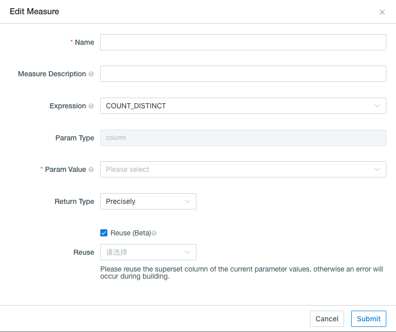

## Count Distinct (Precise) (Beta)

Count distinct is a frequent-used function for most data analysts. Since v2.1, this product implements precise count distinct based on bitmap. For the data with type tiny int(byte), small int(short) and int, project the value into the bitmap directly. For the data with type long, string and others, encode the value as String into a dict, and project the dict id into the bitmap. The result of measure is the serialized data of bitmap, not just the count value. This ensures results are always correct within any segment, even roll-up across segments. 

### Prerequisite

Before using count distinct query, you need to clarify if the target column is ready for it. You can get measures information by checking `measures` of built `Cube`(as shown below). If the measure desired has been pre-calculated on precise count distinct syntax(here requires both `Expression` to be count_distinct and `Return Type` to be bitmap), and stored within the Cube information, then this measure is ready to do further count distinct query. Otherwise, you need to create a new Cube.

### Count Distinct Precision Setting 

Firstly, after created a new Cube and ensure all dimensions selected, then click `+ Add Measures` on the lower left corner to start measures setting.  

Next, choose the column desired from `Param Value` and COUNT_DISTINCT from `Expression`. Here be careful to select accuracy requirement from `Return Type`. Kyligence Enterprise offers both approximate count distinct function and precise count distinct function. To get the pre-calculated precise count distinct value, you should select  `Return Type: Precisely` based on bitmap, which would return a no error result if storage resource is sufficient. For instance, one result size might be hundreds of megabytes, when the count distinct value over millions.

This product encodes values into dictionary at the segment level by default. ***Global Dictionary*** ensures that one value is always encoded into the same ID across different segments.

If there is a column in Cube set as precisely count distinct measure, columns which have a hierarchical relationship with the column would reuse the **encoding** directly. You should click the ***Reuse*** checkbox under the ***Return Type***, then select the column to be reused in the reuse list.

> **Note:**
>+ Only the precise count distinct measure column with the same parameter value data type is displayed in the reuse list.
>+ If the reuse column is not a subset of the reused columns, the cube build will fail.

### Reference

[Use Count Distinct in Apache Kylin](http://kylin.apache.org/blog/2016/08/01/count-distinct-in-kylin/) (Yerui Sun)

