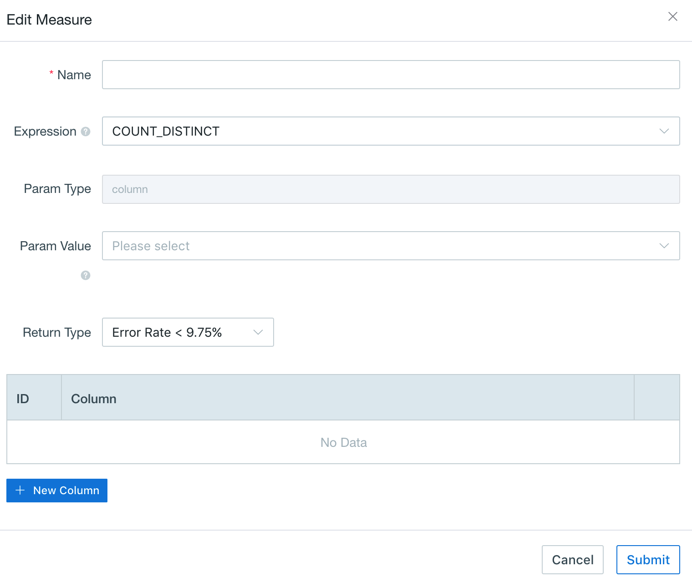

## Count Distinct (Precise)

Count distinct is a frequent-used function for most data analysts. Since v2.1, this product implements precise count distinct based on bitmap. For the data with type tiny int(byte), small int(short) and int, project the value into the bitmap directly. For the data with type long, string and others, encode the value as String into a dict, and project the dict id into the bitmap. The result of measure is the serialized data of bitmap, not just the count value. This ensures results are always correct within any segment, even roll-up across segments. 

### Prerequisite

Before using count distinct query, you need to clarify if the target column is ready for it. You can get measures information by checking `measures` of built `Cube`(as shown below). If the measure desired has been pre-calculated on precise count distinct syntax(here requires both `Expression` to be count_distinct and `Return Type` to be bitmap), and stored within the Cube information, then this measure is ready to do further count distinct query. Otherwise, you need to create a new Cube.

### Count Distinct Precision Setting 

Firstly, after created a new Cube and ensure all dimensions selected, then click `Measures+` on the lower left corner to start measures setting.  

Next, choose the column desired from `Param Value` and COUNT_DISTINCT from `Expression`. Here be careful to select accuracy requirement from `Return Type`. Kyligence Enterprise offers both approximate count distinct function and precise count distinct function. To get the pre-calculated precise count distinct value, you should select  `Return Type: Precisely` based on bitmap, which would return a no error result if storage resource is sufficient. For instance, one result size might be hundreds of megabytes, when the count distinct value over millions.

There is another little setting difference on`Advanced Setting`. To complete precise count distinct setting, which means to get correct results from precise count distinct function not only within a segment, but also across several segments when it is roll-up. So we need to add a global dictionary within `Advanced Dictionaries`. (Notice: please keep default `dict` settings for all long, string, and other non-integer columns to ensure them can be encode in the global dictionary).

Select `Dictionaries+` , then choose desired columns as Column and the global dictionary shown below as its `Builder Class` . Follow the [Create Cube](create_cube.en.md) introduction for rest steps, the Cube would be ready after you set segments during the [Build Cube](../build_cube.en.md) section.

### Example

Select a default **Data Source** named as `learn_kylin`, then the table structure would present below: there are one fact table (`KYLIN_SALES`) and two lookup tables (`KYLIN_CAL_DT` and `KYLIN_CATEGORY_GROUPINGS`). Take a minute to check the `KYLIN_SALES` as well as its sample data, and we'll use it later.

Run `select count(distinct seller_id) as seller_num from kylin_sales where part_dt= DATE '2012-01-02'` query in **Insight** dashboard, then result did returned in 0.18sec.  

Then run `select count(distinct seller_id) as seller_num from kylin_sales where part_dt in ('2012-01-02','2013-01-02')`  and get the result shown below in 0.25sec. 

Both results are confirmed right, proving that precise count distinct query works well and correctly. More information about approximate count distinct function, please refer to [Count Distinct (Approximate)](count_distinct_hllc.en.md) introduction.

### Global Dictionary

This product encodes values into dictionary at the segment level by default. That means one value in different segments maybe encoded into different ID, then the result of count distinct will be incorrect. In v2.1 we introduce “Global Dictionary” with insurance that one value always be encoded into the same ID across different segments. Meanwhile, the capacity of dictionary has expanded dramatically, upper to support 2 billion values in one dictionary. It can also be used to replace the default dictionary which has 5 million values limitation. 

The global dictionary cannot be used for dimension encoding for now, that means if one column is used for both dimension and count distinct measure in one cube, its dimension encoding should be others instead of dict. 

### Reference

[Use Count Distinct in Apache Kylin](http://kylin.apache.org/blog/2016/08/01/count-distinct-in-kylin/) (Yerui Sun)

