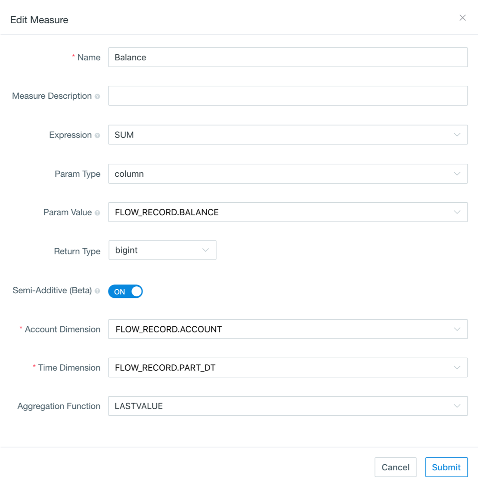

## Semi-additive Measure (Beta)

Semi-additive measures are very common in various data analysis scenarios, like account balance or inventory analysis. Take account balance as an example, you can analyze account balance based on the account transactions history, SUM() is used when aggregated by default, but for aggregating multiple records under the same account, we need to use last record value (LASTVALUE) along the time dimension (typically it's transaction date/timestamp).

Since v3.3, Kyligence Enterprise supports semi-additive measure. When defining a SUM() measure, you can enable semi-additive behavior by specifying a semi-additive function (LASTVALUE), an account dimension, and a time dimension (only TIMESTAMP or DATE type). When querying, Kyligence Enterprise will take only the last value along the time dimension for multiple records in the same account, and then perform normal accumulation (SUM) on other dimensions.

### How to Use

Taking the balance analysis based on account transaction history data as an example, the following is the bank account transaction hisotry table *FLOW_RECORD*:

| Part_DT             | Account   | Expense | Income | Balance |
| ------------------- | --------- | ------- | ------ | ------- |
| 2018-01-01 13:28:18 | account_a | 100     |        | 1000    |
| 2018-01-02 04:53:00 | account_b | 200     |        | 800     |
| 2018-01-02 08:53:00 | account_b | 300     |        | 500     |
| 2018-02-15 13:38:55 | account_a |         | 200    | 1200    |
| 2018-02-18 13:38:58 | account_b |         | 300    | 800     |

We can create a semi-additive measure with *Balance* by the following steps.

Step 1. In the third step of Cube creation, click **Add Measure** in the left corner to add a new measure.

Step 2. Enter the measure name, select *SUM* as expression and *Balance* as the parameter value. Click *Semi-Additive (Beta)*.



Step 3. Select *Account Dimension* and *Time Dimension*, and set an *Aggregation Function*.

> **Note:** only *LASTVALUE* function is supported in the current version.

Step 4. Design and build Cube, then go to **Insight** page to run a query. 

Here are some query examples:

1. Analyze the total expenditure, total income and balance for each account.

   ```sql
   SELECT ACCOUNT, SUM(EXPENSE),SUM(INCOME),SUM(BALANCE)
   FROM FLOW_RECORD
   GROUP BY ACCOUNT
   ```

   The query results:

   ```sql
   account_a, 100, 200, 1200
   account_b, 500, 300, 800
   ```

2. Analyze the total expenditure, total income and balance of all accounts in the year 2018.

   ```sql
   SELECT SUM(EXPENSE),SUM(INCOME),SUM(BALANCE)
   FROM FLOW_RECORD
   WHERE YEAR(PART_DT) = 2018
   ```

   The query results:

   ```sql
   600, 500, 2000
   ```

3. Analyze the total expenditure, total income and balance of each account in every month of the year 2018.

   ```sql
   SELECT MONTH(PART_DT),SUM(EXPENSE),SUM(INCOME),SUM(BALANCE)
   FROM FLOW_RECORD
   WHERE YEAR(PART_DT) = 2018
   GROUP BY MONTH(PART_DT)
   ```

   The query results:

   ```sql
   201801, 600, 0, 1500
   201802, 0, 500, 2000
   ```

### Known Limitation

1. In the current version, only measures with *SUM* as expression can be set to a semi-additive measure, and the aggregation function only supports *LASTVALUE*.
2. Semi-accumulated measures does not support asynchronous queries.
3. In the same project, a column cannot be defined both as semi-additive measure and normal *SUM* measure in one project. That is, in a project, after defining a semi-additive measure based on a column, you can no longer define a normal *SUM* measure based on that same column.
4. In the current version, queries containing semi-additive measure cannot be answered correctly by table index or pushing down to the underlying query engine. That's because when the SQL containing semi-additive measures is answered by the table index or the underlying query engine, the semi-additive measures will be calculated as normal additive measures, leading to inconsistent query results.
