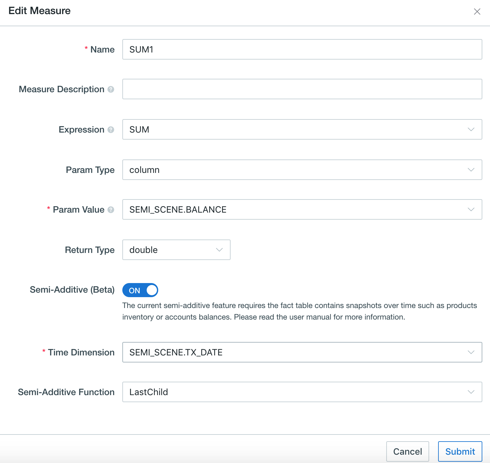

## Semi-additive Measure (Beta)

Semi-additive measures are very common in various data analysis scenarios, like account balance or inventory analysis. Take account balance as an example, you can analyze account balance based on the account transactions history, SUM() is used when aggregated by default, but for aggregating multiple records under the same account, we need to use last record value (LastNonEmpty) along the time dimension (typically it's transaction date/timestamp).

Since v3.3, Kyligence Enterprise supports semi-additive measure. When defining a SUM() measure, you can enable semi-additive behavior by specifying a semi-additive function (LastNonEmpty), an account dimension, and a time dimension (only TIMESTAMP or DATE type). When querying, Kyligence Enterprise will take only the last value along the time dimension for multiple records in the same account, and then perform normal accumulation (SUM) on other dimensions.

### How to Use

Taking the balance analysis based on account transaction history data as an example, the following is the bank account transaction history table *FLOW_RECORD*:

| Part_DT    | Account   | Expense | Income | Balance |
| ---------- | --------- | ------- | ------ | ------- |
| 2018-01-01 | account_a | 100     |        | 1000    |
| 2018-01-01 | account_b | 200     |        | 800     |
| 2018-01-02 | account_b | 300     |        | 500     |
| 2018-02-15 | account_a |         | 200    | 1200    |
| 2018-02-18 | account_b |         | 300    | 800     |

We can create a semi-additive measure with *Balance* by the following steps.

Step 1. In the third step of Cube creation, click **Add Measure** in the left corner to add a new measure.

Step 2. Enter the measure name, select *SUM* as expression and *Balance* as the parameter value. Click *Semi-Additive (Beta)*.



Step 3. Select *Account Dimension* and *Time Dimension*, and set an *Aggregation Function*.

> **Note:** Only *LastNonEmpty* function is supported in the current version. If you see *LASTVALUE*, it is a bug in the beta version and will be fixed soon. It actually behaviors as *LastNonEmpty*.

Step 4. Design and build Cube, then go to **Insight** page to run a query. 

Here are some query examples:

1. Analyze the total expenditure, total income and balance for each account.

   ```sql
   SELECT ACCOUNT, SUM(EXPENSE),SUM(INCOME),SUM(BALANCE)
   FROM FLOW_RECORD
   GROUP BY ACCOUNT
   ```

   The query results:

   ```sql
   account_a, 100, 200, 1200
   account_b, 500, 300, 800
   ```

2. Get the balance of all accounts by the end of January 2018.

   ```sql
   SELECT ACCOUNT, SUM(BALANCE)
   FROM FLOW_RECORD
   WHERE PART_DT <= '2018-01-31'
   GROUP BY ACCOUNT
   ```
   
   The query results:
   
   ```sql
   account_a, 1000
   account_b, 500
   ```
   
3. Analyze the total expenditure, total income and balance of all accounts in the year 2018.

   ```sql
   SELECT SUM(EXPENSE),SUM(INCOME),SUM(BALANCE)
   FROM FLOW_RECORD
   WHERE YEAR(PART_DT) = 2018
   ```

   The query results:

   ```sql
   600, 500, 2000
   ```

4. Analyze the total expenditure, total income and balance of each account in every month of the year 2018.

   ```sql
   SELECT MONTH(PART_DT),SUM(EXPENSE),SUM(INCOME),SUM(BALANCE)
   FROM FLOW_RECORD
   WHERE YEAR(PART_DT) = 2018
   GROUP BY MONTH(PART_DT)
   ```

   The query results:

   ```sql
   201801, 600, 0, 1500
   201802, 0, 500, 2000
   ```

### Notes and Known Limitations

1. In order to get correct query results, please note the below when writing queries:
   - The filter of queries must be open enough to include at least one record for each account that need to be returned.

     For example, the below query won't return value for `account_a` because the filter only includes the date `2018-01-02`, and there is no record for `account_a` on that date.
   
     ```sql
     SELECT ACCOUNT, SUM(BALANCE)
     FROM FLOW_RECORD
     WHERE PART_DT = '2018-01-02'
     GROUP BY ACCOUNT
     ```
   
     The incorrect result will be
   
     ```sql
     account_b, 500
     ```
   
     To get the balances of all accounts on `2018-01-02`, the right query should be
   
     ```sql
     SELECT ACCOUNT, SUM(BALANCE)
     FROM FLOW_RECORD
     WHERE PART_DT <= '2018-01-02'
     GROUP BY ACCOUNT
     ```
   
     And the correct result is
   
     ```sql
     account_a, 1000
     account_b, 500
     ```
   
   - The record sets produced by the Group By of query must be big enough such that, each group must contain at least one record for each account that need to be returned.
   
     For example, the monthly Group By below will return the total balance at each month end correctly, because each month contains records for both `account_a` and `account_b`.
   
     ```sql
     SELECT MONTH(PART_DT), SUM(BALANCE)
     FROM FLOW_RECORD
     WHERE YEAR(PART_DT) = 2018
     GROUP BY MONTH(PART_DT)
     ```
   
     However, the daily Group By below won't return the total balance of each day correctly, because not all accounts have records every day.
   
     ```sql
     SELECT PART_DT, SUM(BALANCE)
     FROM FLOW_RECORD
     WHERE YEAR(PART_DT) = 2018
     GROUP BY PART_DT
     ```
   
   - If there are multiple records of one account at one same point of time, the semi-additive result is undetermined since it is not sure which record is later in time.
   
   - Semi-additive measures does not work with table index, query pushdown, and asynchronous query. Normal additive results will be returned in these cases.
2. Only measures with *SUM* as expression can be set to a semi-additive measure, and the aggregation function only supports *LastNonEmpty*.
4. In the same project, a column cannot be defined both as semi-additive measure and normal *SUM* measure in one project. That is, in a project, after defining a semi-additive measure based on a column, you can no longer define a normal *SUM* measure based on that same column.
