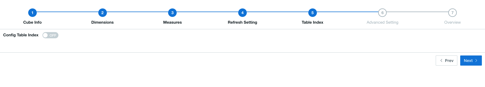
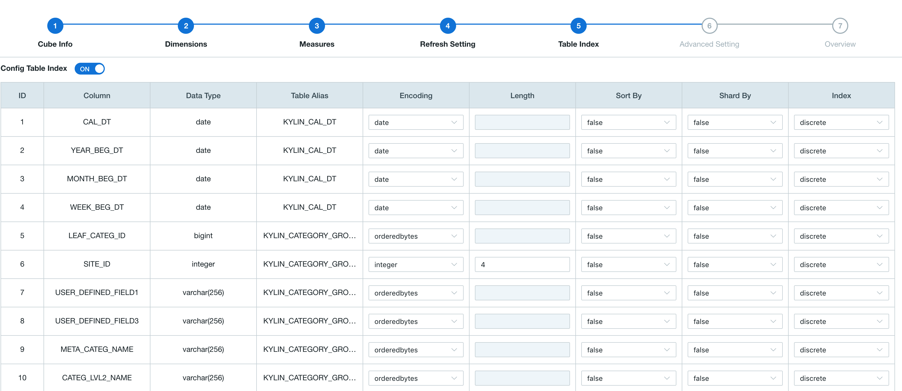
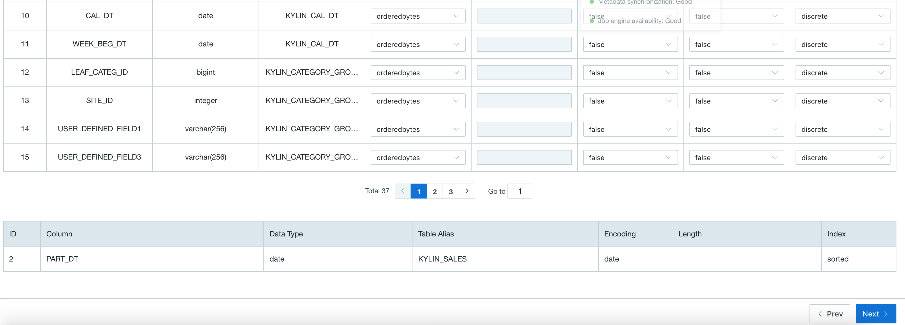
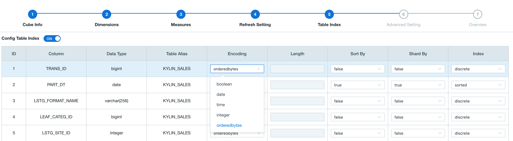
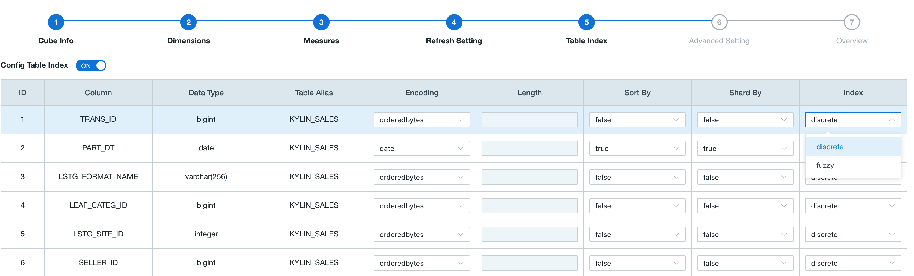

## Table Index

This product provides table index to support querying on raw data. For customized queries, this product leverages well-designed cubes to efficiently process them; for queries not within such scope, Query Pushdown plays a supplementary role. Those functions allow users to quickly get results of aggregation queries. Besides, users can make use of table index to fulfill their tasks, if they are interested in raw data. 

### Create Table Index

The procedure of creating table index is embedded in the procedure of cube creation. As the graph shows, click *+Cube* button to start a general cube creation procedure. When you get the 5th step of Cube creation wizard (in versions higher than 2.4): *Table Index*, you can find a check box of *Config Table Index*, which is unchecked by default: 

Click the check box to enable table index. After that you can find details of table index configuration. Each row refers to possible configurations of one column in raw data table. 

Select appropriate columns in *SortBy* and *ShardBy*, and click the drop down list to set is as SortBy or ShardBy. Also, choose an appropriate encoding for every column. Complete the Cube creation procedure. After building the Cube, you can query for corresponding raw data. 

### SortBy and ShardBy

Setting a certain column as SortBy or ShardBy reasonably could substantially increase query efficiency of table index. Now we introduce their meaning and how to set them. 

When you configure table index, you should set at least 1 column as SortBy. Those columns will be listed below the table index configuration, which looks like: 

Columns set as SortBy will indicate the order of raw data. You can drag one of them up or down to change their order. 

The first column of SortBy list must have encoding of "integer", "date" or "time". No limitation for other columns. Please refer to contents below for more details of encoding. 

Those top columns in the order of SortBy list will get more benefits on efficiency when they are filter condition of queries. Thus, we suggest you arrange SortBy columns as the order of chance to be filter condition in your environment. Do not set too many SortBy columns, because tail columns have little help for performance, increasing overheads of table index building on the contrary. We also suggest you set a column of time to be the first in SortBy list, in order to get a better performance when processing time-related queries, which are very common. 

When you configure table index, you could set 1 column as ShardBy or simply do nothing. If you set a certain column as ShardBy column, the raw data will be sharded according to values of that column. If you don't explicitly specify an ShardBy column, sharding will be done considering of values in all columns. 

Select an appropriate ShardBy column could distribute raw data into multiple shards, which can increase concurrency, and finally get a better query performance. We suggest you choose columns with relatively large cardinality as ShardBy column to prevent heterogeneous distribution of data. 

### Encoding

You can click *Encoding* drop down list of each column in table index configuration page to set encoding for that column, as shown below: 

1. "orderedbytes" is designed for all types. It keeps data's order when encoding. It's the default encoding type in most cases.
2. "var" is similar to orderedbytes except it does not preserve order. It's not suggested. Please use "orderedbytes" instead.
3. "boolean" uses 1 byte to encode boolean values. Valid values include: true, false, TRUE, FALSE, True, False, t, f, T, F, yes, no, YES, NO, Yes, No, y, n, Y, N, 1, 0. 
4. "integer" uses N bytes to encode integer values, where N equals the length parameter and ranges from 1 to 8. [-2^(8*N-1), 2^(8*N-1)) is supported for integer encoding with length of N. 
5. "int" is deprecated. Use latest "integer" instead. 
6. "date" uses 3 bytes to encode date dimension values. 
7. "time" uses 4 bytes to encode timestamps, supporting from 1970-01-01 00:00:00 to 2038/01/19 03:14:07. Milliseconds are ignored. 
8. "fix_length" uses a fixed-length ("length" parameter) byte array to encode integer dimension values, with potential value truncations. 
9. "fixed_length_hex" uses a fixed-length ("length" parameter) byte array to encode the hex string dimension values, such as 1A2BFF or FF00FF, with potential value truncations. For every two hex codes, one length parameter will be assigned. 

Notice: "dict" encoding is NOT supported in table index.

### Index

You can click *Index* drop down list of each column in table index configuration page to set index type for that column, as shown below: 

1. "discrete" index is the default index. It supports fast match of equal condition, but will degrade to table scan when processing ">" or "<" condition. 

2. "fuzzy" index is for query with like filter. If query with "like" filter will be applied to one column, please set the index as "fuzzy". It is not recommended to set index of too many columns as "fuzzy", which will increase storage overhead. 

> If query with the like filter applied to the columns which are not set as "fuzzy", it may spend more time when using table index.
