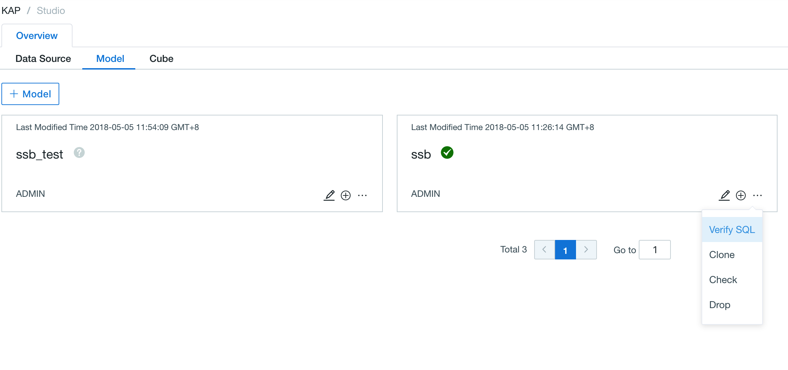
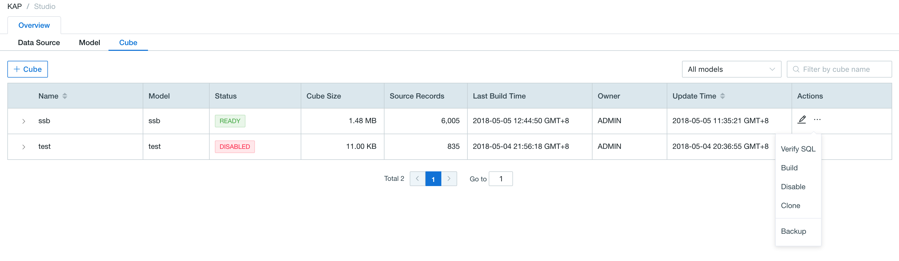
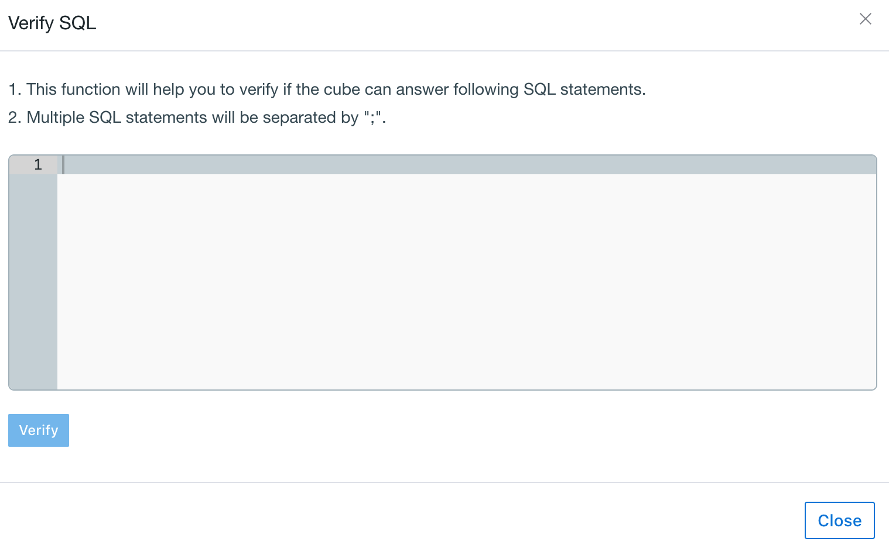
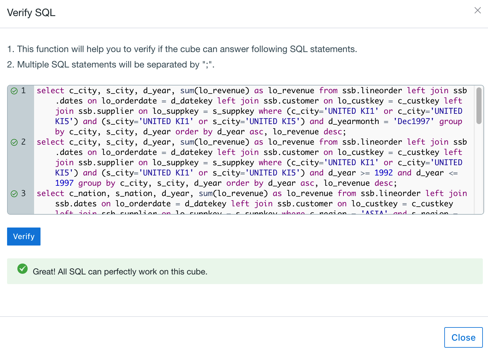
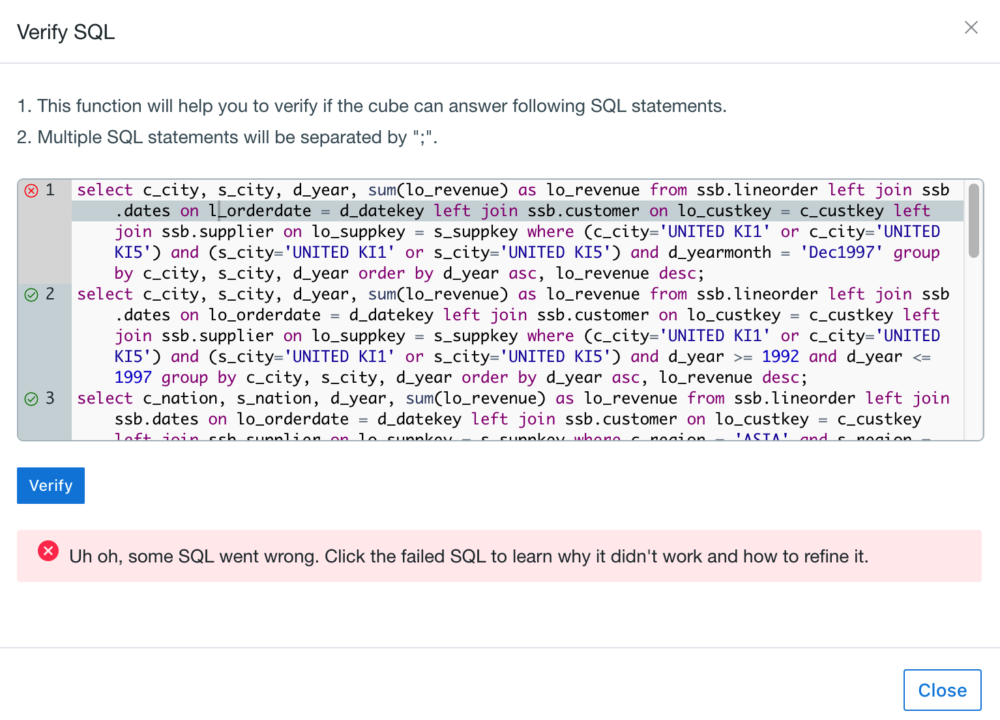
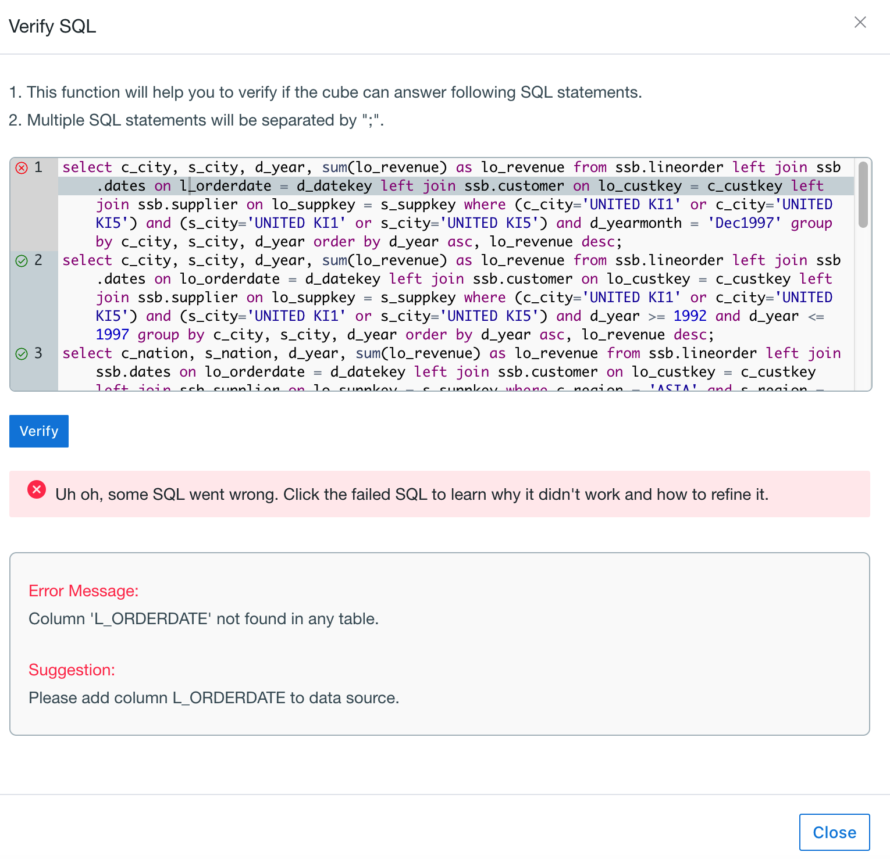

## Verify SQL 

You might be wondering when you design a cube/model: will this cube/model be able to answer all my SQLs? Kyligence Enterprise helps you verify this by providing a ***Verify SQL*** action, before you actually start to build the cube . 

### Verify Approach

Step 1, after you finish cube/model design and save it, you can do the ***verify SQL*** action from action list on the cube/model.

Step 2, paste or manually enter SQLs you want to verify, which are often queried. 

Step 3, click ***verify*** and this action may take a while. If the cube/model is designed appropriately, it can answer all entered queries, you will get the following result.

Step 4, if there are queries cannot pass the verification test, it will be listed after "x". You can click the "x" to get details about ***why*** this query cannot work and ***how*** to refine SQL or cube/model to make it work.

