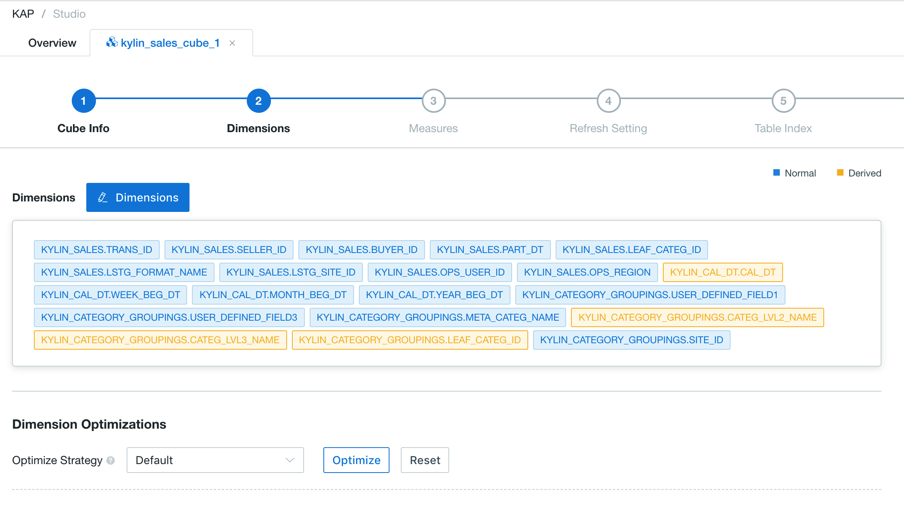

## Cube Design Best Practices and Examples

Cube design is not a trivial task especially for big datasets. Some settings, like dictionary encoding and lookup table snapshot, are not suggested to apply on extremely large datasets. To help you get deep knowledge into your data and design a good cube, Kyligence Enterprise provides tools like table sampling and model check which should be adopted whenever possible.

In this guide, we will explain some best practices of how to design a good cube, using the sample data as an example.


### Prepare the Sample Data

Before start, we need some [Sample Data](../appendix/sample_dataset.en.md). Please [Import The Sample Datasets From Hive](../datasource/import_hive.en.md) if haven't yet. We will use these tables as examples throughout this guide.


### Run Table Statistics

Typically table statistics will answer questions like the following and these numbers are critical for later cube design.

- How many rows a table contains? 
- What are the cardinalities of the columns?
- What are the characteristics of values in all columns?

To get the statistics of your tables:

1. Go to **Data Source** panel. From the left navigation bar, select **Studio** -> **Overview** -> **Data Source**.
2. To collect statistical information of a table, select it in the table list and then click **Sampling** button on  top right of the panel.
   * In the popup, click **Submit** to launch a sampling job on the table.
   * The job can take a few minutes to complete depending on the size of the table and the capacity of your cluster. You can see its progress in **Monitor** panel.

3. Check the statistics of the table once the sampling job is completed.
   * In the **Data Source** panel, select the table and then click the **Statistics** tab in the right panel. You should see the table's row count and the cardinalities of the columns like below.
   * Note the cardinalities are approximate results, but it's already enough for designing a cube.
     
4. Repeat the above steps for all of your tables.

> **Note:**
>
> Alternatively, the row count and column cardinality could also be obtained by running Hive query, like:
>
> ```sql
> select count(*), count(distinct col), ... from table
> ```
> However, the sampling job is still recommended as it is generally faster and collects more information in addition to row count and column cardinality.


### Create Model

Details about creating a model is explained in the [Data Model](model_design/data_modeling.en.md) chapter. Here we just highlight one decision point that causes more problems than others.

The decision point is whether to create snapshots for lookup tables or not. The system assumes lookup tables are relatively small, which is true in most cases. That is why, by default, the system creates snapshots for all lookup tables. And this brings a few benefits:

- With snapshot, a lookup table can be queried directly (without always joining with a fact table). Take the sample data as an example, the following queries requires a snapshot to run:

  ```sql
  select * from TEST_ACCOUNT;
  
  select count(*), ACCOUNT_COUNTRY
  from TEST_ACCOUNT group by ACCOUNT_COUNTRY;
  ```
- With snapshot, you can define derived dimensions in cubes.

  However, if your lookup table is too big, e.g. over 300 MB, you will encounter error during cube build, complaining the table is too big to take a snapshot. So here are some best practices about lookup tables and snapshots:

- Exclude big lookup tables for snapshots in model definition.

  How big is too big? The system measures the table by data size, however, it is not clear until cube is built. By experience, you should **watch out for any lookup table over 1 millions rows**.

  To exclude a lookup table for snapshot, in the bottom of edit model page, find **Overview** and then the **Model** tab, uncheck the snapshot checkbox in the lookup table list.


- Increase `kylin.snapshot.max-mb` very carefully.

  One workaround is to extend the size limit of snapshot such that your lookup table can fit. The default limit is 300 MB and it can be extended by setting `kylin.snapshot.max-mb` in `config/kylin.properties`. However, be very careful when setting the value. Larger snapshots take a lot more memory to build and query. In general, we don't recommend any limit value above 500 MB, even the memory seems to be sufficient.

- Design a new model by making the big lookup table a fact table.

  If you need the snapshot in order to query a big lookup table, consider designing a new model which makes this lookup table a fact table. For example, in the sample data, if there are many queries on the `TEST_ACCOUNT`, then you are analyzing the user accounts. The `TEST_ACCOUNT` can be a new fact table in your analytics.


### Run Model Check

It is highly recommended to run model check after a model is created. Similar to table statistics, this step is optional but very important to later cube design.

Model check analyzes the joined result set of your tables, which is the real data set that goes into cube. Analysis of the data will provide suggestions to hierarchy and joint dimensions, which is critical for cube optimization later.

Please refer to [Model Check](model_design/model_check.en.md) chapter for how to perform the model check. A few tips here:

- **Under the Sampling Setting**, **always specify a time range for model check** to control the amount of data being processed. The **Time Range** is much more efficient than **Sampling Percentage** in order to control the data volume. With big data, checking a full dataset can take forever to complete.
- Note table statistics is also included as a part of the model check. If you have done table statistics before, they will **NOT** be repeated here.


### Create Cube

We are now ready to show why and how the above preparations can help cube design. Please refer to [Cube Design Basics](cube_design/create_cube.en.md)  chapter for detailed operations. Here are a few best practices to pay attention as you design a cube.

- **Deciding Normal or Derived Dimensions**

  Derived dimensions are good as they take little space in cube. Unlike normal dimensions, you can have unlimited number of derived dimensions. However, as explained in the model design, lookup table snapshot is a prerequisite of derived dimensions, and only small lookup tables can have snapshots. 

  Take the sample data as an example:

  * TEST_CAL_DT` is a calendar table and its row count is no more than a few thousand. This is ideal size for snapshot and it makes all columns in `TEST_CAL_DT` possible for derived dimensions.` 
  * `TEST_ACCOUNT` is a user account table and it may contain millions of records. In this case, it is not applicable for snapshot, thus making derived dimension **NOT** possible for `TEST_ACCOUNT` columns.

- **Deciding Aggregation Groups**

  Setting up aggregation groups is a challenging task even for experienced cube designers. That is why we run table statistics and model check to collect data information. And with that, the system can help optimize the aggregation groups automatically.

  In order to take advantage of **Dimension Optimization** feature:

  * Make sure you have run table statistics and model check to collect data information.
  * Optionally, provide some SQL patterns in the first **Cube Info** step.
  * Finally, click the **Optimize** button in the **Dimension Optimization** section. The system will fill out the aggregation groups automatically according to the data characteristics it has collected before.



- **Deciding Rowkey Encodings**

  Another setting that often brings troubles to a newbie is rowkey encoding. The trap here is **dictionary encoding is NOT applicable to Ultra-High-Cardinality (UHC) columns**. The bar of UHC is 1 millions by experience. That is why knowing the cardinality of columns is so important.

  > **Note：** from version 3.2.2, Kyligence  Enterprise will automatically set rowkey encoding and sequence according to dimension data types and cardinalities according to table sampling results.

  The guideline of choosing rowkey encoding is as following:

  * Start with `date`, `time`, and `dictionary` encoding. Date and time have their own specific encodings. For numbers and strings with cardinality under 1 millions, `dictionary` is usually the most efficient encoding.
  * For UHC columns, if they are numbers, choose `integer` or `double` encoding.
  * For the remaining UHC columns, apply `fixed_length` encoding. The `fixed_length` encodes data into a fixed length of bytes. Being not very space efficient, it is the last choice to go.

  Take the sample data as examples:

  * Most of the dimensions can go with `date` and `dictionary` encoding. That includes date columns like `CAL_DT`, string columns like `LSTG_FORMAT_NAME`, and number columns like `LSTG_SITE_ID`. 
  * A few columns are UHC by business meaning, like `ORDER_ID` having a cardinality of number of orders, `SELLER_ID` having a cardinality of number of sellers. The two are of type `bigint` and should apply the `integer` encoding.

- **Deciding Rowkey Order**

  The order of rowkey can have a big impact on query and build performance. In the rowkey list, you can move the rowkeys up and down by drag and drop. Please put the rowkeys in the following order:

  1. Dimensions that are heavily involved in filters.

     Being upper in position, their values will be more clustered in storage and that helps filtering and scanning during query execution.

  2. High cardinality dimensions.
  3. Low cardinality dimensions.

  Organize dimensions **in cardinality's descending order** can help to calculate the cube more efficiently.


### Test the Cube Using a Small Piece of Data

Always test your cube before putting it into production environment. Once more data is loaded, the cube becomes more difficult to change.

Here are some tips to test a new cube:

- **Build a Few Small Segments**
  Smaller segments are faster to build and test. If anything went wrong, it gives us more time to go back and fine-tune the cube.

  Ideally a small segment can be built in tens of minutes.

- **Verify Queries Hitting the Desired Cube**
  Send test queries on the **Insight** page, and verify whether the resulted query engine (above result grid) is the desired cube. Be sure to test some of your most complicated queries early on.

  To analyze why a wanted cube cannot answer a query, you can use the **Verify SQL** feature (find it in the **Actions** in the cube list page). It should output some hints and suggestions about why the query cannot hit this cube and how to alter your cube to match the query.

- **Do Some Performance Benchmark**

  Once the cube is functioning, it is suggested to do some performance benchmark and think about deployment and resource allocation in production.


