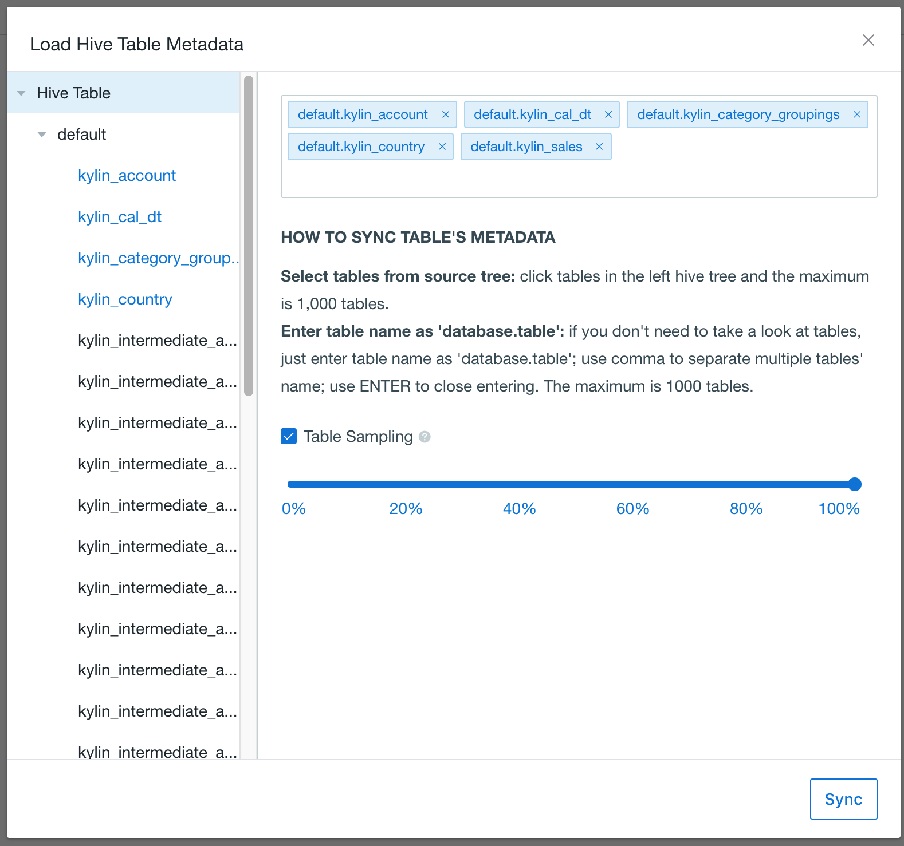
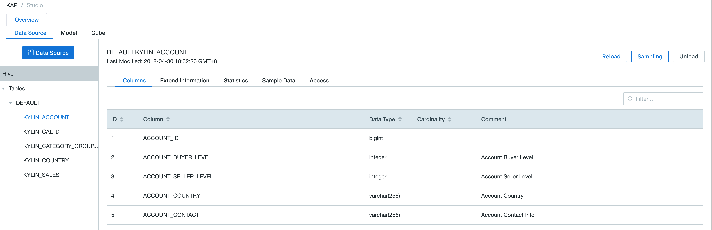

## Import Hive Data Source

Kyligence Enterprise supports accessing *Hive* tables. 

This charpter will introduce how to access hive tables as data source. Following are the intructions.

### Prepare Sample Datasets

You can import the sample data Kyligence Enterprise provided into Hive using executable scripts.

The script is `sample.sh.`. Its default storage path is the bin directory under system installation.

```shell
$KYLIN_HOME/bin/sample.sh
```

> Tips: After sample.sh is run, it is required to choose **Reload Metadata** under the **System** page. Otherwise, there will be errors in data modeling. 

Once the script is finished, excuate commands in Hive shell to confirm the tables are imported successfully.

```hive
hive
```

Check the imported hive tables.

```shell
hive> show tables;
```

Check the details of imported hive tables.

```shell
hive> select count(*) from kylin_sales;
```

### Create Project with Hive Data Source

1. log in on Kyligence Enterprise Web UI
2. add a new project by clicking the `+` at the top right on Web UI.
3. type project name (required) and dscriptions on the pop up page; click `OK` to finish creating a project.
4. select `Data Source` under *Studio* section of  your project.
5. click the blue `Data Source` button.
6. select Hive as data source (as shown below).


7. click `NEXT` and enter the *Load Hive Table Metadata* page; you can select tables you want from *Hive Table* on the left.

8. click `sync` to load the data. 

   

   > By default, Kyligence Enterprise does not select data sample. Users have options to do it and select sample size.

9. once done synchronizing, select specific tables and see the details under *Data Source* section.

