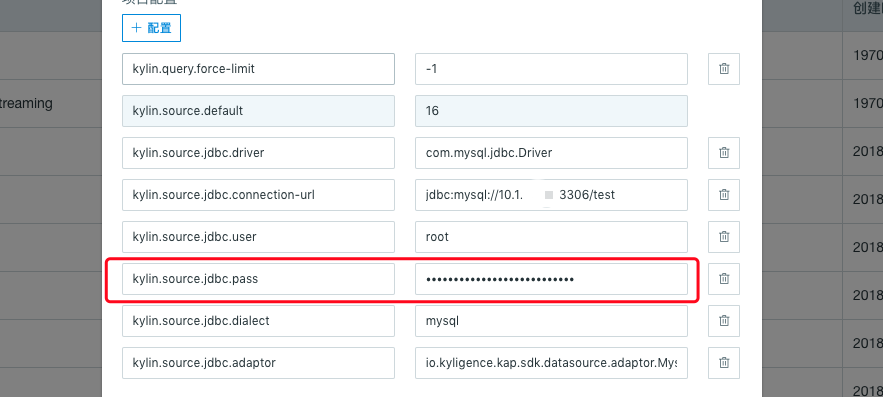
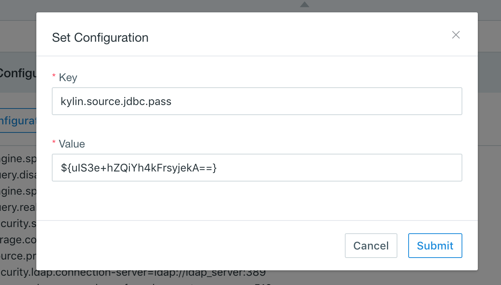

## Import Data from RDBMS

Kyligence Enterprise supports RDBMS as data source since version 3.0. 

### Supported RDBMS
- Greenplum
- MySQL
- Microsoft SQL Server

### Prerequisites

You need to follow the steps below to connect to RDBMS:

- Download RDBMS official JDBC Driver
- Download Kyligence specific data source adaptor from [Kyligence Account](http://download.kyligence.io/#/addons)
- Copy related jar packages to  `$KYLIN_HOME/ext`. 
- Copy related jar packages to `<sqoop_installation_directory> /lib`, check global parameters, and add kylin.source.jdbc.sqoop-home=&lt;sqoop_path&gt; to `kylin.properties`. sqoop_path is the file where the sqoop command locates.

### Connection Configuration

Users can set the following configurations in **project configuration** or **global configuration**.

| Parameter                        | Description                        |
| -------------------------------- | ---------------------------------- |
| kylin.source.jdbc.driver         | JDBC Driver Class Name             |
| kylin.source.jdbc.connection-url | JDBC Connection String             |
| kylin.source.jdbc.user           | JDBC Connection Username           |
| kylin.source.jdbc.pass           | JDBC Connection Password           |
| kylin.source.jdbc.dialect        | Dialect to the Data Source         |
| kylin.source.jdbc.adaptor        | JDBC Data Source Adaptor           |

To enable query pushdown, following configuration is required:

`kylin.query.pushdown.runner-class-name=io.kyligence.kap.query.pushdown.PushdownRunnerSDKImpl`

### Set Up RDBMS Data Source for a Project

To set up a RDBMS data source for a specific project, followings are the steps:

1. Log in Kyligence Enterprise Web UI.
2. Add a new project by clicking the `+` at the top right on Web UI. 
3. Type `project name` (required) and `descriptions` on the pop up page; click OK to finish.
4. Select `Data Source` under *Studio* section of your project.
5. Click the blue `Data Source` button.
6. Select **RDBMS** as data source.
7. Set configuration in project configuration (please refer to supported RDBMS parameter project configuration)
8. Click `NEXT` and enter the *Load RDBMS Table Metadata* page; you can select tables you want from *RDBMS Table* on the left. Keyword search is also supported.
9. Click `sync` to synchronize/load the data. 

### Supported RDBMS and Configurations

- Basic Configuration

```properties
kylin.source.jdbc.connection-url=jdbc:<sqlserver>://<HOST>:<PORT>;database=<DATABASE_NAME>
kylin.source.jdbc.user=<username>
kylin.source.jdbc.pass=<password> 
```

- Greenplum

```properties
kylin.source.jdbc.driver=com.pivotal.jdbc.GreenplumDriver
kylin.source.jdbc.dialect=greenplum
```

- MySQL

```properties
kylin.source.jdbc.driver=com.microsoft.sqlserver.jdbc.SQLServerDriver
kylin.source.jdbc.dialect=mssql
kylin.source.jdbc.adaptor=io.kyligence.kap.sdk.datasource.adaptor.MssqlAdaptor
```

- Microsoft SQL Server

```properties
kylin.source.jdbc.driver=com.microsoft.sqlserver.jdbc.SQLServerDriver
kylin.source.jdbc.dialect=mssql
kylin.source.jdbc.adaptor=io.kyligence.kap.sdk.datasource.adaptor.Mssql08Adaptor
```


### Hide/Encrypt Database Password

* **In Project Configuration**

In project configuration, your database password configured in `kylin.source.jdbc.pass` is automatically hidden and encrpted, as shown below:



* **In System Configuration**

The **System** page you can also configure RDBMS data source at system level. To protect your database password, we suggest you encrypt it before writing it into configuration file. Kyligence Enterprise provides an encryption tool to encrypt your database password. The encryption steps are as follows:

1. Execute the command below in directory `$KYLIN_HOME/tomcat/webapps/kylin/WEB-INF/lib` to encrypt the password:

   ```shell
   java -classpath kap.jar:spring-beans-4.3.10.RELEASE.jar:spring-core-4.3.10.RELEASE.jar:commons-codec-1.7.jar org.apache.kylin.rest.security.PasswordPlaceholderConfigurer AES yourpassword
   ```

> **Note:** The encrypted password is in the form of ${xxxxxxxxx}. In order to prevent the system from identifying your original password as an encrypted password, it is recommended to avoid the format of ${xxxxxxxxx} when setting your database password.


2. Configure property `kylin.source.jdbc.pass` in the **System** page with the encrypted password, which will be automatically recognized.

   


> **Note:** There are several known limitations for Microsoft SQL SERVER.
>
> - Not support sub-query with limit clause
> - Not support 'geometric','geography'
> - Not support INITCAP, MEDIAN, STDDEV_POP, FIRST_VALUE functions
> - Not support aggregate functions like avg/count/max/min/sum
> - Not support windowing functions: over()
