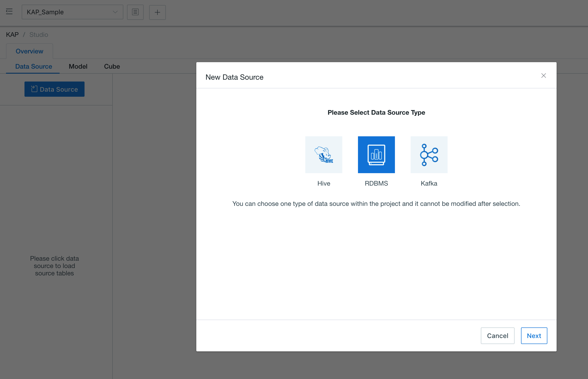
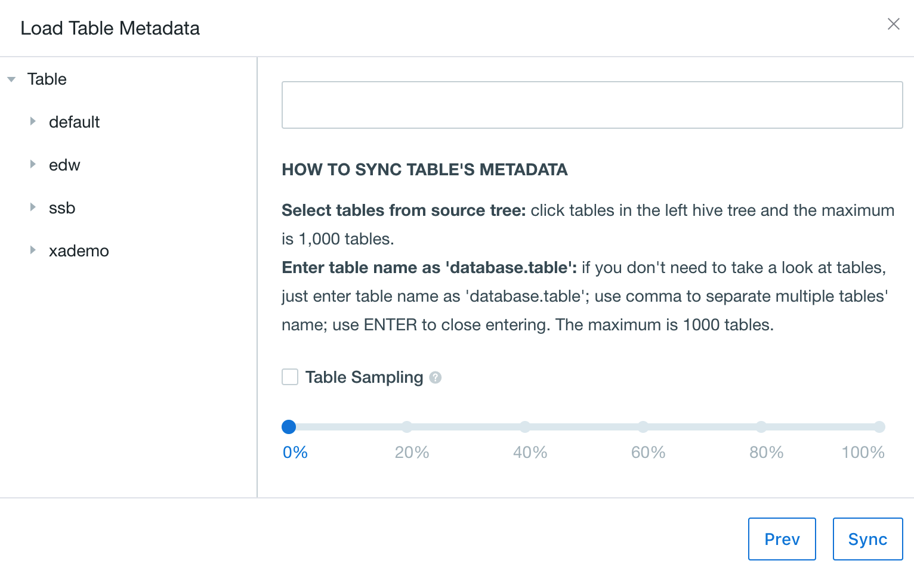
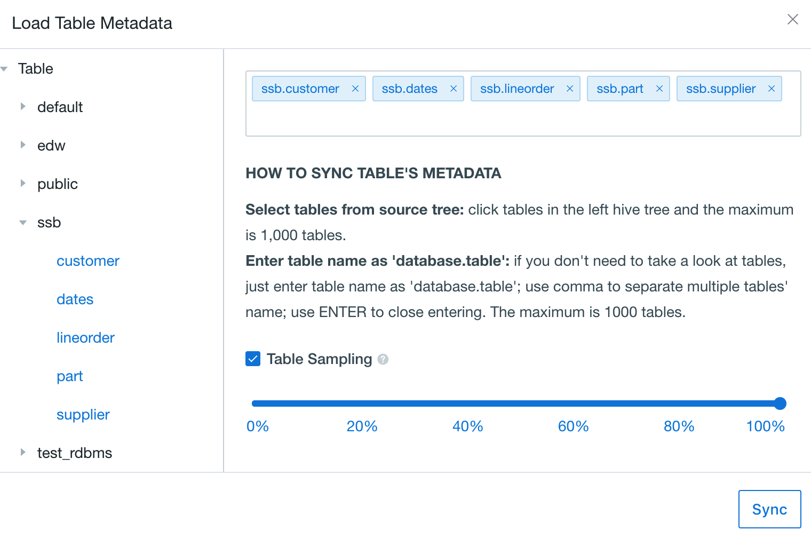

##Import RDBMS Data Source

RDBMS is supported as the default data source since KAP 3.0. In order to load the RDBMS tables, JDBC Driver Jar package is needed to put in  `$KYLIN_HOME/ext`.  The jar package is also needed to copy to `<sqoop_installation_directory>/lib`, because *sqoop* is used in the process of cube building,

Then, please set the following configurations in *kylin.properties*:

| Parameter                        | Description                                                  |
| -------------------------------- | ------------------------------------------------------------ |
| kylin.source.jdbc.driver         | JDBC Driver Class Name                                       |
| kylin.source.jdbc.connection-url | JDBC Connection String                                       |
| kylin.source.jdbc.user           | JDBC Connection Username                                     |
| kylin.source.jdbc.pass           | JDBC Connection Password                                     |
| kylin.source.jdbc.dialect        | Dialect to the data source (Currently only support greenplum and default) |
| kylin.source.jdbc.sqoop-home     | The path to sqoop command                                    |

To enable query pushdown, following configration is required:

`kylin.query.pushdown.runner-class-name=io.kyligence.kap.query.pushdown.PushdownRunnerSDKImpl`

> Tips: All these configruations can be overriden in project-level

After the configuration finished, start KAP, users can access RDBMS Data Source on Web UI now.

### Create Project

Using Greenplum as an example, we connect Greenplum data source with PostgreSQL JDBC Driver, followings are the steps:

1. Download PostgreSQL JDBC Driver jar package, and put it under `$KYLIN_HOME/ext` and `<sqoop_installation_directory>/lib`.
2. Set following configuration in kylin.properties file:

```
kylin.source.jdbc.driver=com.pivotal.jdbc.GreenplumDriver
kylin.source.jdbc.connection-url=jdbc:pivotal:greenplum://<HOST>:<PORT>;DatabaseName=<DATABASE_NAME>
kylin.source.jdbc.user=<username>
kylin.source.jdbc.pass=<password>
kylin.query.pushdown.runner-class-name=io.kyligence.kap.query.pushdown.PushdownRunnerSDKImpl
kylin.source.jdbc.dialect=greenplum
kylin.source.jdbc.sqoop-home=/usr/hdp/current/sqoop-client/bin
```

After the configuration finished, start KAP, users can access Greenplum data source on Web UI now.

In KAP, project is the workspace of tables, models and cubes. To create a sample project, open the web UI of KAP and click the plus icon at the top to create a new project like below.


Select the project you just created on the upper corner of the web UI, all our following operations will be within the project.


### Synchronize RDBMS Table

RDBMS tables need to be synchronized into KAP before they can be used. To make things easy, we synchronize by using following button to load the RDBMS tables.



In the dialog box, expand the ssb schema and select the desired five tables.



After importing, the system will automatically scan the tables to collect basic statistics of the data. Wait a few minutes, we can view the details under the "Data Source" tab.