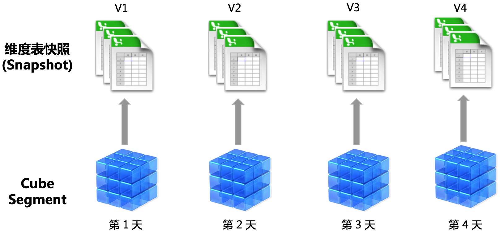
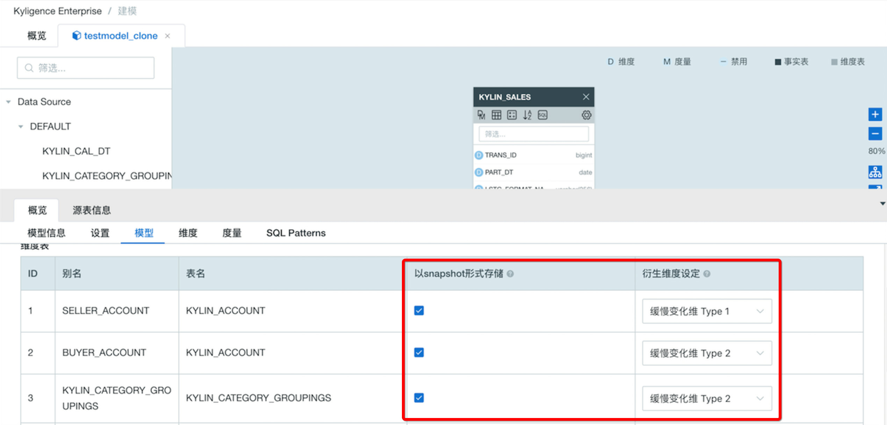
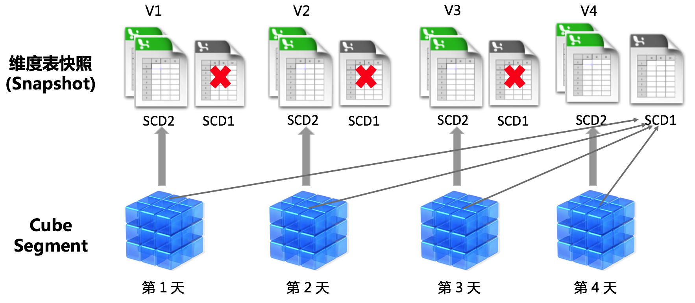

## Slowly Changing Dimension (SCD)

In most multi-dimensional OLAP scenarios, lookup table might change unpredictably, rather than according to a regular schedule. For example product category of one specific product might get changed in product table, or segmentation of some customers might be changed in customer table. As product category or customer segmentation are modeled as dimensions in a cube, they are so called **Slowly Changing Dimension**, or SCD in short.

Dealing with this issue involves SCD management methodologies referred to as Type 0 through 6. But the most commonly seen are **Type 1** and **Type 2**:

- Type 1: overwrite. This methodology overwrites old with new data, and therefore does not track historical data. This is also called "latest status".
- Type 2: add new row. This method tracks historical data by creating multiple records for a given natural key in the dimensional tables with separate surrogate keys and/or different version numbers. Unlimited history is preserved for each insert. This is also called "historical truth".

In Kyligence Enterprise, we deal with all dimensions as Type 2 **by default**, no matter it's normal dimension or derived dimension. During query time, we always get the historical truth of all dimensions when they were built into cube. Below screenshot illustrates the basics:

For normal dimensions, Kyligence Enterprise will add it into the rowkey and built into cube segment; For derived dimension, we will create snapshot tables to store dimension values and these snapshots are linked with the corresponding segments. During query execution, Kyligence Enterprise will join all necessary segments with their related snapshot tables to get the result.

### Enable SCD Type 1

After enabling snapshot for a lookup table, Kyligence Enterprise supports defining derived dimensions based on this lookup table. For derived dimension, Kyligence Enterprise will create snapshot table to store its values, instead of directly building it into cube segment. 

Kyligence Enterprise supports defining SCD Types for **only** derived dimenions based on snapshot enabled lookup tables。You can switch to **SCD Type 1** in column **SCD Type for Derived Dimensions** when you edit a model as shown below:

For a lookup table with snapshot enabled and **SCD Type 1** selected，Kyligence Enterprise will preserve **only the lastest version** of that lookup table snapshot. All segments will point to this snapshot for latest values of all derived dimensions defined on this lookup table. During building a cube segment, snapshot will be updated with only "insert" and "update" operations, so that this snapshot will have all dimension values. For queries on derived dimension of that lookup table, Kyligence Enterprise will join all necessary segments with the latest snapshot for getting the result. 

