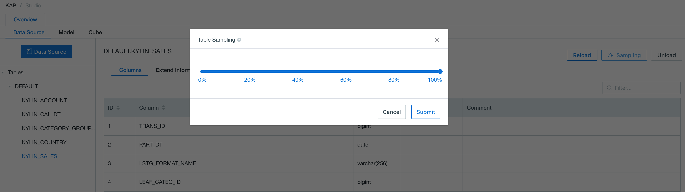
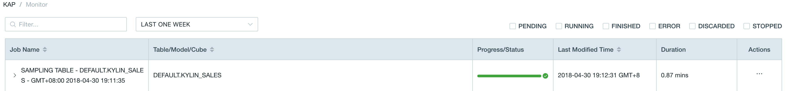
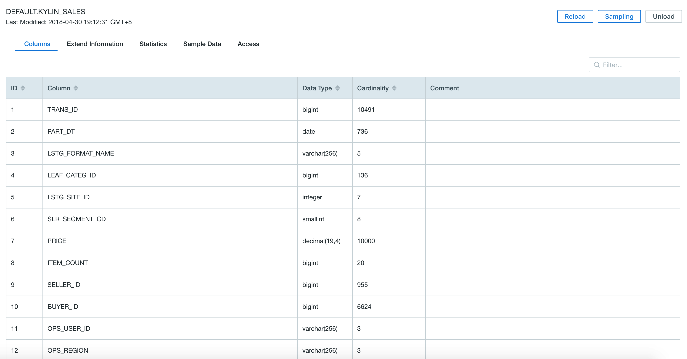
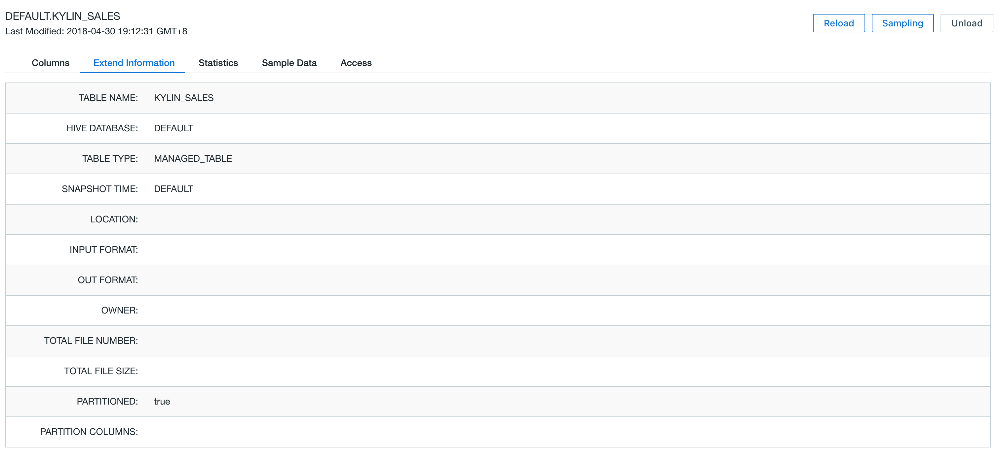
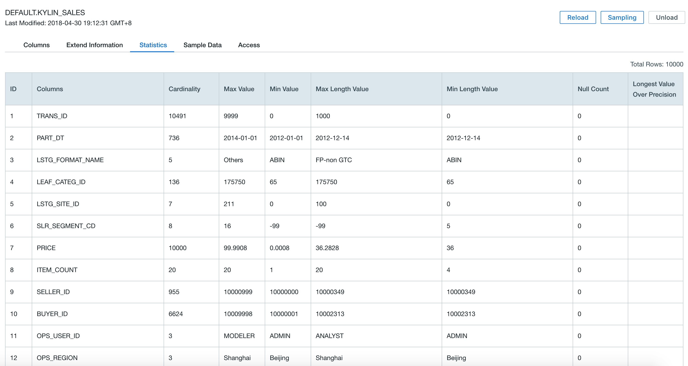
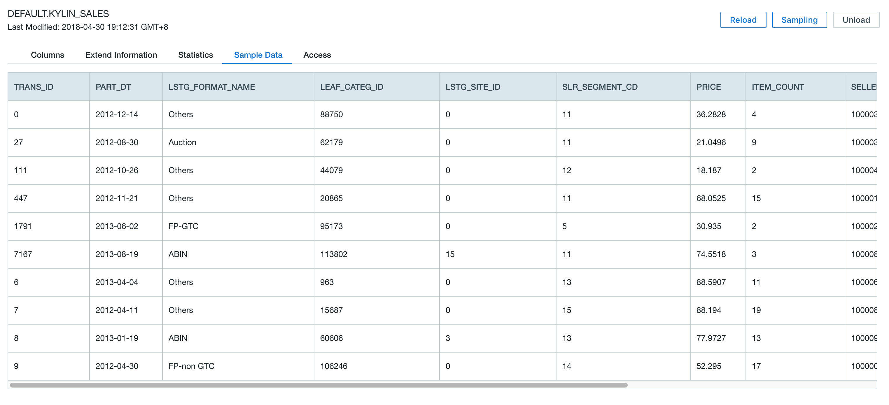
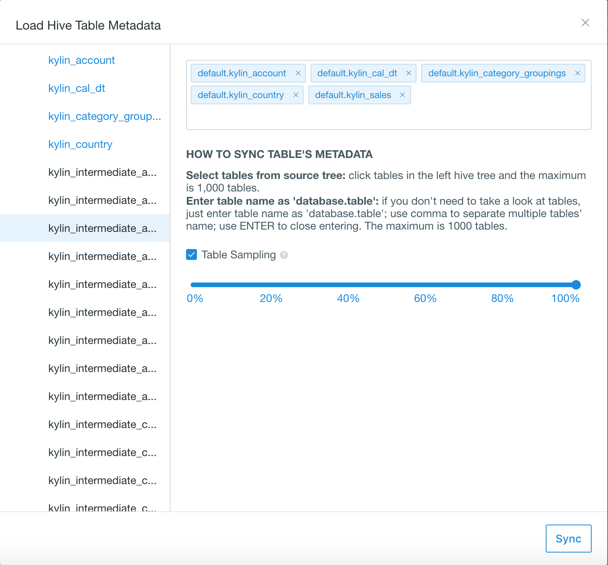

## Collect Table Statistics

Table's statistics include column cardinality, sample data and other statistics, which are helpful in Data Model and Cube design. This chapter will introduce how to collect table's statistics in KAP.

### Single table sampling

Open KAP Web UI, select project `learn_kylin`, click `Data Source` in the Overview tab. Select the the table you want to collect statistics via "Sampling", here we select table `KYLIN_SALES`. Click button `Sampling` on the right side.

A dialog window pops up. Leave the sampling bar 100% by default if you want to scan the whole table, otherwise drag the bar to the percentile desired. Click button `Submit` to start statistics collecting job.

Click `Monitor` on the left side, you can view a job for table sampling and please wait until the job completed.

> Notice: If the data source is Kafka, the job for table sampling will not show in Monitor while KAP will still finish collecting table statistics.

After the sampling job was done, return to `Data Source` tab and select table `KYLIN_SALES`. You can see the table statistics information by clicking tabs `Columns`, `Extend Information`, `Statistics` and `Sample Data`.

### Multiple tables sampling

Open KAP web GUI, select project `learn_kylin`, click `Data Source` in the Overview tab, then click the `Data Souce` blue button.

A dialog window pops up after clicking. Expand the table tree on the left of the dialog window, choose multiple tables that you would like to collect statistics from. Check the `Table Sampling` checkbox to do sampling for all chosen tables. Click `Sync` button to trigger the sampling jobs.

Task monitor and table statistics information check are the same with single table sampling.