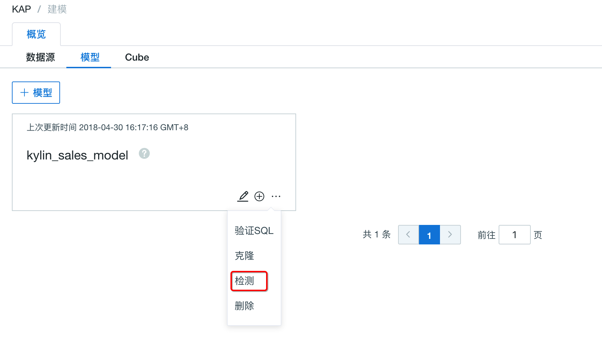

## Model Check

Once the model is created, it is hard to say whether it is reasonable or not. Kyligence Enterprise provides a check procedure to inspect the model before building a cube on it.

The procedure includes the following three steps:

1. Check if there are duplicates in primary key of lookup tables.
2. Check if the data of fact table is distributed evenly, and the possibility of data skew.
3. Check if the join condition is rational.

**Step1.** Launch Kyligence Enterprise and go to the UI page，select a project, such as *learn_kylin*,  then click **Studio** in the left nav bar, after that click **Model** tab.

**Step2.** For the models already exist, such as kylin_sales_model, click the menu on the upper right corner and click **Check** button.

**Step3. Configuration**

Time Range. It asks for selecting a start time and end time if the partition column has been set during model creation process. With the time range condition it could reduce the scanning scope. By default, it will scan the whole data.

Sampling percentage. It means it only checks the data in the given ratio, such as 50% will check one line in each two lines.

**Step4.** After all configurations are done, click **Submit** button and it starts a model checking job. The job status could be observed in **Monitor** page.

If you create or edit a model, after clicking **save**, it will show a checkbox to ask you whether to start a model checking job and it's checked by default.

If the model checking job is finished without any exceptions, you can observe the checking result in the model list. In this case, checking result is healthy. But there might be other checking status and details if the model has some issues.

As mentioned in the beginning, the model check includes 3 different check tasks:

1. **Model Status Checking**: Check if the join condition is reasonable. It will generate a flat table and check the join result. According to the result, it could have basic judgement that the given join condition is good or bad. If the condition is totally bad, there could be some issues in the source data.

2. **Fact Table Sampling**: Check if the source data on the foreign key is distributed evenly. When the data is not distributed evenly, the whole job cannot finish until the latest reducer which possesses the skew data completes its task. It suggests to have some efforts to avoid the this situation before starting the cubing job.

3. **Lookup Table Sampling**: Check if there are the duplications in primary key of lookup tables. If there are the duplication and it is over the given threshold will terminates the check job immediately. In this case, it's better to remove the duplication.

With the above checks, we defines five model checking status:

1. Not Checked Yet. Once a model is created, it will be in this state.
2. On Checking. It means a model checking job is running.
3. Good Health. It means there are no checking errors.
4. Warning. It indicates there is one checking error.
5. Error. It shows there are at least two checking errors.
