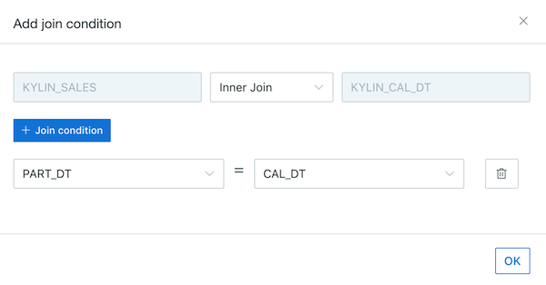

## Model Design Basics

### Introduction
Data model is a star schema or snowflake schema model based on multi-dimensional OLAP theory. Data model is the basis in Kyligence Enterpries and cubes can be created based on data models.

In this section, we take Kyligence Enterprise built-in dataset as an example. There are 1 fact table and 6 lookup tables in the data model, connected by foreign keys. Not all columns in the tables are required for analysis, so we only include necessary fields into our data model. Then we set these columns as dimensions or measures according to analysis scenarios. 

Typically data model design includes:

- Define a fact table and multiple dimension tables
- Define how fact table and dimension tables are joined
- Define dimensions and measures

### Start Data Model Design

Open Kyligence Enterprise Web UI, select project *learn_kylin* in project list in upper left corner and click **Studio** in the navigation bar on the left, then select **Model** tab.

### Create / Edit a Data Model

- **Create a New Model**

1. Click **+ Model** button and input the new model name.
2. Click **Submit** and enter model desinger page.

> **Note**: A new model can be saved only when
>
> 1. at least one fact table is selected.
> 2. at least one dimension column is specified.

- **Edit a Model**

in **Model** tab, click icon **Edit** on one specific model and start to edit a model.

### Design a Data Model

In model designer page, you can define fact table and dimension table via drag and drop in Kyligence web UI.

- **Define Fact Table**

1. From the source table list in the left, you can directly drag source tables to the canvas of model designer (in the center of page). Here we drag  table *KYLIN_SALES*  to the canvas.
2. Click **Setting** icon on the top right corner of *KYLIN_SALES*, select table type as **Fact Table**.

- **Define Dimension Table**

1. Drag following lookup tables into the canvas: *KYLIN_CAL_DT*, *KYLIN_CATEGORY_GROUPINGS*,*KYLIN_ACCOUNT*, *KYLIN_COUNTRY*. 

2. Drag *KYLIN_ACCOUNT* twice and change their names to *SELLER_ACCOUNT* and *BUYER_ACCOUNT* respectively, and drag *KYLIN_COUNTRY* twice and change their names to *SELLER_COUNTRY* and *BUYER_COUNTRY* respectively.

> **Note**: For some scenarios, one source table might be referenced as dimension table multiple times in one single data model. Kyligence support this scenario via renaming the table name in data model.

3. Click **Setting** icon on the top right corner of each table, select table type as **Dimension Table**.

- **Set Dimensions and Measures**

You can specify either one single column or multiple columns as dimensions or measures. Also you can use auto suggestion by the system and make modifications if necessary. 

1. Click **DM** icon on top left of the table, you can open/close editing mode of specifying dimensions and measures.
2. In editing mode, click the icons in the toolbar to specify dimension or measure.
- **D**: Dimension
- **M**: Mesure
- **— **: Disabled
- **A**: Auto Suggestion
3. In this example, we specify the dimensions and measures suggested by the system. Check checkbox to enable select all in the toolbar and click icon **A**.

- **Set Table Joins**

Drag one dimension in fact table and drop it to the corresponding lookup table can setup join condition between tables. For instance, to set up a join condition as `KYLIN_SALES Inner Join KYLIN_CAL_DT on KYLIN_SALES.PART_DT = KYLIN_CAL_DT.CAL_DT`, you can drag *PART_DT* from *KYLIN_SALES* to the table *KYLIN_CAL_DT*, then set up the join condition in the pop up shown as below.

Set up the following join conditions:

1. KYLIN_SALES *Inner Join* KYLIN\_CAL\_DT 
Join Condition：

   **DEFAULT.KYLIN\_SALES.PART_DT = DEFAULT.KYLIN\_CAL\_DT.CAL\_DT**

2. KYLIN_SALES *Inner Join* KYLIN\_CATEGORY_GROUPINGS 
Join Condition: 

   **KYLIN_SALES.LEAF_CATEG_ID = KYLIN\_CATEGORY\_GROUPINGS.LEAF_CATEG_ID**

   **KYLIN_SALES.LSTG_SITE_ID = KYLIN\_CATEGORY\_GROUPINGS.SITE_ID** 

3. KYLIN_SALES *Inner Join* BUYER_ACCOUNT (alias of KYLIN_ACCOUNT)
Join Condition: 

   **KYLIN_SALES.BUYER_ID = BUYER_ACCOUNT.ACCOUNT_ID** 

4. KYLIN_SALES *Inner Join* SELLER_ACCOUNT (alias of KYLIN_ACCOUNT) 
Join Condition: 

   **KYLIN_SALES.SELLER_ID = SELLER_ACCOUNT.ACCOUNT_ID** 

5. BUYER_ACCOUNT (alias of KYLIN_ACCOUNT) *Inner Join* BUYER_COUNTRY (alias of KYLIN\_COUNTRY) 
Join Condition: 

   **BUYER_ACCOUNT.ACCOUNT_COUNTRY = BUYER_COUNTRY.COUNTRY** 

6. SELLER_ACCOUNT (alias of KYLIN_ACCOUNT) *Inner Join* SELLER_COUNTRY (alias of KYLIN\_COUNTRY)
Join Condition: 

   **SELLER_ACCOUNT.ACCOUNT_COUNTRY = SELLER_COUNTRY.COUNTRY**

The result is shown as below. If you click **inner** icon on the connnection lines, it will show you details of the join.

> **Note**: When you design a data model, you can use computed column to define additional columns calculated based on existing columns. This can acheive more data model flexibility as well as some data wrangling functionalities.  For more details, please refer to [Computed Column](computed_column/README.md).

- **Save Model**

Click **Save** button, and then select the time partition column. This is an optional setting. For delta data loading scenarios, you need to specify one time partition column to indicate which data should be loaded into cubes. 

> **Note**: Currently Kyligence Enterprise supports following data type as time partition column: time (time / date / datetime) , integer (integer / tinyint / smallint / bigint / int4 / long8) , and string (varchar / string).

In our example, we specify column *KYLIN_SALES.PART_DT* as time partition column and specify the date format as `yyyy-MM-dd`.

Finally, click the button **Submit**, and the data model is created.

### Advanced: Set Lookup Table Snapshot

When lookup table is less than 300 MB, it is recommended to enable snapshot of lookup table, to simplify cube design and improve overall system efficiency. By default, the system assumes all lookup tables are small and enables snapshot for all lookup tables always.

- **Benefits of Lookup Table Snapshot**
- Allows detailed query on lookup tables.
- Columns in the dimension table can be set as derived dimentions during cube design.

- **How to Disable Lookup Table Snapshot**

If your lookup table is too big, like over 300 MB, please turn off the snapshot feature for the lookup table, in order to successfully build the cube.

To turn on/off snapshot, click **Overview** and then click **Model** tab. The Lookup table and Fact table will appear. In the **Lookup Table** section, you can speficy whether to store the a lookup table as snapshot.

> **Caution**:
>
> 1. When a lookup table is larger than 300 MB, we don't recommend you to store it as snapshop. But you can still set parameter `kylin.snapshot.max-mb` in `kylin.properties` to modify this when it's really necessary.
> 2. When the parameter above is set to be larger than 300 MB, it might cause cube build job fail at step **Build Dimension Dictionary** and hence affect system stability. If you do need to store lookup table as snapshot, please contact [Kyligence Support](../introduction/get_support.en.md) for solution.
> 3. We cannot successfully store a lookup table as snapshot when there are duplicated keys in dimension table.

- **Slow Changing Dimension (SCD)**

In most multi-dimensional OLAP scenarios, lookup table might change unpredictably, rather than according to a regular schedule. For snapshot enabled lookup tables, Kyligence Enterprise supports defining SCD types for all derived dimensions on this lookup table.

For more details, please refer to [Slowly Changing Dimension](scd.en.md).

