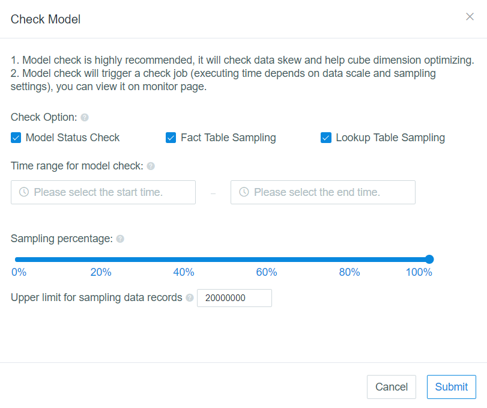

## Model Check

Once the model is created, it is hard to say whether it is reasonable or not. Kyligence Enterprise provides a check procedure to inspect the model before creating a cube on it.

## What is Model Check

Model check includes 3 different check tasks:

1. **Model Status Checking**: Check if the join condition is reasonable. It will generate a flat table and check the join result. According to the result, it could have basic judgement that the given join condition is good or bad. If the condition is totally bad, there could be some issues in the source data.
2. **Fact Table Sampling**: Check if the source data on the foreign key is distributed evenly. When the data is not distributed evenly, the whole job cannot finish until the latest reducer which possesses the skew data completes its task. It suggests to have some efforts to avoid the this situation before starting the cubing job.
3. **Lookup Table Sampling**: Check if there are the duplications in primary key of lookup tables. If there are the duplication and it is over the given threshold will terminates the check job immediately. In this case, it's better to remove the duplication.

## How to start Model Check

**Step1.** Launch Kyligence Enterprise web UI，select a project, such as *learn_kylin*,  then click **Studio** in the left nav bar, after that click **Model** tab.

**Step2.** For the models already exist, such as kylin_sales_model, click the menu on the upper right corner and click **Check** button.

**Step3. Configuration**

By default, **Model Check** includes **Model Status Check**, **Fact Table Sampling** and **Lookup Table Sampling**. 

> **Notes**: If Table Sampling was finished after importing, and the underlying data is unchanged in the model's scope, you can only keep **Model Status Check** checked. 

By default, **Model Check** runs on full dataset, unless you did following configuration to set the ranges:

- Time Range: It asks for selecting a start time and end time if the partition column has been set during model creation process. With the time range condition it could reduce the scanning scope. By default, it will scan the whole data.
- Sampling percentage: It means it only checks the data in the given ratio, such as 50% will check one line in each two lines. 
- Records upper limit: You can set the upper limit for sampling data records, the default value is 2 millions.

**Step4.** After all configurations are done, click **Submit** button and it starts a model checking job. The job status could be observed in **Monitor** page.

We define five model status according to model check result:

- **Not Checked Yet**: Once a model is created, it will be in this state.
- **Checking**: It means a model checking job is running.
- **Good Health**: It means there are no checking errors.
- **Warning**: It indicates there is one checking error.
- **Error**: It shows there are at least two checking errors.
