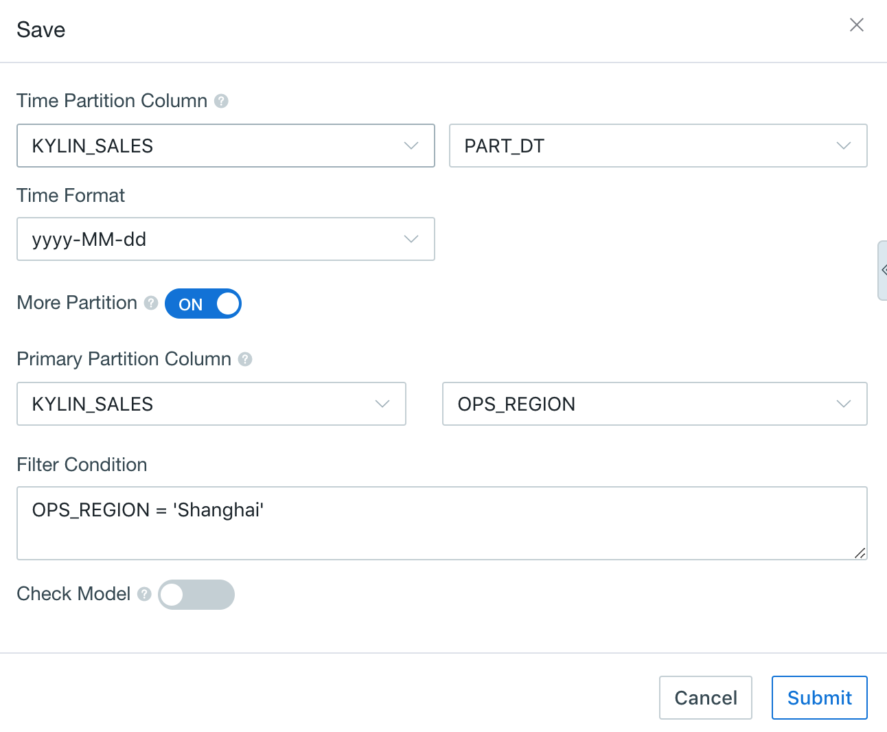
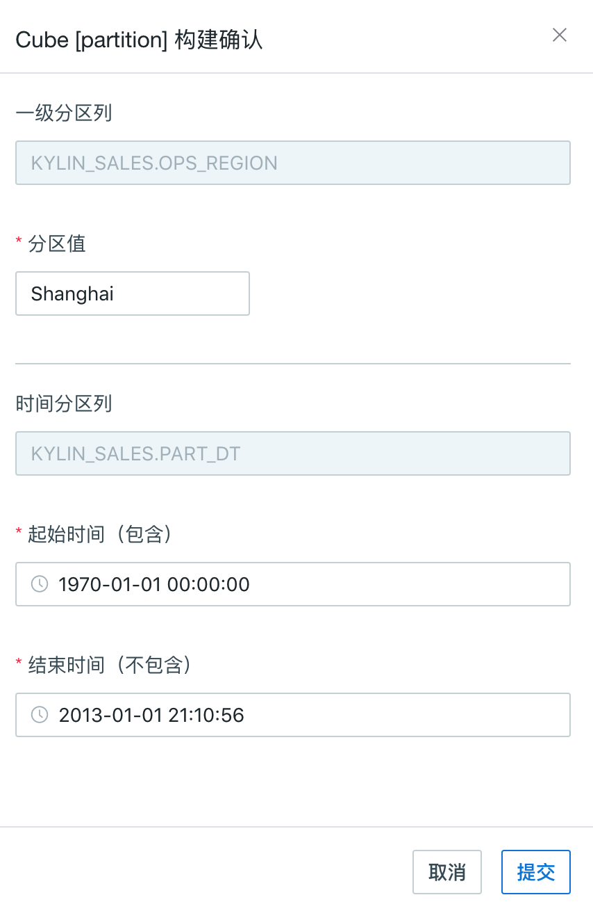

## Multi-Partition Model

In addition to time-based partition, Kyligence Enterprise also supports other types of partitions, collectively referred to multi-level partition.

> The time partition and primary partition are supported in our product since V2.5.2.

Enhanced partition flexibility, such as multi-tenant usage scenarios. Besides time, we often use institutions or regions to partition.

### Concept of Multi-Partition

- Basic Concept: the partition column includes the time partition column and multi-partition column. Regarding to multi-partition column, Kyligence Enterprise currently supports to add only one partition (Primary Partition).
- Common Concepts:
  - Time Partition Column: supports date or finer granularity time partition. The supported data types include time (time / date / datetime) , integer (integer / tinyint / smallint / bigint / int4 / long8) , and string (varchar / string);
  - Multi-Partition Column: the partition dimension except for Time Partition Column. Currently, adding one partition (Primary Partition) is allowed. The supported data types include integer (long / short / int / integer) or string (string / char / varchar);
  - Partition value: the specific value in the primary partition column when being built. The segment is often built incrementally on the partition value.

### Basic Usage

1. The last step in model or cube creation

   + For the general process of model creation, please refer to [Model Design](data_modeling.en.md);
   + For the general process of cube design, please refer to [Create Cube](cube/create_cube.en.md).

2. When saving a model, if you select *More Partition* under Time Partition Column, then multi-partition will be created (currently you can add one partition).

3. In the `Primary Partition Column`, specify the table name where the *partition column* is located and then specify partition column name

   

   ​

4. When a cube is built, if the cube has multi-partition column, you need to choose multi-partition column and the corresponding time partition column.

   

