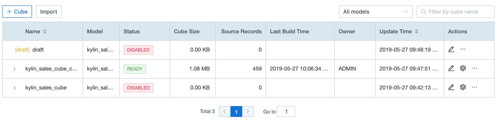
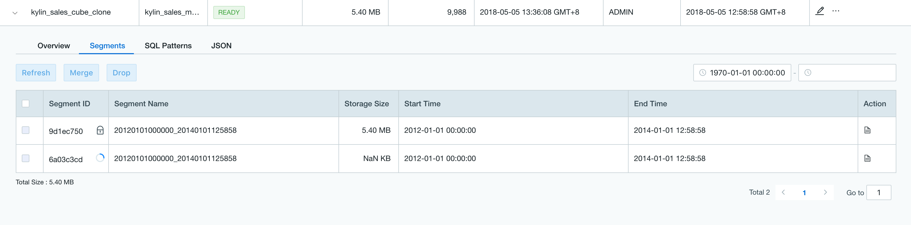

## Cube and Segment Management

### Cube Management

* **Access Cube Management Page**

  Users can access Cube Management page with the following steps.

  * Log in and switch to a specific project.

  * Click **Modeling** on the left navigation bar, then click on the **Overview** -> **Cube** tab on the right to view the cube list (as shown below)

  

* **Cube Status and Operations**

  There are 4 types of cubes status, which is shown in the **Status** column in the cube list, and to the rightmost of each cube are action buttons/menus for cube operations.
  
  * **DRAFT**: A cube that has not been officially saved. You can continue to edit or delete.
  
  * **DISABLED**: A cube with DISABLED status means it cannot be queried. The status will be converted to READY status automatically when it is built successfully. Besides viewing the cube description, you can also execute the following actions.
  
    * Edit: Access to the studio page. 
    
    * Build: Build the segments based on the partition columns.
    
    * Delete: Delete the metadata of cube and segments.
    
    * Enable: Convert a cube with a segment to READY status.
    
    * Purge: Delete all segments information under a cube, which will only delete the metadata. To totally delete the segment data, please refer to [Routine Operation Tool](../operation/routine_ops/routine_tool.en.md).

    * Clone: Copy a cube metadata, such as the dimension and measure description.

      > **Note**: The clone operation will only copy the metadata, without the segment data.
    
    * Verify SQL: Verify if the cube can answer a certain SQL statement.
    
    * Backup/Export: Backup or export a cube's metadata to local or a HDFS path.
    
  * **READY**: A cube with READY status means it has segments to be queried. Besides viewing the cube description, you can also execute the following actions.

    * Build: Build the segments based on the partition columns.
    
    * Disable: Convert a READY cube to DISABLED.
    
      > **Note**: When a READY cube becomes DISABLED, you can modify the description of dimensions and measures, refresh settings and advanced setting. To prevent the inconsistent of data after cube building, add or remove dimensions and measures is not supported in this status.
    
    * Clone: Copy a cube metadata, such as the dimension and measure definition.
    
      > **Note**: The clone operation will only copy the metadata, without the segment data.
    
    * Verify SQL: Verify if the cube can answer a certain SQL statement.
    
    * Export TDS: The exported TDS file could be imported to Tableau. After that, the designed model and cube can be used directly.
    
    * Backup/Export: Backup or export a cube's metadata to local or a HDFS path.
    
  * **DESCBROKEN**: A cube with DESCBROKEN status means it is unavailable because its metadata is broken.
  
    * Edit: You can edit a DESCBROKEN cube trying to recover it to normal status.
    * Delete: Delete the cube and any data it contains.
  

### Segment Management

Cube consists of one or more segments. Each segment contains a range of data. Segment is created by building the cube with a selected data range on the partition columns.

User can access the Segment management interface by the following steps:

1. Open cube list page, and click the **>** arrow to the left of cube name.
2. Select **Segment** tag.

On Segment page, you can execute the following actions: 

- **Refresh**: Rebuild the segment with latest source data.

- **Merge**: Merge several segments into one.

  > **Note:** 
  >
  > 1. Discontinuous segments can also be merged and the hole will be automatically built in the job.
  > 2. If the corresponding snapshots of those segments are different, a warning message will pop up. If continue to merge, the processing for slowly changing dimension (SCD) might be changed and your query result might be affected. For more information about SCD, please refer to [Slowly Changing Dimension](model_design/slowly_changing_dimension.en.md).
  > 3. Too many segments in one cube may degrade query performance. It is recommended to set up auto merge in refresh setting (step 4) when designing cube.
  > 4. Auto merge only applies to cube/model with incremental data loading type **By Date/Time**. For other scenarios, please plan your merge tasks accordingly and invoke the [Segment Rest API](../rest/segment_manage_api.en.md) to keep segment merge going.

- **Delete**: Delete the segment. Only segment metadata is deleted immediately. To totally delete the segment data, please refer to [Routine Operation Tool](../operation/routine_ops/routine_tool.en.md).

- **Import**: Import the segment files into the current cube from HDFS

- **Details**: View the segment details, such as storage path and storage size.

- **Export**: Export the segment and the data files to a HDFS directory, which includes segment data, dictionaries, snapshot files and the cube metadata.

Clicking the ID of a segment that is being built, refreshed or merged, will lead you to the related job in **Monitor** page.

