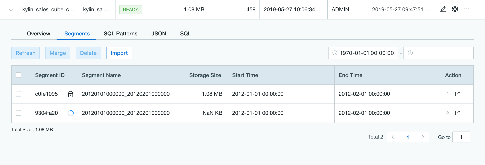

## Cube and Segment Management

### Cube Management

* **Open Cube Management Page**

  Users can enter Cube Management page with the following steps.

  **Step 1**: Log in to the product web UI and switch to a specific project.

  **Step 2**: Click `Modeling` on the left navigation bar, then click on the `Overview` -> `Cube` tab on the right to view the Cube list (as shown below)

* **Cube Status and Operation Type**

  There are 4 types of Cubes built, which can be viewed in the `Status` column of the Cube list, and the rightmost `Actions` for Cube operation management.
  * *Draft*: A cube that has not been officially saved. You can continue to edit, delete, and view the cube (see the cube description).
  * *Disable:* A cube with Disable status means it cannot be queried. The status will be converted to Ready automatically when it is built. Common executable actions includes:

    * Validate SQL
    * Delete
    * Edit
    * Build 
    * Ready (Convert a cube with a segment to Ready)
    * Purge (Empty all segments under a cube)
    * Clone (Copy a cube, without copy a segment)
    * View Cube (View a cube's description)
    * Backup (Backup a cube's metadata), 
    * Edit cube's details (view or edit a cube's json).

  * *Ready:* A cube with Ready status means it has a segment and can be queried, but cannot be deleted or purged directly. Common executable actions includes: 

    * Validate SQL
    * Edit
    * Disable (Convert a Ready cube to Disable) 
    * Clone (Copy a cube, without copy a segment) 
    * View Cube (View a cube's description) 
    * Backup (Backup a cube's metadata) 
  * *DESCBROKEN*: A cube with Broken status means it is abnormal because its metadata is broken.

  > **Note:**
  >
  > 1. When cubes are disabled after they are enabled, the user cannot modify the definition of dimensions and measures, or add/remove dimensions and measures. If you need to edit dimensions and metrics, you need to redesign and build a new cube.
  > 2. When cubes are disabled after they are enabled,  the user can edit dimension description, measure description, Refresh Setting and Cube Configuration/Job Related Configuration/Hive Related Configuration in the Advanced Setting step.
  > 3. User can edit dimension description and measure description in a *DESCBROKEN* cube.

### Segment Management

Cube consists of one or more segments. When a cube is built, the segment data will be generated. The segment is divided by the partition columns.

Users can enter the Segment management interface by the following steps:

1. Click on the `Cube` list, the **>** arrow of the *Cube Name* column.
2. Select `Segment` tag.

On Segment page, users can execute the following actions: 

- Refresh (Rebuild the segment) 
- Merge (Merge several segments into one even if they are discontinuous) 
- Delete

> **Note:** by clicking an ID of a segment that is being built, refreshed or merged, may lead you to the jobs associated in the Monitor page.

