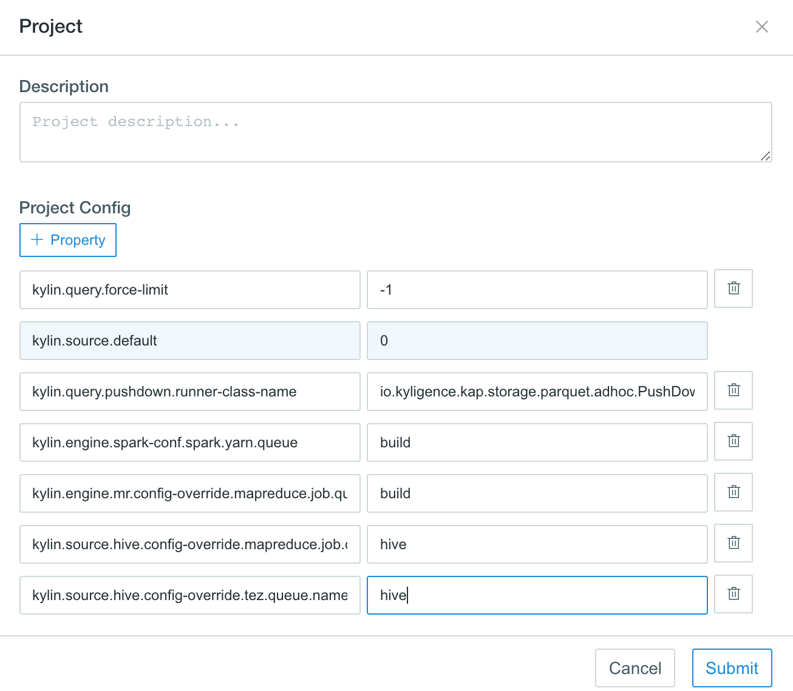

## YARN Queue Configuration

In the case of multiple-tenants environment, to securely share a large cluster, each tenant needs to have allocated resources in a timely manner under constraints of allocated capacities. With the assumption that each tenant owns a separate project in KAP, to achieve computing resources allocation and separation, each project can be configured to use different YARN queue. 

To achieve this, first, you need to create a new YARN capacity scheduler queue. By default, job sent out by KAP will go to default YARN queue.

In the screenshot below, a new YARN queue `learn_kylin` has been set up.


Then you may configure the YARN queue to be used in KAP

1. In KAP, go to project setting page, choose the project you are intended to switch the queue.
2. Edit the page and click `+property` to add key value pair as shown below. 




```shell
kylin.engine.spark-conf.spark.yarn.queue = YOUR_QUEUE_NAME
kylin.engine.mr.config-override.mapreduce.job.queuename = YOUR_QUEUE_NAME
kylin.source.hive.config-override.tez.queue.name = YOUR_QUEUE_NAME
kylin.source.hive.config-override.mapreduce.job.queuename = YOUR_QUEUE_NAME
```

You will need to change the YOUR_QUEUE_NAME to your queue name. 

In this example, queue for project learn_kylin has been changed to `learn_kylin` as shown in the above screenshot. You may test out if this change has been effective by triggering a cube building job in project learn_kylin.


Now, go to YARN Resource Manager on the cluster, you may observe that this job has been submitted under queue `learn_kylin`. 


Similarly, you may set up YARN queue for other KAP projects to achieve computing resource separation.