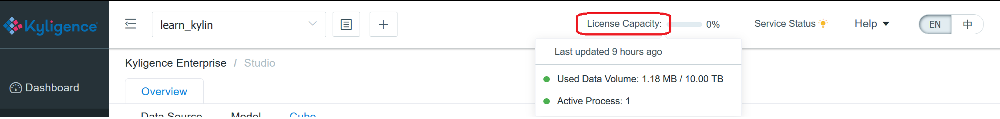
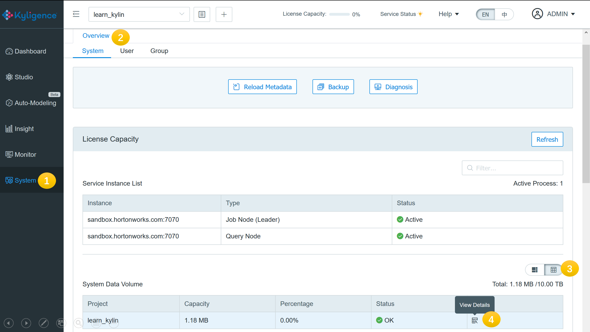

## License Capacity

To ensure the system always runs in a healthy condition, please pay attention to the license capacity and keep the usage within limit. You may hover the mouse over the **License Capacity** indicator at the top of the page to learn the current usage of the system.



A license includes the following capacity controls:

- **Used Data Volume**: The volume of the data that has been loaded into the system.
- **Active Process**: The number of the service processes that are running.

The states of capacity controls are:

- **Normal**: The system is running within capacity. Everything is fine.
- **Over Capacity**: The used data volume or the active processes is beyond the allowed capacity. In this state, the system will remain query-able but will refuse to load additional data. Please consider the following actions to recover from this state.
  - If the used data volume is over capacity, you can delete some old cube segments to offload the system and downgrade the data volume back to normal.
  - If the active process is over capacity, you can stop some Kyligence service processes to bring the system back to normal.
  - Or you can contact Kyligence sales to get a new license with higher capacity.
- **Tentative** / **Error**: In some rare cases, the system may encounter error when accessing the source database and result the data volume in Tentative or Error state. Usually, the system can recover by itself when it calculates data volume the next time. If the system remains in Tentative or Error state for a long time (like a few days), please contact Kyligence Technical Support for help, before the impact getting worse.

From the **System** > **Overview** > **License Capacity** panel, you can get more information about the license capacity and the current usage. The used data volume can be reviewed by projects and by tables (interactions highlighted below). In the table level data volume list, you may trigger the recalculation of a table when its data volume is in Tentative or Error state.




### Data Volume Calculation and Planning

The used data volume means the size of the data that has been loaded into the system. The calculation of data volume follows the rules below:

- Only the columns and the rows that are loaded into the system are counted according to models and cubes.
- Data size is counted in its uncompressed text form, in order to avoid the ambiguity introduced by compression algorithm.
- Within one project, tables are counted only once if they participate in multiple models and cubes. However, in separate projects, the same table will be counted multiple times according to its usage.

For capacity planning, it is a common need to estimate the future data volume of your system. Below we introduce a simple estimation method using the [learn_kylin sample data](../appendix/sample_dataset.en.md) as an example.

- Fact Table Data Volume Estimation

  First decide the columns that will be loaded into the system. All dimensions and measures should be included. A fact table may hold 100 columns, but only 30 of them will participate in multi-dimensional analysis. The calculation should only count the 30 involved columns. Export the data rows of a certain time period and get the size in uncompressed text format.

  Use table KYLIN_SALES as an example, the following commands export the data to text format and gets the size estimation.

  ```sh
  hive -f export_fact.sql > export_fact.out
  ```

  The `export_fact.sql` is:

  ```sql
  SELECT 
    TRANS_ID
    ,PART_DT
    ,LEAF_CATEG_ID
    ,LSTG_SITE_ID
    ,LSTG_FORMAT_NAME
    ,SELLER_ID
    ,BUYER_ID
    ,OPS_USER_ID
    ,OPS_REGION
    ,PRICE
    ,ITEM_COUNT
  FROM
    DEFAULT.KYLIN_SALES
  WHERE
    PART_DT>='2012-01-01' and PART_DT<'2014-01-01'
  ;
  ```

  The size in bytes of the `export_fact.out` file is the wanted volume estimate.

  ```sh
  wc --bytes export_fact.out
  ```

  For large fact tables, recommend exporting a small portion of the table and then get the total estimate by multiplication.

  

- Lookup Table Data Volume Estimation

  Comparing to large fact tables, lookup tables are small and relatively stable. Their sizes are usually ignorable when doing volume estimation.

  If  the size of lookup tables does count, we can export the whole lookup table to text format and observe the size.

  Use the *learn_kylin* project as an example, the following commands get the volume estimate of the lookup tables.

  ```sh
  hive -f export_lookup.sql > export_lookup.out
  ```

  The `export_lookup.sql` is:

  ```sql
  SELECT * FROM DEFAULT.KYLIN_CAL_DT;
  SELECT * FROM DEFAULT.KYLIN_CATEGORY_GROUPINGS;
  SELECT * FROM DEFAULT.KYLIN_ACCOUNT;
  SELECT * FROM DEFAULT.KYLIN_COUNTRY;
  ```
  
  The size in bytes of the `export_lookup.out` is the wanted volume estimate.

  ```sh
  wc --bytes export_lookup.out
  ```

  

Finally, sum up all the fact and lookup estimates to get the total volume estimate. Usually if done right, assuming no missing columns from fact table and full lookup tables are counted, the estimate should be slightly less than the actual data volume.

