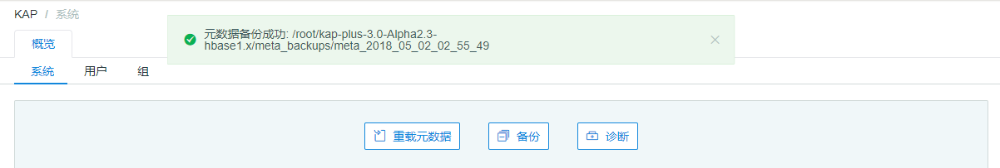
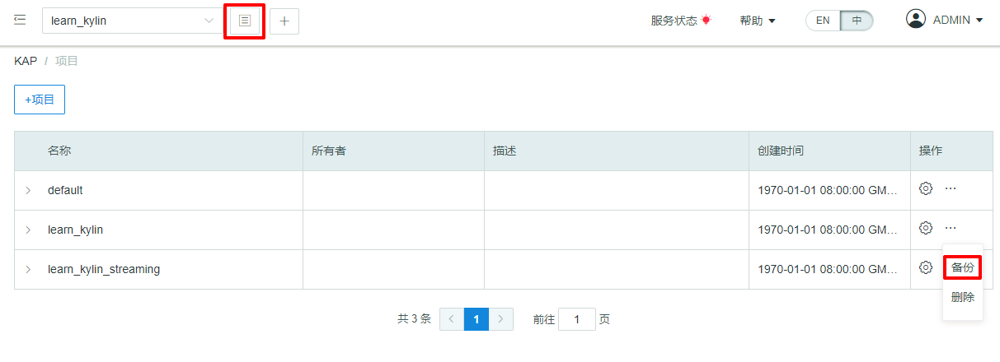

## Metadata Backup

### Metadata Backup in Command Line

Metadata is the most important data in Kyligence Enterprise. Backup metadata is a regular task in daily operation. It is the only way to recover a Kyligence Enterprise when the entire metadata is crashed causing Kyligence Enterprise service is down due to some mishandling. In general, it is a good practice to backup metadata before each failover or system upgrade. This will ensure that the Kyligence Enterprise service can roll back, and in the worst case still maintain the system's robustness.

Kyligence Enterprise provides a command line tool for metadata backup; the usage is as follows：

System Level

```shell
$KYLIN_HOME/bin/metastore.sh backup
```
Project Level

```shell
$KYLIN_HOME/bin/metastore.sh backup-project PROJECT_NAME PATH_TO_LOCAL_META_DIR
```

Cube Level

```shell
$KYLIN_HOME/bin/metastore.sh backup-cube CUBE_NAME PATH_TO_LOCAL_META_DIR
```

Then backup is succcessful when below message displays in the console:

```shell
metadata store backed up to /usr/local/kylin/meta_backups/meta_2016_06_10_20_24_50
```
> Note: PROJECT_NAME and CUBE_NAME indicate the name of the project and cube you need to back up, such as learn_kylin;
>
> PATH_TO_LOCAL_META_DIR represents the metadata save path you want to back up,
>
> Such as `/usr/local/kylin/meta_backups/meta_2016_06_10_20_24_50`;
>
> In the above example, this command will download all the metadata used by Kyligence Enterprise to a local directory as a file (e.g. `/usr/local/kylin/meta_backups/meta_2016_06_10_20_24_50`).

### Metadata Backup in User Interface

Besides using the command line to backup metadata, Kyligence Enterprise also supports to backup metadata in the user interface.

- **Instance metadata backup**

Go to the system page and click the backup button to backup instance metadata. The instance metadata will be backed up to Kyligence Enterprise's installation folder (e.g. `/root/kap-plus-2.5-hbase1.x-236/kap-plus-2.5.5-alpha3.1-hbase1.x/meta_backups`).  The name will be generated as meta_current time (e.g. `meta_2018_01_11_07_01_47`).



- **Project metadata backup**

Click the project list button (at the top of the page) and choose the project which needs to backup. Then unfold the action menu and click the backup button. The project metadata will be backed up to Kyligence Enterprise's installation folder with name as project_project name_current time (e.g. `project_learn_kylin_2018_01_11_19_03_09`).



- **Cube metadata backup**

Go to the studio page and switch to Cube. Then choose one cube and unfold the action menu backup metadata. The Cube metadata will be backed up to Kyligence Enterprise's installation directory and with name as cube_cube name_current time (e.g. `cube_corr_2018_01_11_19_04_21`).


### Metadata Directory Structure

In the above example, this command downloads all of the metadata to the local directory as local files (e.g.: `/usr/local/kylin/meta_backups/meta_2016_06_10_20_24_50`). System level metadata may include directories as shown in the following ：

| Directory          | Description                                                |
| :----------------- | :--------------------------------------------------------- |
| project            | The basic information of the Projects                      |
| model_desc         | Description of the Data Models                             |
| cube_desc          | Description of the Cubes                                   |
| cube               | Information of Cube Instances                              |
| cube_statistics    | Statistics information of Cube Instances                   |
| table              | Table definitions                                          |
| table_exd          | Table extended information                                 |
| table_snapshot     | Snapshots of lookup tables                                 |
| dict               | Dictionary of dimension columns                            |
| execute            | Cube Job definitions                                       |
| execute_output     | Cube Job outputs                                           |
| info               | Package time, type                                         |
| raw_table_desc     | Description of the Table Indexes                           |
| raw_table_instance | Information of Table Index Instances                       |
| user               | User information                                           |
| acl                | Account Access List information                            |
| query              | Saved queries                                              |
| draft              | Draft model and cube definitions                           |
| kylin_env          | Environmental information                                  |
| model_opt_log      | Model operation information (sql suggestion results, etc.) |
| model_stats        | Model detection information                                |
| user_group         | User group information                                     |

> Note:
>
> The *system level* metadata directory contains all the directories in the table;
>
> The *project-level* metadata directory includes only commit_SHA1, cube, cube_desc, model_desc, streaming, UUID, info, kylin_env, project, table;
>
> The *cube level* only includes commit_SHA1, cube, cube_desc, info, kylin_env, model_desc, table, table_exd, UUID.

