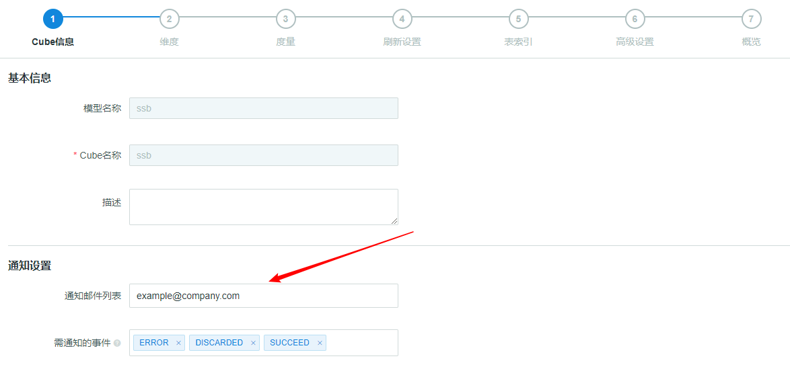
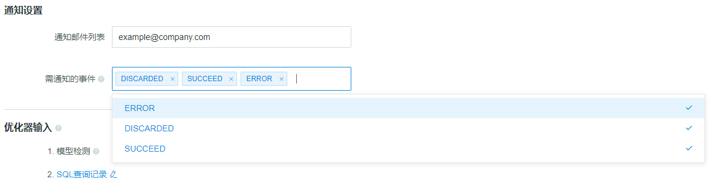

## Job Status Alert

Kyligence Enterprise provides *Email Notification* function, will send emails to Cube administrators when Cube status changes, which helps DevOps to troubleshoot or incremental build rapidly.

### How to enable *Email Notification* function
#### 1. Following configurations in `kylin.properties` is required,

```
kylin.job.notification-enabled=true|false  # set to true to enable the function
kylin.job.notification-mail-enable-starttls=true|false    
kylin.job.notification-mail-host=your-smtp-server  # address of SMTP server
kylin.job.notification-mail-port=your-smtp-port  # port of SMTP server
kylin.job.notification-mail-username=your-smtp-account  # SMTP account username
kylin.job.notification-mail-password=your-smtp-pwd  # SMTP account password
kylin.job.notification-mail-sender=your-sender-address  # sender address
kylin.job.notification-admin-emails=adminstrator-address 
```
*Restart Kyligence Enterprise* to make configurations work.

#### 2.Setting in the Cube Design Page
Modelers and Analysts need to fill in the `Notification Email List` with their email addresses in the `Cube info` Page when designing a Cube, as shown in the following picture.


More detailed trigger condition for notification can be selected in the `Notification Events`, which means when Cube status turns to the specific  condition, email notification will be sent, as shown in the following picture.
